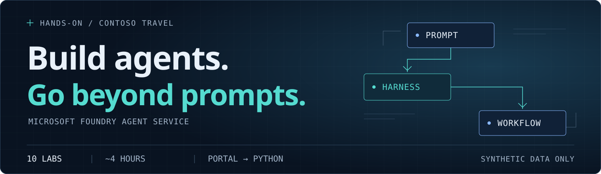
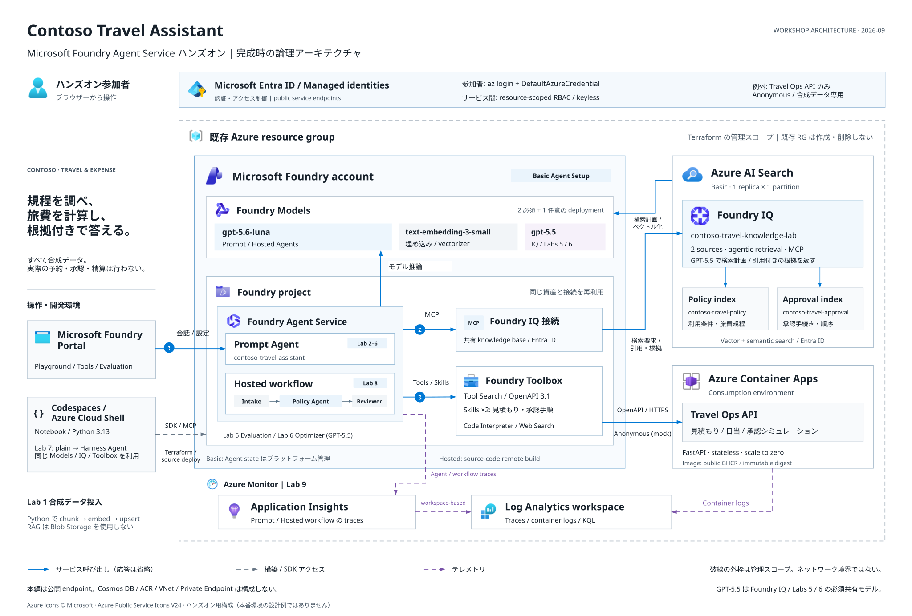

[日本語](README.md) | **English**

# Microsoft Foundry Agent Service Hands-on

**Start with conversation. Add evidence, tools, and an orchestrated workflow.**

“What is the hotel allowance for a trip to Osaka?” “Can you calculate the travel costs?”
Build an AI assistant for these requests from employees of the fictional company Contoso.
Start with conversation, add policy retrieval and API calculations, then evaluate and improve
the answers. No prior AI agent development experience is required.

The step-by-step labs use **Japanese explanations and the English UI of Foundry (new)
in dark mode**.

[**Start the workshop →**](labs/00-overview.md) · [Prerequisites](docs/participant/prerequisites.md) · [Agenda](#agenda) · [Help](#help)

## Learning path

**Grow one Prompt Agent, then bring its resources into code.**
Labs 0–1 prepare the environment. Labs 2–6 work mainly in the Portal; Labs 7–8 use Python
Notebooks. Lab 9 compares traces and cleans up.

[Full-size diagram (SVG)](docs/images/workshop-learning-flow.svg) · [Editable source (Excalidraw)](docs/diagrams/workshop-learning-flow.excalidraw)

Implementation notes for Labs 7–8

Lab 7 reuses Foundry IQ, Toolbox, and Skills, progressing from a plain Agent to a Harness
Agent. To reduce Luna token use, Lab 8 does not carry that Harness forward. It deploys
normal intake, policy, and reviewer agents as a sequential workflow. Lab 8 does not
depend on Lab 7 session state.

All content uses **synthetic data**. The workshop does not make real bookings, approvals,
or reimbursements.

## What you will learn

| Concept | Meaning and observable outcome |
|---|---|
| **Agent / Prompt Agent** | An AI assistant that follows instructions and can use connected capabilities. A Prompt Agent is configured through written instructions. Save its role and response guidelines |
| **Knowledge / Foundry IQ** | Knowledge is the reference material behind an answer. Foundry IQ retrieves information across sources. Search travel policies, then inspect citations |
| **Tool / Skill / Toolbox / Tool Search** | Tools provide API, calculation, and web-search capabilities; Skills explain how to use them; a Toolbox packages both. Tool Search discovers the needed capability dynamically before Travel Ops or another tool runs |
| **Evaluation / Optimizer** | Evaluation checks answers against a shared question set and criteria. Optimizer tests alternative instructions. Read scores and reasons before deciding whether to adopt a candidate |
| **Agent Framework / Harness Agent / Hosted Agent** | Lab 7 reuses Foundry IQ and Toolbox Tools/Skills in code and adds planning, todos, and memory with a Harness Agent. Lab 8 assigns intake, policy lookup, and review to three normal agents and deploys their sequential workflow |

For example, Lab 3 checks that an answer about Osaka lodging cites the synthetic policy's
JPY 15,000-per-night limit. Lab 4 checks the cost breakdown and total returned by the API.
These are examples of what to verify, not fixed wording that the model must reproduce.

## Where you work

- **Your chosen browser environment:** use VS Code in GitHub Codespaces, or Azure
  Cloud Shell Bash with JupyterLab through Web preview, to open the same workshop files.
  Its **Terminal** runs commands. A **Notebook** combines explanations with small executable
  Python cells; the required Notebook exercises are in Labs 7 and 8.
- **Microsoft Foundry Portal in another browser tab:** configure Agents, chat, evaluate,
  optimize, and inspect execution history using **English UI and dark mode**.
- **Your local PC:** use the browser and save files needed for Portal uploads.
  Run workshop commands in the **chosen environment's Terminal**, not your PC's PowerShell
  or terminal. Portal file pickers read your local PC, so download generated remote files
  before uploading them.

The workshop uses **three model deployments** (named model instances you can call):
**Luna (`gpt-5.6-luna`)** is shared by Prompt/Hosted Agents and Foundry IQ;
**GPT-5.5 (`gpt-5.5`)** is shared by the configurable evaluation judges in Lab 5
and both the Evaluation and Optimization model roles in Lab 6;
**`text-embedding-3-small`**, deployed as `embedding`, converts text into numbers for search.
If GPT-5.5 quota is unavailable, its deployment and Labs 5 and 6 can be skipped while the
remaining Luna-based labs stay available.
[Lab 0](labs/00-overview.md) explains the names used in the Portal and generated configuration.

## Prerequisites

- An Azure account that can run `az login`
- **Owner** on an individual or sandbox subscription, or equivalent permission to
  create the workshop resource group and become its **Owner**
- A dedicated workload resource group created by the participant using the
  instructor's naming convention
- Access to one of the environments below

See [participant prerequisites](docs/participant/prerequisites.md) for the checklist.

### Choose your environment once

| Environment | Additional requirements | Setup guide |
|---|---|---|
| **GitHub Codespaces** (the original path) | A GitHub account with Codespaces access | [Codespaces](docs/participant/environments/codespaces.md) |
| **Azure Cloud Shell Bash + JupyterLab** | Individual validation, or subscription-level permission to let Cloud Shell create a dedicated resource group and storage. Administrator approval for policy, network, and concurrency | [Cloud Shell](docs/participant/environments/cloud-shell.md) |

**Only environment preparation differs. Labs 2–9 and the existing Lab 7 / 8 Notebooks
are shared.** Cloning the public workshop in Cloud Shell does not require a GitHub account,
but your organization must allow access to GitHub and the package sources.
The Cloud Shell first-run UI can create its dedicated resource group, storage
account, and share. Cloud Shell compute is free; storage and workshop workloads incur charges.
Organizers must check Cloud Shell's default **20 concurrent users per tenant** limit in advance.

## Start

**Begin with [Lab 0 — Overview](labs/00-overview.md).**
Then prepare your selected environment with the [participant prerequisites](docs/participant/prerequisites.md).
Lab 1 brings both paths into the same Terraform / Azure setup commands. Check each lab's completion conditions before
following its next-lab link.

## Agenda

**10 labs · About 4 hours (including a 10-minute break)**

| Lab | Topic | Estimated time |
|---|---|---:|
| [Lab 0](labs/00-overview.md) | Overview and workshop flow | 5 min |
| [Lab 1](labs/01-setup.md) | Execution environment and Terraform setup | 20 min |
| [Lab 2](labs/02-prompt-agent.md) | Prompt Agent and Azure AI Search | 20 min |
| [Lab 3](labs/03-rag-foundry-iq.md) | Foundry IQ | 25 min |
| — | Break | 10 min |
| [Lab 4](labs/04-tools-toolbox.md) | Toolbox with multiple tools, Skills, and Tool Search | 30 min |
| [Lab 5](labs/05-evaluation.md) | Portal agent evaluation | 15 min |
| [Lab 6](labs/06-optimization.md) | Agent Optimizer | 20 min |
| [Lab 7](labs/07-agent-framework-harness.md) | Agent Framework Agent and Harness Agent | 45 min |
| [Lab 8](labs/08-hosted-multi-agent.md) | Hosted sequential workflow with normal agents | 30 min |
| [Lab 9](labs/09-observability-cleanup.md) | Trace comparison and cleanup | 10 min |

## Azure architecture

This diagram shows the services, agents, and call paths in the architecture completed
through Lab 8, rather than the learning sequence.
You do not need to memorize every service before starting.

[Edit the architecture in draw.io](docs/diagrams/workshop-architecture.drawio) ·
[Open the SVG](docs/images/workshop-architecture.drawio.svg)

## Help

- [Participant troubleshooting](docs/participant/troubleshooting.md)
- [Administrator prerequisites](docs/admin/prerequisites.md)
- [Optional labs](labs/optional/README.md)

> [!WARNING]
> Model calls, evaluation, optimization, Azure resources, and Codespaces can incur charges.
> Cloud Shell storage also remains billable after the session ends.
> Closing your browser does not remove Azure resources. Complete the cleanup in
> [Lab 9](labs/09-observability-cleanup.md), then follow your environment guide's shutdown steps.
