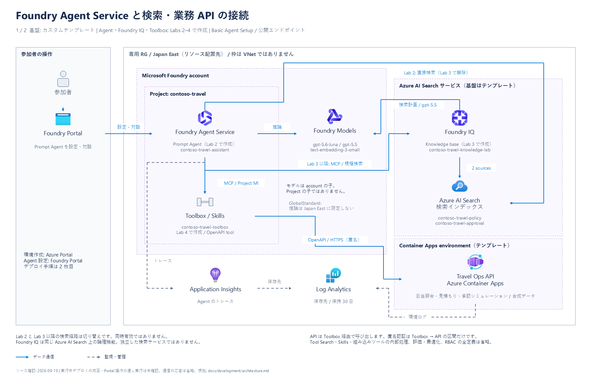

**日本語** | [English](README.en.md)

# Microsoft Foundry Agent Service Hands-on

架空の Contoso 社の出張・経費アシスタントを作る、9 つの演習です。
検索、ツール、評価、最適化から Hosted Agent までを体験します。

[**Lab 1 から始める**](labs/01-setup.md) ·
[参加条件](docs/participant/prerequisites.md) ·
[準備ガイド](docs/participant/environments/custom-template.md)

[拡大表示（PNG）](docs/images/azure-architecture-01.png) ·
[編集用 PowerPoint（2枚）](docs/diagrams/azure-architecture.pptx) ·
[デプロイと初期化の流れ](docs/images/azure-architecture-02.png) ·
[構成と通信経路の詳細](docs/development/architecture.md)

## 進め方

1. **Lab 1**：Azure Portal で、この演習専用のリソース グループ（RG）を 1 つ作成します。
   次に、管理者から案内されたテンプレートを使い、作成した RG に環境をデプロイします。
2. **Labs 2〜6**：Microsoft Foundry Portal でエージェントを作り、
   Foundry IQ や Toolbox を追加して機能を強化します。さらに、評価と最適化を通じて、
   エージェントの精度を継続的に改善するサイクルを学びます。
3. **Labs 7〜8**：[GitHub Codespaces](docs/participant/environments/codespaces.md) または
   [ローカルの Dev Container](docs/participant/environments/local-dev-container.md) で、Agent Framework を使ってエージェントをコードから作ります。
   Lab 7ではPlain AgentとHarness AgentをDev Container内で実行し、動作を比較します。
   Lab 8では別の順次実行ワークフローを構築し、Hosted Agent としてデプロイします。
4. **Lab 9**：Prompt Agent と Hosted Agent のトレースを比較し、処理の流れや性能の違いを確認します。
   最後に成果物を保存し、Hosted Agent と利用した開発環境を片付けてから、専用 RG を削除します。

Notebook・Python コードはリポジトリに揃っています。フォルダーの手動アップロードは不要です。
Codespaces のブラウザー経路では、PC への Docker・Python のインストールも不要です。

## 演習一覧

| Lab | 内容 | 目安 |
|---|---|---:|
| [Lab 1](labs/01-setup.md) | 環境作成と初期化の確認 | [開催枠を確認](#開催時間と事前準備) |
| [Lab 2](labs/02-prompt-agent.md) | Prompt Agent と Azure AI Search | 20分 |
| [Lab 3](labs/03-rag-foundry-iq.md) | Foundry IQ | 25分 |
| — | 休憩 | 10分 |
| [Lab 4](labs/04-tools-toolbox.md) | Toolbox、OpenAPI、Skills、Tool Search | 30分 |
| [Lab 5](labs/05-evaluation.md) | エージェントの評価 | 15分 |
| [Lab 6](labs/06-optimization.md) | Agent Optimizer | 20分 |
| [Lab 7](labs/07-agent-framework-harness.md) | Codespaces の準備、Agent Framework、Harness Agent | 50分 |
| [Lab 8](labs/08-hosted-multi-agent.md) | Hosted Agent のワークフロー | 30分 |
| [Lab 9](labs/09-observability-cleanup.md) | トレースの比較と片付け | 20分 |

## 開催時間と事前準備

表の目安は **Lab 1を除き、休憩込みで合計220分（3時間40分）** です。
表の時間は進行計画に使う目安です。実測済みの開催時間としては扱いません。
Lab 1の時間はここでは未計測として扱い、環境作成の時間をこの合計へ含めていません。
評価・最適化・デプロイの待機やトラブル対応により、実際の終了時刻は変わります。

開催案内で、Lab 1を事前に実施するか当日に実施するかを確認してください。
Lab 2へ進む前に、Lab 1の初期化成功まで確認します。
主催者は実環境での事前確認を基に準備時間と余裕を見積もり、
事前作成する場合の課金・保持期間・片付け担当も案内します。
詳しくは [講師向けの時間計画](instructor/README.md#開催時間の計画) を参照してください。

## 読者別の資料

| 読者 | 参照先 |
|---|---|
| 参加者 | [資料一覧](docs/README.md)、[困ったとき](docs/participant/troubleshooting.md)、[費用と片付け](docs/participant/costs-and-cleanup.md) |
| 管理者・講師 | [事前準備・モデル一覧](docs/admin/prerequisites.md)、[講師向けガイド](instructor/README.md) |
| 教材開発者 | [開発者向けガイド](docs/development/README.md)、[構成と設計](docs/development/architecture.md) |

説明文は日本語を正本とし、[英語版 README](README.en.md)を併記しています。

> [!IMPORTANT]
> 合成データだけを使い、認証情報・トークンを共有・保存しないでください。
> Azure と Codespaces の利用には料金が発生する場合があります。
> 終了時は Lab 9 に従い、**自分の専用 RG だけ**を削除して、削除完了を確認します。
