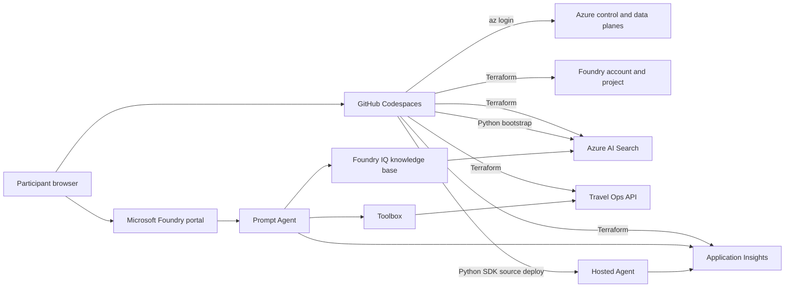

# Architecture

## Goal

The workshop must be repeatable from a GitHub Codespace by a participant who can run
`az login` and is Owner only on an existing Azure resource group. Subscription-level
preparation is deliberately separated from participant setup.

The core path is intentionally a **Basic Agent Setup**. Azure AI Search is provisioned
for workshop knowledge, but Agent Service state remains platform-managed. This avoids
Cosmos DB, capability hosts, ACR, and private networking in the limited workshop slot.

## Runtime view

## Resource ownership

| Object | Owner | Lifecycle |
|---|---|---|
| Existing resource group | Workshop administrator | Never created or deleted by this repository |
| Foundry account/project and model deployments | Terraform | `setup.sh` / `destroy.sh` |
| Search, Application Insights, Container Apps | Terraform | `setup.sh` / `destroy.sh` |
| Search index documents | Bootstrap adapter | Idempotent upsert after Terraform |
| Prompt Agent and Foundry IQ knowledge base | Participant in portal | Deleted with the parent project |
| Toolbox versions | Participant in portal; optional SDK adapter | Created in Lab 4; SDK edits preserve Skills and guardrails |
| Travel Ops Skills | Participant in portal | Upload synthetic `data/skills/` content in Lab 4; remove references before deleting Skills |
| Synthetic evaluation dataset and rubric | Setup adapter | Idempotently prepared for Portal Labs 5 and 6 |
| Evaluation runs | Participant in portal | Created in Lab 5; deleted with the parent project |
| Hosted Agent and immutable versions | Python SDK wrapper | Created in Lab 7; deleted before Terraform |
| Hosted Agent runtime telemetry role | Hosted Agent deploy adapter | Resource-scoped grant after the runtime identity exists |

Terraform and SDK wrappers must not manage the same object.

## Resource set

Core infrastructure in the participant resource group:

- Microsoft Foundry account (`AIServices`) with project management enabled
- Microsoft Foundry project
- `gpt-5.6-luna` deployment for Prompt/Hosted Agent inference and Foundry IQ query planning
- `gpt-5.5` deployment for configurable LLM evaluation judges and Agent Optimizer
- `text-embedding-3-small`, deployed as `embedding`, for the seeded vector indexes
- Azure AI Search Basic, one replica and one partition
- Log Analytics and workspace-based Application Insights
- Container Apps consumption environment and scale-to-zero Travel Ops API

The exact model version, deployment SKU, and capacity are inputs. The subscription
administrator preflight verifies them before participants start.

There are exactly three deployments. `primary_model_deployment_name` still exposes
`gpt-5.6-luna`; `optimizer_model_deployment_name` exposes `gpt-5.5`; the embedding output
remains unchanged. Foundry IQ shares the primary deployment, not the optimizer.
Evaluation still invokes the Luna-backed target agent, while configurable judges use
GPT-5.5. Service-managed safety evaluators do not receive a judge deployment override.
The two chat model versions have no Terraform defaults: preflight discovers each
version and quota `usageName` from the same required-SKU catalog entry.

Initial capacities are 40/20/40K TPM, respectively, subject to live preflight evidence.
Shared uses are counted once per deployment, not once per lab. Verify that the current
Portal uses a [Search API compatible with Luna knowledge-base query planning](https://learn.microsoft.com/azure/search/agentic-retrieval-how-to-create-knowledge-base);
model catalog availability alone does not prove picker/API compatibility.

## Authentication and authorization

The participant authenticates interactively with Azure CLI. Terraform and Python use
the same cached Entra identity through `DefaultAzureCredential`.

- No client secrets or service-principal credentials are required.
- Local/shared keys are disabled where supported.
- The participant receives Foundry and data-plane roles inside the existing resource
  group through Terraform.
- The project, Search, and Hosted Agent runtime identities receive only the
  resource-scoped roles needed for model, data, and trace access.
- Terraform state can contain provider-computed credentials and is treated as
  sensitive even when runtime access is keyless.

## Control-plane and data-plane split

AzureRM is used for stable Azure resources. AzAPI is used for the current Foundry
account/project/deployment/connection resource shapes when AzureRM does not expose the
required contract. Terraform provider auto-registration is disabled because a resource
group Owner cannot register resource providers.

Data-plane operations remain in typed Python adapters:

- load synthetic source documents directly into Azure AI Search
- generate embeddings
- create/update the semantic vector indexes
- merge-or-upload indexed chunks
- export live OpenAPI and Skill ZIPs for Portal upload without remote writes
- optionally update Toolbox tools or connect an existing Toolbox when UI is unavailable
- create optional automated evaluation runs
- prepare the synthetic evaluation dataset and rubric used by the Portal
- deploy/delete Hosted Agent versions from source and grant their dynamic runtime
  identities trace-ingestion access

Pure configuration, chunking, validation, and policy logic is kept independent from
Azure clients so tests run without Azure access.

Lab 4 separates API execution from behavioral guidance: the Toolbox includes the
Travel Ops OpenAPI tool plus `travel-estimation` and `preapproval-simulation` Skills.
Foundry IQ remains the policy knowledge source, and Skills do not duplicate rate tables.
Skills are MCP resources, not ordinary API tools or authorization controls. Consumers
need a compatible Skill provider; neither a successful API call nor registration in
the Portal proves a Skill was loaded. The Lab 7 workflow remains independent of this
preview runtime integration.

## Network posture

The workshop uses public service endpoints protected by Entra ID/RBAC. It does not
configure VNet injection, private endpoints, private DNS, customer-managed keys, or
network-isolated evaluation. These are production design topics, not hidden defaults.

## Failure boundaries

1. `admin-preflight.sh` reports subscription blockers before the event.
2. `preflight.sh` fails before Terraform when identity, RG, provider, region, quota
   evidence, or policy is missing.
3. Terraform failure leaves state for a safe retry.
4. Bootstrap uses upsert semantics and validates the final index.
5. Hosted remote build polls to a bounded terminal status and exposes build failure
   details.
6. Cleanup removes data-plane children before their Terraform-managed parent and only
   deletes local state after Azure cleanup succeeds.

## Maintainability checks

- Business rules in the mock API and Hosted workflow are testable without HTTP or Azure.
- Preview API shapes are isolated behind adapters and contract tests.
- Generated resource values have one source of truth: `.workshop/context.json`.
- Optional Fabric IQ, Work IQ, A2A, ACR, and CI/CD material cannot alter the core setup.
