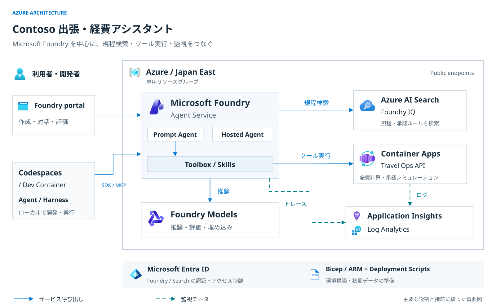

# Workshop architecture

[Full-size SVG](images/azure-architecture.svg) ·
[Editable draw.io source](diagrams/azure-architecture.drawio) ·
[Icon attribution](images/ATTRIBUTION.md#diagrams)

The diagram prioritizes readability: it shows the main service roles, not every resource,
connection or deployment step. Resource names, model capacities, the account/project hierarchy
and detailed identity wiring are intentionally left to the sections below. The bottom strip
summarizes authentication and provisioning rather than resource placement.

It combines template-provisioned services with objects participants create during the labs.
The **Foundry IQ path is used from Lab 3 onward**; Lab 2's earlier direct Search tool is not shown.
The boundary is not a VNet, and the diagram is not deployment evidence. Japan East is the
configured resource location; **GlobalStandard** models do not imply a regional inference boundary.

## Reading the connections

| Path | Meaning |
|---|---|
| Solid blue | Service requests: Portal operations, SDK/MCP calls, model inference and tool execution. Responses are omitted for clarity. |
| Dashed teal | Foundry agent traces to workspace-based Application Insights, and Container Apps environment logs to Log Analytics. |

The Foundry project and model deployments are separate children of the same Foundry account.
The knowledge base is backed by **Azure AI Search** and is configured through Foundry Portal.
Search uses its managed identity to call the Foundry models for query planning and embeddings;
this secondary connection is omitted from the overview.

| Runtime | Runs in | Dependencies |
|---|---|---|
| Prompt Agent, Labs 3–6 | Foundry Agent Service | Primary model + Foundry IQ; Toolbox is added in Lab 4 |
| Plain Agent / Harness, Lab 7 | Codespaces or the local Dev Container | Both call the primary model and Foundry IQ directly; Harness additionally uses Toolbox tools and Skills |
| Hosted workflow, Lab 8 | Foundry Agent Service, following a source remote build | `intake_agent` → `policy_agent` → `reviewer_agent`; all use the primary model, only `policy_agent` calls Foundry IQ |

The Dev Container's SDK/MCP arrow summarizes Azure access; it does not place the local Harness inside
Foundry or route its Search calls through a hosted agent. The Lab 8 workflow does **not** call
Toolbox, Skills or the Travel Ops API. Evaluation and Agent Optimizer use the same `gpt-5.5`
deployment also used for Foundry IQ query planning.

The OpenAPI hop from Toolbox to the synthetic Travel Ops API uses **Anonymous HTTPS**.
That exception does not make Foundry, Toolbox or Search anonymous: the workshop uses Microsoft
Entra ID, the project/runtime identities and scoped RBAC for those services.

## Editing the architecture diagram

Open `docs/diagrams/azure-architecture.drawio` in draw.io / diagrams.net. Resource containers,
service icons, text and attached connectors are individually editable. The official SVG icons
are embedded, so the diagram does not depend on externally hosted images.

After an edit, save the `.drawio` source and export **SVG** to
`docs/images/azure-architecture.svg`. Include a copy of the diagram and embedded images, retain
the white background, and keep **Formatted Text** and **Word Wrap** disabled for labels so the
SVG uses native text rather than `foreignObject`. Update the two READMEs and this page together
if the architecture changes; `infra/main.bicep` and the lab implementations remain the source
of truth.

The earlier step-oriented views remain available separately:
[provisioning overview](images/workshop-architecture.svg)
([Excalidraw source](diagrams/workshop-architecture.excalidraw)) and
[learning flow](images/workshop-learning-flow.svg)
([Excalidraw source](diagrams/workshop-learning-flow.excalidraw)).

## Ownership

| Owner | Responsibility |
|---|---|
| Participant / Azure Portal | Manually create one dedicated RG; select that existing RG in the custom template; keep other defaults; verify success; delete the RG at the end |
| Bicep / generated ARM | Foundry, models, Search, API, monitoring, connections and scoped RBAC within the existing RG |
| Deployment Scripts | Seed two Search indexes, prepare evaluation data and rubric, validate, then return completed context |
| GitHub | Shared Skill ZIPs and OpenAPI under `assets/`; notebooks, scripts and Python source |
| Foundry Portal | Prompt Agent, Foundry IQ, Toolbox, evaluation, optimizer and traces |
| Codespaces / local Dev Container | The same Notebook environment for Labs 7/8; personal Azure CLI sign-in and Hosted lifecycle commands |

The Portal template is generated from `infra/main.bicep`. Bootstrap prepares data, not the learning
Agent, knowledge base or Toolbox. Participants create those in the labs.

## Azure services

One dedicated **Japan East** RG contains:

- Foundry project `contoso-travel`, **Basic Agent Setup**
- GlobalStandard: `gpt-5.6-luna` **40K TPM**, `gpt-5.5` **100K TPM**,
  `embedding` / `text-embedding-3-small` **40K TPM**
- Search **Basic** with `contoso-travel-policy` and `contoso-travel-approval`
- Public Container Apps Travel Ops API
- Log Analytics and Application Insights
- System identities, scoped RBAC and a dedicated bootstrap user-assigned identity

`contoso-travel-search` is the AAD Search resource connection.
`contoso-travel-knowledge-lab-mcp` and `contoso-travel-appinsights` use **Project Managed Identity**.
Foundry and Search local auth stay disabled; public endpoints remain enabled.

Application Insights and Log Analytics remain in use for trace collection and inspection.
Automatic alerts are outside the workshop scope; no alert rules or notification groups are
deployed by this template, and `Microsoft.AlertsManagement` registration is not required.
Azure's default alert creation is separate; see [the administrator note](admin/troubleshooting.md#application-insights-の自動アラート).

Infrastructure and bootstrap implementation details are in [infra/README.md](../infra/README.md).
Release defaults and publication checks are in [administrator prerequisites](admin/prerequisites.md).

## Materials and connection settings

- Lab 4 downloads `assets/skills/travel-estimation.zip`, `assets/skills/preapproval-simulation.zip`
  and `assets/openapi/travel-ops.openapi.json` directly from GitHub.
  Each Skill ZIP contains `SKILL.md` at its root; source text stays in `data/skills/`.
  Only OpenAPI `servers[0].url` changes, using the participant's ARM `travelApiBaseUrl`.
- ARM exposes `resourceOutputs`, `workshopContext`, `travelApiBaseUrl` and `foundryPortalUrl`.
  `workshopContext.setup_status = complete` is available only after initialization succeeds.
- In the container, `notebooks/00-setup.ipynb` uses `scripts/configure_workshop.py` to retrieve that
  successful context from subscription ID and RG name and write `.workshop/context.json`.
  Schema `2.0` keeps the canonical `resource_outputs.<key>.value` structure.
- Dev Container post-create prepares separate Python **3.12** management and **3.13** Hosted venvs
  outside the checkout. It does not sign in or provision Azure. The participant signs in once
  with Azure CLI before running notebooks; GitHub and Portal logins are separate.
- Setup uses **Python (Foundry Workshop)**. Labs 7/8 use **Python (Foundry Hosted Agent)**;
  deploy/delete cells explicitly call the management venv and require confirmation.

Shared Skill ZIPs and the Hosted API's source-code ZIP serve different purposes; both remain in use.
There is no environment-specific workshop archive to download.

## Finish

Save/export results → delete Hosted Agent versions → stop/delete the Codespace →
Azure Portal **Delete resource group** for only the participant's RG → verify deletion.
Deleting deployment history does not delete resources. Follow [Lab 9](../labs/09-observability-cleanup.md).
