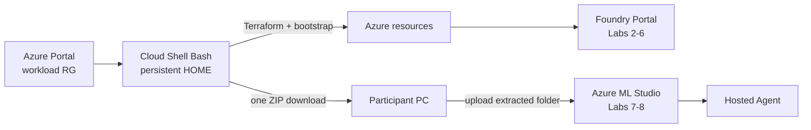

# Hybrid architecture

## Ownership

| Owner | Objects / responsibility |
|---|---|
| Azure Portal | workload resource group; Lab 7 Compute creation/deletion |
| Azure Cloud Shell Bash | first-run persistent Storage creation; persisted repository/state; setup/destroy; one ZIP download |
| Terraform | Foundry/project/models, Search, monitoring, Container Apps API, Search/Foundry IQ/trace connections, RBAC, Azure ML workspace/backing resources |
| Python setup adapters | Search documents, evaluation assets, validation, live Portal assets, handoff ZIP |
| Foundry Portal | Prompt Agent, Foundry IQ, Toolbox, evaluation, optimizer, traces |
| Azure ML | Notebook kernels, Agent Framework, Hosted Agent data-plane lifecycle |

Terraform intentionally does not create Azure ML Compute. The participant creates it only for Labs 7/8
to keep Cloud Shell occupancy short.

## Handoff boundary

Setup writes canonical `.workshop/context.json` with `resource_outputs`, then creates exactly:

```text
.workshop/download/foundry-workshop-files.zip
```

The ZIP includes non-secret context, generated `portal-assets`, notebooks, and source. It excludes
Terraform state, `.env`, tokens, credentials, infrastructure source, and local environments.



## Resource topology

One Japan East workload resource group contains Foundry Basic Agent Setup project `contoso-travel`,
three fixed deployments, Search Basic, monitoring, public Container Apps Travel Ops API, managed
identities/connections, and Azure ML workspace with Storage/Key Vault/Application Insights.
No Cosmos DB, Agent capability host, ACR, or private networking is added.

## Authentication and data boundary

Cloud Shell uses its Azure CLI session; Azure ML uses interactive Azure CLI authentication when
needed. Service calls use Microsoft Entra ID and managed identities. Local auth is disabled where
specified. No key/secret is packaged. Traces can retain prompts, responses, and tool arguments, so
only synthetic data is permitted.

## Lifecycle

1. Portal creates workload RG.
2. Cloud Shell first-run UI creates persistent Storage; mount verification completes before timing.
3. Cloud Shell setup provisions, bootstraps, validates, packages, downloads, exits.
4. Foundry Portal runs Labs 2–6.
5. Azure ML Compute is created, bundle uploaded, kernels prepared, Labs 7–8 executed.
6. Export notebooks; remove Hosted/data-plane objects; stop/delete Compute.
7. Same persistent Cloud Shell repository/state runs destroy.
8. Verify RG empty; Portal deletes workload RG; Cloud Shell exits.
9. Cloud Shell storage is handled separately only when dedicated and policy permits.
