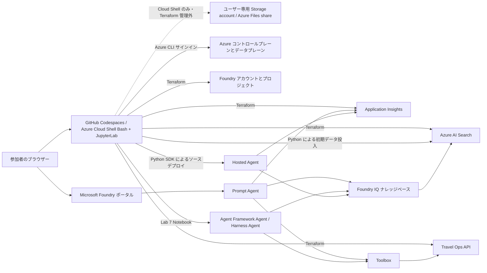

# アーキテクチャ

## 目標

このハンズオンは、`az login` を実行でき、既存の Azure リソースグループに対してのみ
Owner 権限を持つ参加者が、GitHub Codespaces または Azure Cloud Shell Bash + JupyterLab から
繰り返し実施できる構成とします。
サブスクリプションレベルの事前準備は、参加者によるセットアップと明確に分離しています。
実行環境の選択は準備時だけに集約し、Lab 2〜9 と Lab 7 / 8 の Notebook を共用します。

必須の手順では、意図的に **Basic Agent Setup** を採用しています。ハンズオンの
ナレッジ用に Azure AI Search をプロビジョニングしますが、Agent Service の状態は
引き続きプラットフォームが管理します。これにより、限られたハンズオン時間内に
Cosmos DB、capability host、ACR、プライベートネットワークを扱わずに済みます。

## 実行時の構成

[draw.io で編集する](diagrams/workshop-architecture.drawio) ·
[SVG を開く](images/workshop-architecture.drawio.svg)

図は Lab 8 までで完成する構成を示します。枠はリソースや論理機能のまとまりであり、
VNet などのネットワーク境界ではありません。Foundry IQ の knowledge base と 2 つの
index は Azure AI Search 上に置き、Lab 7 のローカル実行からも同じ資産を参照します。
Foundry と Search などは Entra ID/RBAC を使いますが、**合成データ専用の公開
Travel Ops API だけは Anonymous** です。

図形・ラベル・接続線を編集できる `.drawio` と、元の図データも埋め込んだ SVG を
用意しています。アイコンは
[Microsoft 公式 Azure Architecture Icons](https://learn.microsoft.com/azure/architecture/icons/)
の V24（2026-09-09 取得）を使用し、各ファイル内に埋め込んでいます。

テキスト版の構成を開く（Mermaid）

## リソースの管理責任

| 対象 | 管理主体 | ライフサイクル |
|---|---|---|
| 教材workload用リソースグループ | 参加者が前提条件のAzure portal手順で作成 | Terraform実行前は空。このリポジトリでは作成も削除もしない |
| Cloud Shell の専用 RG / Storage account / Azure Files share | Cloud Shell の初回UIが参加者ごとに自動作成。新規RGを許可しない組織だけ管理者が既存Storageを割り当てる。Terraform管理外 | workload cleanup、成果物退避、session終了、設定解除の後に、自動作成された専用RG一式だけを削除。既存Storageは割当範囲だけを扱う |
| Foundry アカウント / プロジェクトとモデルのデプロイ | Terraform | `setup.sh` / `destroy.sh` |
| Search, Application Insights, Container Apps | Terraform | `setup.sh` / `destroy.sh` |
| Search インデックス内のドキュメント | 初期データ投入アダプター | Terraform の実行後に、繰り返しても結果が変わらない追加・更新（upsert）を実行 |
| Prompt Agent と Foundry IQ ナレッジベース | 参加者がポータルで管理 | 親プロジェクトとともに削除 |
| Toolbox のバージョン | 参加者がポータルで管理。任意で SDK アダプターを使用 | Lab 4 で作成。SDK による編集では既存の Skills とガードレールを保持 |
| Travel Ops Skills | 参加者がポータルで管理 | Lab 4 で `data/skills/` 内の合成コンテンツをアップロード。Skills を削除する前に参照を解除 |
| 合成の評価データセットと評価基準（ルーブリック） | セットアップアダプター | ポータルで実施する Lab 5 と Lab 6 に向けて冪等に準備 |
| 評価実行 | 参加者がポータルで管理 | Lab 5 で作成。親プロジェクトとともに削除 |
| Hosted Agent と変更不可のバージョン | Python SDK ラッパー | Lab 8 で作成。Terraform による削除の前に削除 |
| Hosted Agent ランタイムの Search / Foundry / テレメトリ用ロール | Hosted Agent デプロイアダプター | ランタイム ID の作成後、Search Index Data Reader、Foundry User、Monitoring Metrics Publisher を各 resource scope で冪等に付与 |

Terraform と SDK ラッパーが同じオブジェクトを管理してはいけません。

### 実行環境と永続化の境界

- Codespaces は既存 devcontainer、Cloud Shell はユーザー領域の準備スクリプトを使います。
  どちらも Python 3.13 と2つの `.venv` / kernels を維持します。
  root の `azure-ai-projects==2.5.0` と Hosted Agent の `<2.4` は統合しません。
- Cloud Shell の JupyterLab は root 環境から起動し、`foundry-workshop` と
  `foundry-hosted-agent` を選択します。Notebook の公開ルートは repository 内に限定し、
  認証・XSRF を維持した Web preview を使います。
- Cloud Shell の HOME は Azure Files に保存される disk image の永続マウントを確認して使用します。
  repository、`.venv`、Terraform state、`.workshop` は HOME 内へ置き、
  `clouddrive` の SMB share 直下に実行環境を作りません。ephemeral session は本編の対象外です。
- HOME の保持は実際の再起動で確認します。ファイル保存はプロセス・kernel 内メモリーの
  永続化ではありません。再開時は activation、Jupyter 起動、必要なセルの再実行が必要です。

手順は [Codespaces](participant/environments/codespaces.md) /
[Cloud Shell](participant/environments/cloud-shell.md) を参照してください。
Cloud Shell 用 storage は、Foundry のナレッジ用 Storage や Terraform remote backend ではありません。
自動作成されたCloud Shell専用RGは、教材workload用の既存RGとは別であり、
このリポジトリのTerraformから作成・削除しません。

## リソース構成

参加者のリソースグループ内に作成する必須のインフラストラクチャは次のとおりです。

- プロジェクト管理を有効にした Microsoft Foundry アカウント（`AIServices`）
- Microsoft Foundry プロジェクト
- Prompt / Hosted Agent 本体が共有する `gpt-5.6-luna` デプロイ
- Foundry IQ、Lab 5 の設定可能な LLM 評価、Lab 6 の Agent Optimizer が共有する
  必須の `gpt-5.5` デプロイ
- 初期データを投入するベクトルインデックス用に、`embedding` という名前でデプロイする `text-embedding-3-small`
- Azure AI Search Dedicated Basic（レプリカ 1、パーティション 1）。`--ai-search-serverless`
  指定時は Serverless Developer preview
- Log Analytics とワークスペースベースの Application Insights
- Container Apps の従量課金環境と、ゼロまでスケールできる Travel Ops API

正確なモデルバージョン、デプロイ SKU、容量は入力値として指定します。
参加者の開始前に、サブスクリプション管理者向けの事前チェックでこれらを検証します。

3つのデプロイはすべて必須です。`primary_model_deployment_name` は Prompt / Hosted Agent
本体が使う `gpt-5.6-luna` を示します。`evaluation_model_deployment_name` と
`optimizer_model_deployment_name` は同じ `gpt-5.5` デプロイを示し、Foundry IQ、
Lab 5 の judge、Lab 6 の Evaluation / Optimization model に使用します。サービスが管理する
安全性評価器には、判定モデルのデプロイを上書きする設定を渡しません。
Luna と GPT-5.5 のバージョンには Terraform の既定値を設けず、どちらも必須にします。
事前チェックで、各モデルのバージョンとクォータの `usageName` を、
それぞれ同一の必須 SKU カタログエントリから取得します。

既定の容量はそれぞれ 40/100/40K TPM ですが、実環境の事前チェック結果に従います。
共有の GPT-5.5 には Foundry IQ、評価、最適化を実行できるよう100を割り当てます。
これは既存のクォータ内で GlobalStandard のスループットを割り当てるものであり、
サブスクリプションのクォータ上限を引き上げたり、トークン利用料を固定額にしたりするものではありません。
実際の使用量には引き続き課金され、100 単位でも HTTP 429 応答が発生しない保証はありません。
共有用途の容量は、ラボごとではなくデプロイごとに 1 回だけ計上します。
Foundry IQ と Optimizer の2つのモデル選択では GPT-5.5 を選びます。
モデルカタログに掲載されているだけでは、選択 UI や API との互換性は確認できません。
[Search のモデルと API の要件](https://learn.microsoft.com/azure/search/agentic-retrieval-how-to-create-knowledge-base)
と
[Agent Optimizer の対応モデル](https://learn.microsoft.com/azure/foundry/agents/concepts/agent-optimizer-overview#models)
を実際のポータルの選択欄と照合してください。

## 認証と認可

参加者は Azure CLI のサインインを使います。Terraform は Azure CLI 認証、
Python は `DefaultAzureCredential` を通じて同じ参加者の Entra ID を使用します。
Cloud Shell では既存の Azure CLI サインインを使い、教材のローカルプロセスだけ
`AZURE_TOKEN_CREDENTIALS=AzureCliCredential` に限定します。
この設定を Hosted Agent のデプロイ先へ渡さず、Hosted runtime は managed identity を使います。

- クライアントシークレットやサービスプリンシパルの資格情報は不要です。
- 対応している Foundry workload のサービスでは、ローカルキーと共有キーを無効にします。
  Cloud Shell の storage マウントは別のサービス要件です。必要な方式が組織ポリシーで
  禁止されている場合は、ポリシーを弱めず管理者へ相談します。
- Terraformを通じて、参加者が事前作成したworkload用RG内でFoundryとデータプレーンのロールを付与します。
- プロジェクト、Search、Hosted Agent ランタイムの ID には、モデル、データ、
  トレースへのアクセスに必要なリソーススコープのロールのみを付与します。
- Terraform の状態ファイルにはプロバイダーが生成した資格情報が含まれる可能性があるため、
  実行時のアクセスがキーレスであっても機密情報として扱います。

## コントロールプレーンとデータプレーンの分離

安定した Azure リソースには AzureRM を使用します。現在の Foundry のアカウント、
プロジェクト、デプロイ、接続のリソース形式について、AzureRM が必要な API 契約に対応していない場合は
AzAPI を使用します。リソースグループの Owner はリソースプロバイダーを登録できないため、
Terraform プロバイダーの自動登録は無効にしています。

データプレーン操作は、型付きの Python アダプターで実施します。

- 合成のソースドキュメントを Azure AI Search に直接読み込む
- 埋め込みを生成する
- セマンティックベクトルインデックスを作成・更新する
- インデックス化したチャンクを追加・更新する（`merge-or-upload`）
- リモートへの書き込みを行わず、ポータルへのアップロード用に稼働中の API の OpenAPI 定義と Skill ZIP をエクスポートする
- UI が利用できない場合に、任意で Toolbox のツールを更新するか、既存の Toolbox を接続する
- 任意の自動評価実行を作成する
- ポータルで使用する合成の評価データセットとルーブリックを準備する
- ソースから Hosted Agent のバージョンをデプロイ・削除し、動的に作成されるランタイム ID にトレース取り込み権限を付与する

構成、チャンク分割、検証、ポリシーに関する純粋なロジックは Azure クライアントから独立させ、
Azure にアクセスせずにテストを実行できるようにしています。

Lab 4 では、API の実行と動作の指針を分離します。Toolbox には Travel Ops OpenAPI ツールに加え、
`travel-estimation` と `preapproval-simulation` の Skills を含めます。
ポリシーに関するナレッジの参照元は引き続き Foundry IQ とし、Skills に料金表を重複して持たせません。
Skills は MCP リソースであり、通常の API ツールや認可制御ではありません。
利用するクライアントには、互換性のある Skill プロバイダーが必要です。
API 呼び出しの成功やポータルへの登録だけでは、Skill が読み込まれたことを証明できません。
Lab 7 は Foundry IQ と Toolbox Skills を Agent Framework から再利用し、plain Agent から
Harness Agent へ発展させます。Lab 8 は Luna の token 消費を抑えるため Harness を
引き継がず、`intake_agent`、Foundry IQ を持つ `policy_agent`、`reviewer_agent` という
通常 Agent の sequential workflow を使います。Lab 8 は checked-in source と Lab 3 の
Foundry IQ に依存し、Lab 7 の Notebook session state には依存しません。

## ネットワークの方針

このハンズオンでは、Entra ID/RBAC で保護されたパブリックなサービスエンドポイントを使用します。
VNet インジェクション、プライベートエンドポイント、プライベート DNS、カスタマーマネージドキー、
ネットワーク分離された評価は構成しません。これらは本番環境の設計で検討する項目であり、
暗黙に有効になる既定の設定ではありません。

## 障害時の処理範囲

1. `admin-preflight.sh` は、開催前にサブスクリプションに関する阻害要因を報告します。
2. ID、リソースグループ、プロバイダー、リージョン、クォータの確認情報、ポリシーのいずれかが
   不足している場合、`preflight.sh` は Terraform の実行前に失敗します。
3. Terraform が失敗した場合は、安全に再試行できるよう状態ファイルを残します。
4. 初期データ投入には upsert を使用し、最終的なインデックスを検証します。
5. Hosted Agent のリモートビルドは、制限時間内で終了状態になるまでポーリングし、
   ビルド失敗の詳細を表示します。
6. クリーンアップでは、Terraform が管理する親リソースより先にデータプレーンの子オブジェクトを削除し、
   Azure 側のクリーンアップが成功した後にのみローカルの状態ファイルを削除します。

## 保守性の確認項目

- モック API と Hosted Agent ワークフローの業務ルールは、HTTP や Azure を使わずにテストできます。
- プレビュー API の形式は、アダプターと契約テストで分離します。
- 生成されたリソースの値は、`.workshop/context.json` を唯一の正とします。
- 任意の Fabric IQ、Work IQ、A2A、ACR、CI/CD の教材で、必須のセットアップを変更してはいけません。
