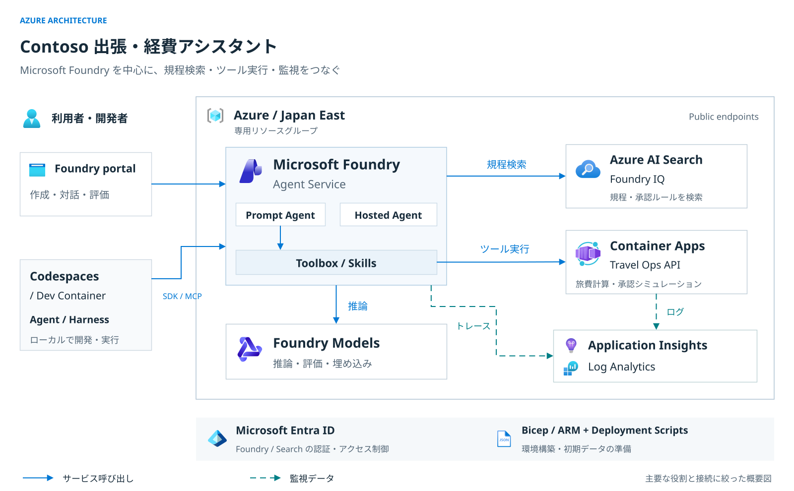

# ハンズオンの構成

[開発者向けガイド](README.md) / [本編の対応範囲](feature-support-matrix.md)

この文書は、教材開発者がサービスの責務、通信経路、認証、教材の受け渡しを確認するための資料です。
構成の正本は `infra/main.bicep` と各 Lab の実装です。
参加者向けの操作は [Lab 1](../../labs/01-setup.md) から順に確認してください。

## 構成図

[拡大表示（SVG）](../images/azure-architecture.svg) ·
[編集用 draw.io](../diagrams/azure-architecture.drawio) ·
[画像・アイコンの出典](../images/ATTRIBUTION.md#構成図)

図は主要サービスの役割を示しています。すべてのリソース、接続、デプロイ手順を描いたものではありません。
リソース名、モデルの容量、アカウントとプロジェクトの階層、ID の設定は後続の節で説明します。
図の下段は認証と環境作成の概要であり、リソースの配置を表していません。

テンプレートが作るサービスと、参加者が演習中に作るオブジェクトを同じ図に含めています。
Foundry IQ の経路は Lab 3 以降で使い、Lab 2 で先に使う Search ツールの直接接続は省略しています。
図の境界は仮想ネットワークではなく、図自体もデプロイの実行証跡ではありません。
リソースの配置先は Japan East ですが、`GlobalStandard` のモデルは推論処理のリージョン境界を保証しません。

## 通信経路と実行場所

| 表示 | 意味 |
|---|---|
| 青の実線 | Portal 操作、SDK / MCP 呼び出し、モデル推論、ツール実行の要求。応答は省略しています。 |
| 青緑の破線 | Foundry のトレースをワークスペースベースの Application Insights へ、Container Apps 環境のログを Log Analytics へ送る経路です。 |

Foundry プロジェクトとモデルのデプロイは、同じ Foundry アカウント配下の別々の子リソースです。
ナレッジベースには Azure AI Search を使い、Foundry Portal で設定します。
Search はマネージド ID で Foundry のモデルを呼び出し、検索計画と埋め込みを処理します。
この追加の接続は概要図では省略しています。

| 実行対象 | 実行場所 | 依存先 |
|---|---|---|
| Prompt Agent（Labs 3〜6） | Foundry Agent Service | 主モデルと Foundry IQ。Lab 4 で Toolbox を追加します。 |
| Plain Agent / Harness（Lab 7） | Codespaces またはローカル Dev Container | 両方が主モデルと Foundry IQ を直接呼びます。Harness は Toolbox のツールと Skills も使います。 |
| Hosted ワークフロー（Lab 8） | ソースコードのリモートビルド後、Foundry Agent Service で実行 | `intake_agent` → `policy_agent` → `reviewer_agent`。全員が主モデルを使い、Foundry IQ を呼ぶのは `policy_agent` だけです。 |

Dev Container の SDK / MCP の矢印は Azure へのアクセスをまとめたものです。
ローカルの Harness が Foundry 内で動いたり、Hosted Agent 経由で検索したりする意味ではありません。
Lab 8 のワークフローは Toolbox、Skills、Travel Ops API を呼びません。
評価と Agent Optimizer は、Foundry IQ の検索計画にも使う `gpt-5.5` の同じデプロイを使います。

Toolbox から合成データ用の Travel Ops API への OpenAPI 接続は、匿名認証の HTTPS です。
Foundry、Toolbox、Search への認証はこの例外に含まれません。
これらには Microsoft Entra ID、プロジェクト・実行環境の ID、対象を限定したロールベースのアクセス制御（RBAC）を使います。

## 構成図の編集

`docs/diagrams/azure-architecture.drawio` を draw.io / diagrams.net で開きます。
リソースの枠、サービスアイコン、テキスト、接続線は個別に編集できます。
公式の SVG アイコンを埋め込んでおり、外部ホストの画像には依存しません。

変更後は `.drawio` を保存し、`docs/images/azure-architecture.svg` へ SVG を書き出します。
図のコピーと画像を埋め込み、白背景を維持します。ラベルの **Formatted Text** と
**Word Wrap** は無効にし、`foreignObject` ではなく SVG のテキストを使います。
構成を変更した場合は、日本語・英語の README とこの文書を同時に更新します。

手順を中心にした図は、次の資料として残しています。

- [環境作成の概要](../../docs/images/workshop-architecture.svg)（[Excalidraw の編集用データ](../../docs/diagrams/workshop-architecture.excalidraw)）
- [学習の流れ](../../docs/images/workshop-learning-flow.svg)（[Excalidraw の編集用データ](../../docs/diagrams/workshop-learning-flow.excalidraw)）

## 責務の分担

| 担当 | 責務 |
|---|---|
| 参加者 / Azure Portal | 専用リソースグループ（RG）を 1 個手動作成し、テンプレートでその RG を選択します。他の既定値を維持し、成功を確認した後、終了時に RG を削除します。 |
| Bicep / 生成した ARM テンプレート | 既存 RG 内の Foundry、モデル、Search、API、監視基盤、接続、対象を限定した RBAC を管理します。 |
| Deployment Scripts | Search の 2 インデックスへデータを投入し、評価データと評価基準を準備・検証して、完了した接続情報を返します。 |
| GitHub | `assets/` の共通 Skill ZIP・OpenAPI、Notebook、スクリプト、Python ソースを保持します。 |
| Foundry Portal | Prompt Agent、Foundry IQ、Toolbox、評価、最適化、トレースの操作に使います。 |
| Codespaces / ローカル Dev Container | Labs 7〜8 の共通 Notebook 環境です。本人の Azure CLI サインインと Hosted Agent の作成・削除を行います。 |

Portal 用テンプレートは `infra/main.bicep` から生成します。
初期化処理が準備するのはデータです。学習用エージェント、ナレッジベース、Toolbox は参加者が演習で作ります。

## Azure のリソースと制約

Japan East の専用 RG に、次のリソースを配置します。

- Foundry プロジェクト `contoso-travel`。構成は **Basic Agent Setup** です。
- `GlobalStandard` の主モデル、評価・最適化用モデル、埋め込みモデル。
  モデル名と容量は [管理者向けのモデル利用枠](../../docs/admin/prerequisites.md#モデルの利用枠) を参照します。
- Search **Basic** と `contoso-travel-policy`、`contoso-travel-approval` の 2 インデックス。
- 公開エンドポイントを持つ Container Apps の Travel Ops API。
- Log Analytics と Application Insights。
- システム割り当て ID、対象を限定した RBAC、初期化専用のユーザー割り当て ID。

Search のリソース接続は AAD 認証、ナレッジベースの MCP と Application Insights の接続は
**Project Managed Identity** を使います。接続名・API バージョン・設定は
[インフラの接続スキーマ](../../infra/README.md#接続スキーマの例外) を参照します。
Foundry と Search のローカル認証は無効、公開エンドポイントは有効です。

Application Insights と Log Analytics はトレースの収集・閲覧に使います。
自動アラートは演習の対象外で、テンプレートはアラートルールや通知グループを作成しません。
`Microsoft.AlertsManagement` の登録も前提条件に含めません。
Azure が別途作る既定アラートの扱いは、[管理者向けの説明](../../docs/admin/troubleshooting.md#application-insights-の自動アラート)を参照してください。

初期化基盤の詳細は [インフラ実装ガイド](../../infra/README.md)、
リリース既定値と公開前の確認は [管理者向け前提条件](../../docs/admin/prerequisites.md) にまとめています。

## 教材と接続情報の受け渡し

- Lab 4 は `assets/skills/travel-estimation.zip`、`assets/skills/preapproval-simulation.zip`、
  `assets/openapi/travel-ops.openapi.json` を GitHub から直接取得します。
  Skill ZIP の直下に `SKILL.md` を置き、ソースは `data/skills/` で管理します。
  OpenAPI は `servers[0].url` だけを、本人の ARM 出力 `travelApiBaseUrl` に変更します。
- ARM は `resourceOutputs`、`workshopContext`、`travelApiBaseUrl`、`foundryPortalUrl` を出力します。
  初期化成功後にだけ `workshopContext.setup_status = complete` を返します。
- コンテナー内の `notebooks/00-setup.ipynb` は `scripts/configure_workshop.py` を使い、
  サブスクリプション ID と RG 名から成功した環境の情報を取得して `.workshop/context.json` に保存します。
  スキーマ `2.0` の正規構造は `resource_outputs.<key>.value` です。
- Dev Container の作成後処理は、チェックアウトの外に Python 3.12 の管理用仮想環境と
  Python 3.13 の Hosted 用仮想環境を分けて準備します。Azure の認証や環境作成は行いません。
  Notebook 実行前に本人が Azure CLI へサインインします。GitHub / Portal の認証とは別です。
- 初期設定には **Python (Foundry Workshop)**、Labs 7〜8 には
  **Python (Foundry Hosted Agent)** を使います。デプロイ・削除セルは明示的に管理用仮想環境を呼び、確認入力を要求します。

共通 Skill ZIP と Hosted API に渡すソースコード ZIP は用途が異なり、両方を使います。
環境固有の教材アーカイブを配布する構成ではありません。

## 終了時の操作

成果物の保存・エクスポート、Hosted Agent の全バージョンの削除、Codespace の停止・削除の順に進みます。
続けて Azure Portal の **Delete resource group** で本人の専用 RG を削除し、削除完了を確認します。
デプロイ履歴を消すだけではリソースは削除されません。[Lab 9](../../labs/09-observability-cleanup.md) に従ってください。
