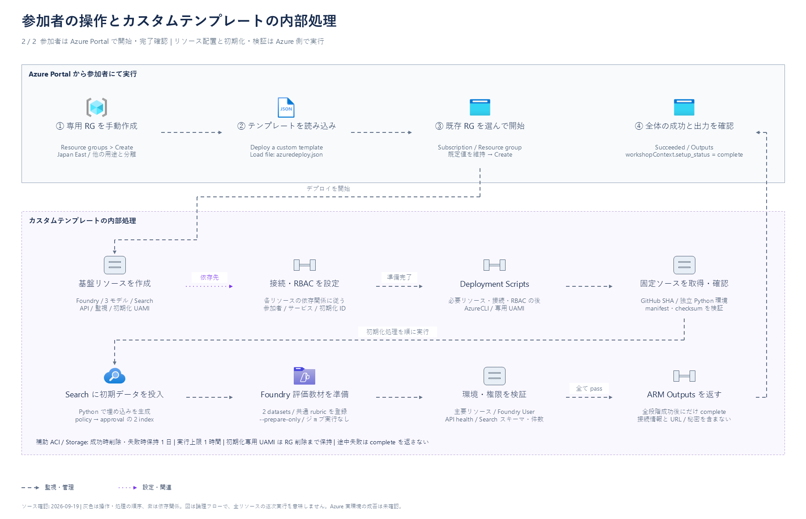

# ハンズオンの構成

[開発者向けガイド](README.md) / [本編の対応範囲](feature-support-matrix.md)

この文書は、教材開発者がサービスの責務、通信経路、認証、教材の受け渡しを確認するための資料です。
構成の正本は `infra/main.bicep` と各 Lab の実装です。
参加者向けの操作は [Lab 1](../../labs/01-setup.md) から順に確認してください。

## 構成図


[拡大表示（PNG）](../images/azure-architecture-01.png) ·
[編集用 PowerPoint（2枚）](../diagrams/azure-architecture.pptx) ·
[概要図の JSON](../diagrams/azure-architecture.json) ·
[画像・アイコンの出典](../images/ATTRIBUTION.md#構成図)

1 枚目は **カスタムテンプレートの基盤と、Labs 2〜4 で追加するサービス接続**です。
基盤は `infra/main.bicep` が正本で、生成した `infra/azuredeploy.json` を既存の専用 RG へ適用します。
Prompt Agent、Foundry IQ の Knowledge base、Toolbox はテンプレートではなく各 Lab で作成するため、
図の該当ノードに作成する Lab を記載しています。Codespaces / Dev Container と Hosted Agent は図に含めません。

2 枚目は参加者の Azure Portal 操作と、カスタムテンプレート内部のデプロイ・初期化・検証を分けています。
RBAC の全定義、Tool Search・Skills・組み込みツールの内部処理、評価・最適化ジョブは省略しています。
境界は仮想ネットワークではなく、図自体も実行中デプロイの成否を確認した証跡ではありません。
リソースの配置先は Japan East ですが、`GlobalStandard` のモデルは推論処理のリージョン境界を保証しません。

## サービスの接続と作成時点

| 表示 | 意味 |
|---|---|
| 青の実線 | Agent のモデル推論、検索、ツール呼び出し。応答は省略します。Lab 2 と Lab 3 以降の検索経路は切り替えであり、同時有効ではありません。 |
| 灰色の破線 | 1 枚目は監視、2 枚目は参加者の操作と内部処理の順序。 |
| 紫の点線の矢印 | リソースと接続・RBAC の依存関係。すべてのリソースを逐次実行する指定ではありません。 |
| 紫の破線の枠 | Foundry のリソース階層、Search 上の論理機能、Container Apps 環境、処理の担当範囲。ネットワーク境界ではありません。 |

| 接続 | リポジトリで定義した動き |
|---|---|
| Agent Service → Azure AI Search | Lab 2 は `contoso-travel-policy` を Semantic 検索します。Lab 3 でこの直接検索ツールを解除します。 |
| Agent Service → Foundry IQ → Search indexes | Lab 3 以降の経路です。Knowledge base は同じ Search サービス上にあり、policy と approval の 2 つの indexed knowledge source を使います。独立した Search サービスを追加する構成ではありません。 |
| Foundry IQ → Foundry Models | Lab 3 の検索計画に `gpt-5.5` / Medium を設定します。初期データの埋め込み生成は別経路であり、Deployment Scripts 内の Python が行います。 |
| Agent Service → Toolbox → Travel Ops API | Lab 4 は Knowledge を残したまま、Toolbox を MCP / Project Managed Identity で接続します。Toolbox が OpenAPI の 4 operation を公開し、匿名 HTTPS で API を呼び出します。Agent から API への直接接続ではありません。 |

Foundry プロジェクトとモデルのデプロイは、同じ Foundry アカウント配下の別々の子リソースです。
テンプレートは Search の AAD 接続、Search ID のモデル利用権限、Project Managed Identity による
Application Insights 接続を準備します。MCP 接続も先に定義しますが、接続先の Knowledge base 本体は
後の演習で作成します。Application Insights の保存先は共通の Log Analytics ワークスペースで、
Container Apps 環境のログもそのワークスペースへ送る設定です。

## 参加者の操作とテンプレート内部の処理



[デプロイ・初期化の拡大表示（PNG）](../images/azure-architecture-02.png) ·
[デプロイ・初期化図の JSON](../diagrams/azure-architecture-deployment.json)

参加者側は RG の手動作成、テンプレートの読み込み、既存 RG を指定した開始、完了確認です。
CLI / Python による初期化を参加者の PC で実行する構成ではありません。
内部のリソース・接続・RBAC は Bicep の依存関係に従い、準備が整ってから Deployment Scripts が開始します。
図のリソース作成と権限設定の箱は責務を分けたもので、全リソースを一列に逐次作成する意味ではありません。

Deployment Scripts は専用 UAMI で固定ソースを取得し、独立した Python 環境を準備します。
`bootstrap_data.py` が文書の埋め込みを生成し、policy、approval の順に Search データを投入します。
続いて評価用・最適化用の 2 datasets と共通 rubric を登録します。
`--prepare-only` は登録後に終了するため、評価・最適化ジョブや Agent 作成は実行しません。
最後の検証対象は接続情報、主要リソース、対象参加者の Foundry User ロール、
API の health、Search のスキーマと件数です。参加者として全サービスを操作する通し試験ではありません。
全段階の成功後にだけ `workshopContext.setup_status = complete` を返します。
補助 ACI / Storage は成功時に片付け、失敗時の保持期間は 1 日、実行上限は 1 時間です。
初期化専用 UAMI とその権限は専用 RG を削除するまで保持します。

## Lab ごとの実行場所

1 枚目は Prompt Agent の接続を示しています。Lab 7 のローカル実行と Lab 8 の Hosted ワークフローは
図の対象外ですが、後続 Lab での再利用先として次にまとめます。

| 実行対象 | 実行場所 | 依存先 |
|---|---|---|
| Prompt Agent（Labs 3〜6） | Foundry Agent Service | 主モデルと Foundry IQ。Lab 4 で Toolbox を追加します。 |
| Plain Agent / Harness（Lab 7） | Codespaces またはローカル Dev Container | 両方が主モデルと Foundry IQ を直接呼びます。Harness は Toolbox のツールと Skills も使います。 |
| Hosted ワークフロー（Lab 8） | ソースコードのリモートビルド後、Foundry Agent Service で実行 | `intake_agent` → `policy_agent` → `reviewer_agent`。全員が主モデルを使い、Foundry IQ を呼ぶのは `policy_agent` だけです。 |

Lab 7 の SDK / MCP はモデル・Foundry IQ・Toolbox を直接呼びます。
ローカルの Harness が Foundry 内で動いたり、Hosted Agent 経由で検索したりする意味ではありません。
Lab 8 のワークフローは Toolbox、Skills、Travel Ops API を呼びません。
評価と Agent Optimizer は、Foundry IQ の検索計画にも使う `gpt-5.5` の同じデプロイを使います。

Toolbox から合成データ用の Travel Ops API への OpenAPI 接続は、匿名認証の HTTPS です。
Foundry、Toolbox、Search への認証はこの例外に含まれません。
これらには Microsoft Entra ID、プロジェクト・実行環境の ID、対象を限定したロールベースのアクセス制御（RBAC）を使います。

## 構成図の編集

主成果物は `docs/diagrams/azure-architecture.pptx` です。
サービスごとの公式 SVG・名前・説明をグループ化し、境界・文字・通信線は個別の
PowerPoint オブジェクトにしています。図全体を 1 枚の画像として貼り付けたものではありません。
選択ウィンドウの `service:`、`boundary:`、`flow:` で対象を探せます。
サービスを移動すると接続端は追従しますが、折れ線の途中の経路は手動調整が必要です。

表示確認には PNG、編集にはデスクトップ版 PowerPoint を使ってください。
今回の Copilot 内蔵プレビューでは、PPTX の SVG 拡張画像とネイティブ接続線が描画されませんでした。
データが消えたわけではありません。PNG はデスクトップ版 PowerPoint から書き出しています。

再生成の正本はサービス接続図とデプロイ・初期化図の 2 つの JSON です。
使用する 11 個の公式 SVG は `docs/diagrams/azure-icons/` に同梱し、
[取得元・SHA-256](../diagrams/azure-icons/manifest.json)を記録しています。
PPTX を手編集した内容は JSON に戻りません。手編集版を保存した後は、
その変更を取り込まずに JSON から上書きしないでください。

再生成には Windows、デスクトップ版 PowerPoint、Python 3.10 以降、pywin32 と
`azure-architecture-powerpoint` Skill が必要です。
既存の `.venv` を使い、リポジトリルートの PowerShell から次を実行します。
pywin32 がない場合だけ、同 Skill の `requirements.txt` からその仮想環境へ復元してください。

```powershell
$SkillDir = Join-Path $HOME '.copilot\skills\azure-architecture-powerpoint'
$Python = '.\.venv\Scripts\python.exe'
& $Python "$SkillDir\scripts\build_powerpoint.py" `
  '.\docs\diagrams\azure-architecture.json' `
  '.\docs\diagrams\azure-architecture-deployment.json' `
  --icons-dir '.\docs\diagrams\azure-icons' `
  --output '.\artifacts\architecture\azure-architecture.pptx'
& $Python "$SkillDir\scripts\validate_powerpoint.py" `
  '.\artifacts\architecture\azure-architecture.pptx'
```

PowerPoint 本体から PPTX と `azure-architecture-01.png`、`azure-architecture-02.png` を生成します。
既存出力があれば停止するため、次回は空の出力先を使ってください。
両方の PNG で文字切れ・交差・線の向きを確認してから、PPTX を `docs/diagrams/`、
PNG を `docs/images/` に反映します。構成を変えたら、日本語・英語の README とこの文書も更新します。

公開リポジトリへ反映する前に、組織の秘密度ラベルが公開可能な設定であることと、
作成者・最終更新者の個人メタデータが残っていないことを確認します。
秘密度は組織の方針に沿って PowerPoint で設定し、ラベルの削除で回避しません。

旧 [draw.io](../diagrams/azure-architecture.drawio) と
[SVG](../images/azure-architecture.svg) は更新前の履歴として保持しています。
現行構成の正本・再生成元には使いません。

手順を中心にした図は、次の資料として残しています。

- [環境作成の概要](../../docs/images/workshop-architecture.svg)（[Excalidraw の編集用データ](../../docs/diagrams/workshop-architecture.excalidraw)）
- [学習の流れ](../../docs/images/workshop-learning-flow.svg)（[Excalidraw の編集用データ](../../docs/diagrams/workshop-learning-flow.excalidraw)）

### 図の前提と出典

確認日は **2026-09-19** です。今回の入力プロンプトは
「Azure 構成図作成のスキルを用いて、現状の構成図をアップデートして！」です。
追加指定「今は、Codespacesを使っておらず、カスタムテンプレートによるデプロイを実行しています。」
に従い、Codespaces は図から除外しています。その後の接続追加の指定を反映し、
1 枚目には Labs 2〜4 の Agent Service・Search・Foundry IQ・Toolbox 経由 API を加え、
2 枚目を「Azure Portal から参加者にて実行」と「カスタムテンプレートの内部処理」に分けました。

| 図の判断 | 確認したリポジトリ内の根拠 |
|---|---|
| Search 直接接続を IQ に切り替える | [Lab 2](../../labs/02-prompt-agent.md#5-azure-ai-search-tool-を接続する)、[Lab 3](../../labs/03-rag-foundry-iq.md#2-knowledge-base-を-agent-に接続する)。Portal 操作の定義として確認。 |
| IQ の 2 sources と検索計画モデル | [Lab 3 の設定](../../labs/03-rag-foundry-iq.md#1-foundry-iq-knowledge-base-を作成する)。`gpt-5.5`、Medium、2 index を指定。 |
| Agent → MCP Toolbox → OpenAPI API | [Toolbox 接続](../../scripts/connect_toolbox.py#L37-L63)、[MCP 接続と Agent への追加](../../scripts/create_toolbox.py#L403-L513)、[OpenAPI 認証](../../scripts/create_toolbox.py#L83-L132)、[Lab 4](../../labs/04-tools-toolbox.md)。 |
| API の 4 operation と合成データ処理 | [FastAPI router](../../src/travel-api/travel_api/adapters/api/routes.py#L49-L145)、[OpenAPI 正本](../../assets/openapi/travel-ops.openapi.json)。実承認ではなくシミュレーション。 |
| 作成する基盤、待ち合わせ、完了出力 | [Bicep](../../infra/main.bicep#L113-L709)、[参加者操作](../../labs/01-setup.md#3-初期化の成功を待つ)。 |
| 固定ソースと独立 Python 環境 | [Deployment Scripts ラッパー](../../scripts/bootstrap-custom-template.sh#L30-L180)。 |
| データ投入 → 評価教材 → 検証 → complete | [初期化順序](../../scripts/bootstrap_custom_template.py#L163-L251)、[成功判定](../../scripts/bootstrap_custom_template.py#L263-L339)、[完了出力](../../scripts/bootstrap_custom_template.py#L365-L401)。 |
| 初期化 Python が埋め込みを生成する | [OpenAI クライアントからの生成](../../scripts/bootstrap_data.py#L1068-L1107)。Search サービスが初期データを埋め込む図にはしていません。 |
| 評価・最適化ジョブを初期化で実行しない | [`--prepare-only` の早期終了](../../scripts/run_evaluation.py#L724-L771)。 |
| 初期化後に確認する範囲 | [検証項目](../../scripts/validate_environment.py#L471-L591)。Foundry User の権限付与を確認し、全参加者権限の実操作試験とは区別。 |

テンプレートに固定された `sourceRevision` と作業ツリーの初期化用 5 ファイルも比較しました。
差分は `run_evaluation.py` の docstring 内の参照先だけで、図示した初期化ロジックは一致しています。
図の検査は [構成図の契約テスト](../../tests/contract/test_architecture_diagrams_contract.py) にあり、
直接 API 接続、IQ の別サービス化、検索経路の同時有効化、参加者による初期化実行、
初期化中の評価ジョブ実行、検証前の完了出力という 6 つの誤った検体を拒否することも確認します。

今回の図の更新では Azure へのデプロイ・Lab の通し実行は行っていません。
実行中のデプロイについて Azure の状態照会も行っていないため、成否は未確認です。
Basic Agent Setup のサービス管理ストレージ、RBAC の全定義、Labs 7〜8 の通信経路は図から省略しています。

| 確認した内容 | Microsoft Learn の一次情報 |
|---|---|
| Foundry アカウント配下のプロジェクトとモデルの階層 | [projects（2026-05-01）](https://learn.microsoft.com/en-us/azure/templates/microsoft.cognitiveservices/2026-05-01/accounts/projects)、[deployments（2026-05-01）](https://learn.microsoft.com/en-us/azure/templates/microsoft.cognitiveservices/2026-05-01/accounts/deployments) |
| Foundry IQ と Azure AI Search の関係 | [What is Foundry IQ?](https://learn.microsoft.com/en-us/azure/foundry/agents/concepts/what-is-foundry-iq)、[Agentic retrieval](https://learn.microsoft.com/en-us/azure/search/agentic-retrieval-overview) |
| Deployment Scripts の実行主体・補助リソース・出力 | [Use deployment scripts in ARM templates](https://learn.microsoft.com/en-us/azure/azure-resource-manager/templates/deployment-script-template) |
| Container Apps 環境からのログ送信 | [Log storage and monitoring options](https://learn.microsoft.com/en-us/azure/container-apps/log-options) |
| Application Insights と Log Analytics の関係 | [Workspace-based Application Insights](https://learn.microsoft.com/en-us/azure/azure-monitor/app/create-workspace-resource) |
| GlobalStandard の推論処理場所 | [Foundry deployment types](https://learn.microsoft.com/en-us/azure/foundry/foundry-models/concepts/deployment-types) |

この図は現行教材の Preview 接続定義を含む構成を示し、機能全体の GA・SLA を保証しません。
アイコンの利用条件は[出典一覧](../images/ATTRIBUTION.md#構成図)を参照してください。

## 責務の分担

| 担当 | 責務 |
|---|---|
| 参加者 / Azure Portal | 専用リソースグループ（RG）を 1 個手動作成し、テンプレートでその RG を選択します。他の既定値を維持し、成功を確認した後、終了時に RG を削除します。 |
| Bicep / 生成した ARM テンプレート | 既存 RG 内の Foundry、モデル、Search、API、監視基盤、接続、対象を限定した RBAC を管理します。 |
| Deployment Scripts | Search の 2 インデックスへデータを投入し、評価データと評価基準を準備・検証して、完了した接続情報を返します。 |
| GitHub | `assets/` の共通 Skill ZIP・OpenAPI、Notebook、スクリプト、Python ソースを保持します。 |
| Foundry Portal | Prompt Agent、Foundry IQ、Toolbox、評価、最適化、トレースの操作に使います。 |
| Codespaces / ローカル Dev Container | Labs 7〜8 の共通 Notebook 環境です。本人の Azure CLI サインインと Hosted Agent の作成・削除を行います。 |

Portal 用テンプレートは `infra/main.bicep` から生成します。
初期化処理が準備するのはデータです。学習用エージェント、ナレッジベース、Toolbox は参加者が演習で作ります。

## Azure のリソースと制約

Japan East の専用 RG に、次のリソースを配置します。

- Foundry プロジェクト `contoso-travel`。構成は **Basic Agent Setup** です。
- `GlobalStandard` の主モデル、評価・最適化用モデル、埋め込みモデル。
  モデル名と容量は [管理者向けのモデル利用枠](../../docs/admin/prerequisites.md#モデルの利用枠) を参照します。
- Search **Basic** と `contoso-travel-policy`、`contoso-travel-approval` の 2 インデックス。
- 公開エンドポイントを持つ Container Apps の Travel Ops API。
- Log Analytics と Application Insights。
- システム割り当て ID、対象を限定した RBAC、初期化専用のユーザー割り当て ID。

Search のリソース接続は AAD 認証、ナレッジベースの MCP と Application Insights の接続は
**Project Managed Identity** を使います。接続名・API バージョン・設定は
[インフラの接続スキーマ](../../infra/README.md#接続スキーマの例外) を参照します。
Foundry と Search のローカル認証は無効、公開エンドポイントは有効です。

Application Insights と Log Analytics はトレースの収集・閲覧に使います。
自動アラートは演習の対象外で、テンプレートはアラートルールや通知グループを作成しません。
`Microsoft.AlertsManagement` の登録も前提条件に含めません。
Azure が別途作る既定アラートの扱いは、[管理者向けの説明](../../docs/admin/troubleshooting.md#application-insights-の自動アラート)を参照してください。

初期化基盤の詳細は [インフラ実装ガイド](../../infra/README.md)、
リリース既定値と公開前の確認は [管理者向け前提条件](../../docs/admin/prerequisites.md) にまとめています。

## 教材と接続情報の受け渡し

- Lab 4 は `assets/skills/travel-estimation.zip`、`assets/skills/preapproval-simulation.zip`、
  `assets/openapi/travel-ops.openapi.json` を GitHub から直接取得します。
  Skill ZIP の直下に `SKILL.md` を置き、ソースは `data/skills/` で管理します。
  OpenAPI は `servers[0].url` だけを、本人の ARM 出力 `travelApiBaseUrl` に変更します。
- ARM は `resourceOutputs`、`workshopContext`、`travelApiBaseUrl`、`foundryPortalUrl` を出力します。
  初期化成功後にだけ `workshopContext.setup_status = complete` を返します。
- コンテナー内の `notebooks/00-setup.ipynb` は `scripts/configure_workshop.py` を使い、
  サブスクリプション ID と RG 名から成功した環境の情報を取得して `.workshop/context.json` に保存します。
  スキーマ `2.0` の正規構造は `resource_outputs.<key>.value` です。
- Dev Container の作成後処理は、チェックアウトの外に Python 3.12 の管理用仮想環境と
  Python 3.13 の Hosted 用仮想環境を分けて準備します。Azure の認証や環境作成は行いません。
  Notebook 実行前に本人が Azure CLI へサインインします。GitHub / Portal の認証とは別です。
- 初期設定には **Python (Foundry Workshop)**、Labs 7〜8 には
  **Python (Foundry Hosted Agent)** を使います。デプロイ・削除セルは明示的に管理用仮想環境を呼び、確認入力を要求します。

共通 Skill ZIP と Hosted API に渡すソースコード ZIP は用途が異なり、両方を使います。
環境固有の教材アーカイブを配布する構成ではありません。

## 終了時の操作

成果物の保存・エクスポート、Hosted Agent の全バージョンの削除、Codespace の停止・削除の順に進みます。
続けて Azure Portal の **Delete resource group** で本人の専用 RG を削除し、削除完了を確認します。
デプロイ履歴を消すだけではリソースは削除されません。[Lab 9](../../labs/09-observability-cleanup.md) に従ってください。
