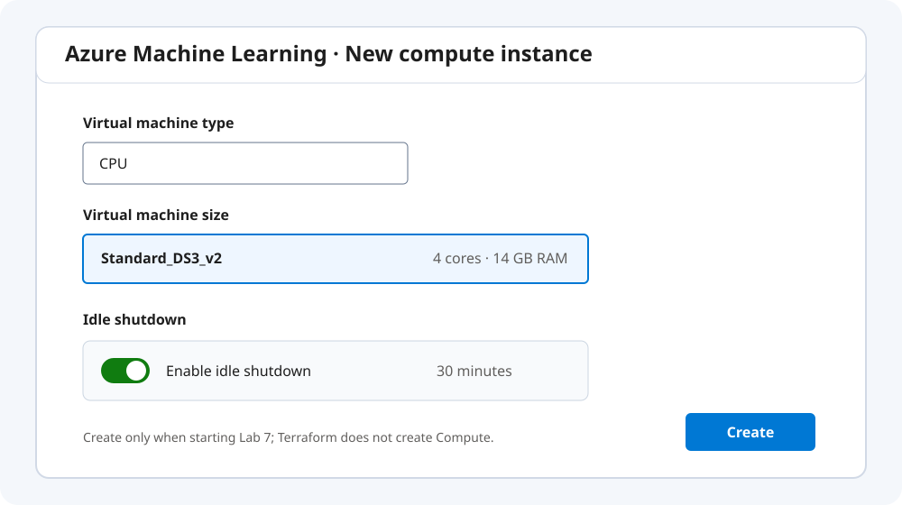
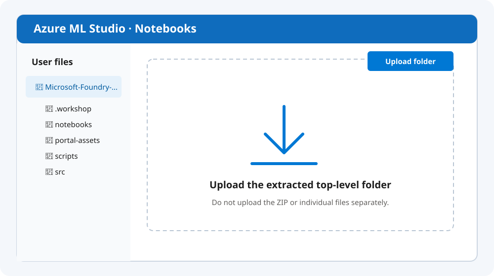
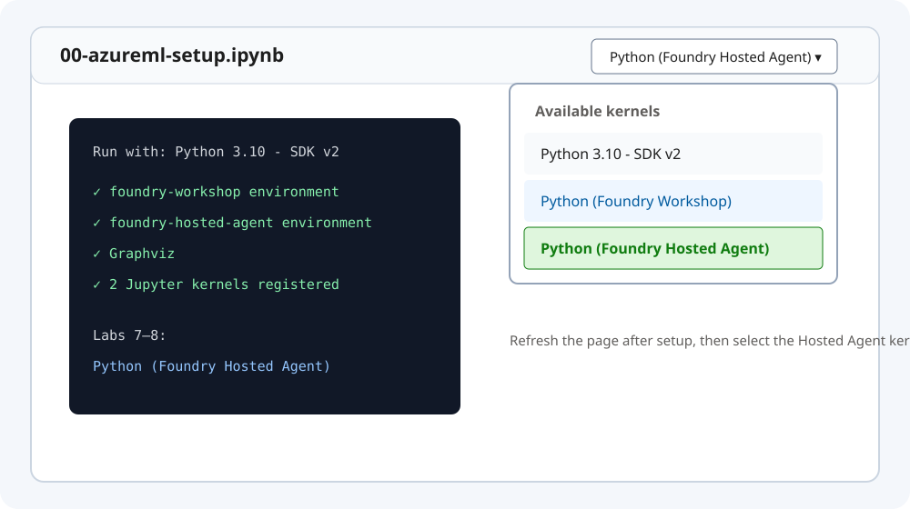

# Azure Machine Learning Studio — Labs 7 / 8

Azure ML Studio は Labs 7/8 の Notebook execution environment です。Terraform が workspace、
Storage、Key Vault、Application Insights を作成済みですが、Compute instance は作りません。

## 1. bundle を確認

Lab 1 で PC に download・展開した最上位 folder を使います。
`.workshop/context.json`、`notebooks/`、`src/` が揃っていることを確認します。
canonical context は non-secret で、key は `resource_outputs` です。

## 2. Compute instance

1. [Azure ML Studio](https://ml.azure.com) で Terraform-created workspace を開く。
2. **Compute > Compute instances > New**。
3. **Virtual machine type = CPU**、size **Standard_DS3_v2**。
4. **Idle shutdown** を有効化して作成。



Compute は Lab 7 直前に作り、不要時は Stop します。workspace や Compute を共有せず、
production data を upload しません。

## 3. User files upload

**Notebooks > User files** で、PC に展開した最上位 folder を folder ごと upload します。
ZIP のまま upload せず、個別ファイルもばらばらにしません。



## 4. 2 kernels を作る

1. `notebooks/00-azureml-setup.ipynb` を開く。
2. built-in **Python 3.10 - SDK v2** kernel を選ぶ。
3. cell を上から実行し、**Python (Foundry Workshop)** と
   **Python (Foundry Hosted Agent)** の 2 kernels を作る。
4. page を refresh し、両方を選択できることを確認。



setup Notebook は environment preparation 専用です。Labs 7/8 は
**Python (Foundry Hosted Agent)** を選びます。Notebook 保存は kernel memory の保存では
ありません。Compute 再起動後は必要な cell を上から再実行します。

## 5. Authentication

必要な場合は Azure ML **Terminal** で次を実行し、同じ subscription を選びます。

```bash
az login --use-device-code
az account set --subscription "<subscription-id>"
```

device code、token、credential を Notebook、チャット、ログ、スクリーンショットへ
貼り付けません。長期共有 secret へ切り替えません。

## 6. Export / Stop / Delete

Lab 9 で必要な Notebook と安全な結果を PC へ **Export** します。その後 Compute instance を
**Stop** し、続けて **Delete** します。Terraform-created Azure ML workspace は Cloud Shell
の destroy で削除します。Compute が残っている状態で destroy へ進みません。
