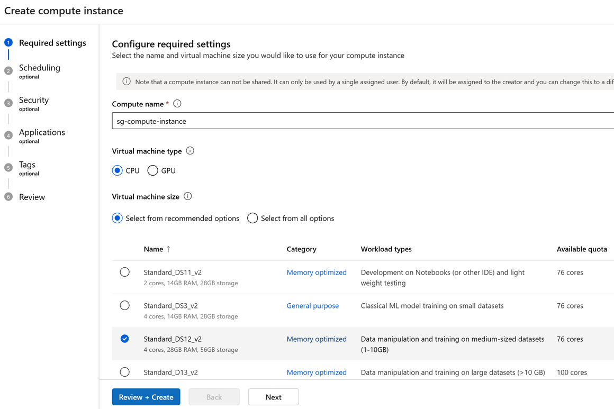
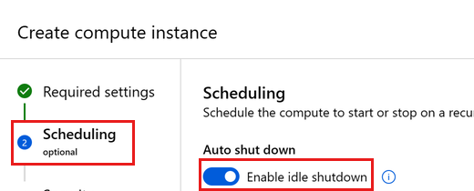
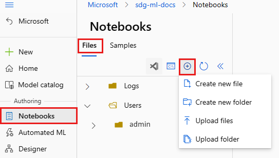

# Azure Machine Learning Studio — Labs 7 / 8

Azure ML Studio は Labs 7/8 の Notebook execution environment です。Lab 1 の custom template が
workspace、Storage、Key Vault、Application Insights を作成済みですが、Compute instance は作りません。

## 1. bundle を確認

Lab 1 で private container `workshop-files` から **Microsoft Entra user account** で
download・展開した最上位 `Microsoft-Foundry-Agent-Service-Handson` folder を使います。
`.workshop/context.json`、`notebooks/`、`src/` が揃っていることを確認します。
canonical context は non-secret で、値は `resource_outputs.<key>.value` です。
`setup_status = complete` と管理者指定の `source_revision` も確認します。

## 2. Compute instance

1. **Lab 7 の開始時に** [Azure ML Studio](https://ml.azure.com) で template が作成した workspace を開く。
2. **Compute > Compute instances > New**。
3. **Virtual machine type = CPU**、size **Standard_DS3_v2**。
4. **Idle shutdown** を有効化し、**30 minutes** に設定して作成。





Compute は Lab 7 直前に作り、不要時は Stop します。workspace や Compute を共有せず、
production data を upload しません。

## 3. User files upload

**Notebooks > User files > Upload folder** で、PC に展開した最上位 folder を folder ごと upload します。
ZIP のまま upload せず、個別ファイルもばらばらにしません。
隠し folder の `.workshop/context.json` を含め、`portal-assets/`、`scripts/`、
`notebooks/`、`src/hosted-agent/`、必要な `tests/` の相対位置を保ちます。



## 4. 2 kernels を作る

1. `notebooks/00-azureml-setup.ipynb` を開く。
2. built-in **Python 3.10 - SDK v2** kernel を選ぶ。
3. cell を上から実行し、**Python (Foundry Workshop)** と
   **Python (Foundry Hosted Agent)** の 2 kernels を作る。
4. page を refresh し、両方を選択できることを確認。


setup Notebook は environment preparation 専用です。Labs 7/8 は
**Python (Foundry Hosted Agent)** を選びます。Notebook 保存は kernel memory の保存では
ありません。Compute 再起動後は必要な cell を上から再実行します。

## 5. Authentication

必要な場合は Azure ML **Terminal** で次を実行し、同じ subscription を選びます。

```bash
az login --use-device-code
az account set --subscription "<subscription-id>"
```

device code、token、credential を Notebook、チャット、ログ、スクリーンショットへ
貼り付けません。長期共有 secret へ切り替えません。

## 6. Export / Stop / Delete

Lab 9 で必要な Notebook と安全な結果を PC へ **Export** します。
**Python (Foundry Hosted Agent)** の cleanup cell で Hosted Agent / versions を削除してから、
Compute instance を **Stop**、続けて **Delete** します。その後 Azure Portal で専用 RG の
**Delete resource group** を実行し、workspace / backing resources ごと削除されたことを確認します。
deployment history の削除だけでは resources は消えません。
