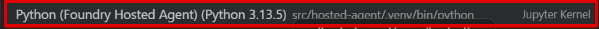

# 実行環境ガイド — GitHub Codespaces

従来の **GitHub Codespaces** 経路です。ブラウザーの VS Code で Terminal と Notebook を使います。
環境の準備後は [Lab 1 の手順 2](../../../labs/01-setup.md#2-事前確認を実行する)に戻り、
Cloud Shell を選んだ参加者と同じ Labs 2〜9 を進めます。
[実行環境の選択へ戻る](../prerequisites.md)

## Codespace を開いて準備する

1. 講師が指定した GitHub リポジトリとブランチを開きます。
2. ファイル一覧の上で **Code → Codespaces** を選択します。
3. 指定のブランチで **Create a codespace on …**（画像では右上の **＋**）を選択します。
   演習用の Codespace がある場合は、同じリポジトリ・ブランチのものを開き直します。
4. ブラウザーに VS Code が開いたら、初期化が終わるまで待ちます。


**Running postCreateCommand** は準備中の表示です。
エラーが出たら先へ進まず、[トラブルシューティング](../troubleshooting.md)を確認してください。

フォルダーを信頼するか尋ねられたら、講師指定のリポジトリであることを確認して
**Trust Folder & Continue** を選択します。無関係なフォルダーは信頼しないでください。

devcontainer は Python 3.13、Azure CLI、Terraform、Graphviz、Foundry Toolkit と
2つの Notebook kernels を用意します。PC 側へインストールする必要はありません。
**Terminal > New Terminal** で repository root の Terminal を開き、次を確認します。

```bash
pwd
.venv/bin/python --version
src/hosted-agent/.venv/bin/python --version
dot -V
```

両方の Python が `3.13.x` であることを確認します。
root `.venv` は管理・デプロイ用、`src/hosted-agent/.venv` は Agent Framework 演習用です。
`azure-ai-projects` の依存が競合するため、2つを統合しません。

## Azure にサインインする

Codespace の Terminal で実行します。表示された案内に沿って、
参加者向け前提条件でworkload用RGを作成し、そのRGの**Owner**を持つAzureアカウントでサインインします。

```bash
az login --use-device-code
```

デバイスコードを講師やチャットへ共有しないでください。
組織の認証ポリシーで拒否された場合は止めて管理者へ連絡します。
API キー、クライアントシークレット、`azd auth login` は本編では使いません。

**準備できたら [Lab 1 の手順 2](../../../labs/01-setup.md#2-事前確認を実行する)へ戻ります。**
以降の項目は各 Lab から参照する操作ガイドです。

<a id="notebook"></a>

## Notebook の操作

1. VS Code の **Explorer** から、Lab が指定する `notebooks/` 内の `.ipynb` を開きます。
2. Notebook の本文と toolbar が表示されるまで待ち、右上の **Select Kernel** を選択します。
   すでに kernel 名が出ている場合は、その選択欄を開きます。
3. kernel の種類を選ぶ画面では **Jupyter Kernel...** を選択します。
4. Lab 7 / 8 は **Python (Foundry Hosted Agent)** を選択します。
   パスが `src/hosted-agent/.venv/bin/python` であることも確認します。
   **Recommended** と表示されても、root の **Python (Foundry Workshop)** は選びません。



| 用途 | 表示名 | kernel 名 |
|---|---|---|
| Lab 7 / 8 の共通 Notebook | `Python (Foundry Hosted Agent)` | `foundry-hosted-agent` |
| Lab 4 の任意 SDK 補助 Notebook | `Python (Foundry Workshop)` | `foundry-workshop` |

各 Lab の説明に従い、上から1セルずつ実行して保存します。
Notebook を保存しても、実行中の Python 変数や AgentSession のメモリーは保存されません。
kernel 再起動後は接続・構築セルから必要なセルを再実行します。
Lab 8 の Notebook を **Run All** しても Hosted Agent はデプロイされません。

<a id="graphviz"></a>

## Graphviz の確認

現在の devcontainer では Graphviz をインストールします。
以前作った **Codespace だけ**で `dot` が見つからない場合は、次を実行して
可視化セルを再実行します。Cloud Shell ではこのコマンドを使いません。

```bash
sudo apt-get update && sudo apt-get install -y graphviz
```

グラフは環境内で描画し、外部の描画サービスへ送信しません。

<a id="files"></a>

## ファイルを PC にダウンロードする

**Codespace と手元の PC は別のファイルシステムです。**
Foundry Portal の **Upload skill** などのファイル選択画面は PC を参照します。

1. [Lab 4](../../../labs/04-tools-toolbox.md) の素材生成を実行します。
2. VS Code の **Explorer** で `.workshop/toolbox/` を開きます。
3. `travel-estimation.zip` を右クリックし、**Download** で手元の PC に保存します。
4. `preapproval-simulation.zip` も同じように保存します。
5. Foundry Portal のファイル選択画面で、PC に保存した該当 ZIP を選びます。

ZIP は展開・再圧縮せず、`SKILL.md` が直下にある生成済みのファイルを使います。
OpenAPI の貼り付けは Lab 4 の `cat .workshop/toolbox/travel-ops.openapi.json` で内容を表示できます。
`.workshop` 全体、Terraform state、認証情報をダウンロード・配布しないでください。
残したい Notebook も保存後に対象ファイルだけ **Download** できます。

<a id="resume"></a>

## 中断後に再開する

GitHub の **Code → Codespaces** から同じ Codespace を開き直します。
cleanup が終わるまで Codespace を削除したり、新しい Codespace へ state を作り直したりしません。
必要なら Azure に再サインインし、Lab 1 の subscription を再確認します。
Notebook の kernel を選び直し、失われたメモリーを復元するために必要なセルを順番に実行します。
Azure 側の評価・ビルドが進行中なら Portal で状態を確認し、同じ処理を重複送信しません。

<a id="stop"></a>

## Lab 9 後に Codespace を停止する

**[Lab 9 の cleanup](../../../labs/09-observability-cleanup.md) が成功した後**に行います。
Codespace を停止するだけでは Azure resources は削除されません。
失敗時は Terraform state と `.workshop/` を保持して cleanup を再実行してください。

1. 残しておきたい Notebook などを保存し、必要なファイルだけ [Download](#files) します。
2. **Ctrl+Shift+P**（macOS は **Cmd+Shift+P**）で Command Palette を開きます。
3. `Codespaces: Stop Current Codespace` と入力し、同名の項目を選択します。


4. **Codespace is stopped** と表示されることを確認します。
   **Stopping codespace...** の表示が続く場合は、ブラウザーを再読み込みして確認します。
5. **Restart codespace** は押さず、ブラウザーのタブを閉じます。

停止後も Codespaces の保存ストレージは残ります。不要な Codespace の削除は、
Azure の cleanup と成果物の退避が完了したことを確認し、組織の保存・課金方針に従って行います。
