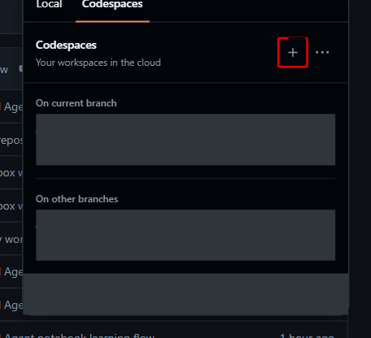

# 参加者向け前提条件

ここでは、教材を操作する場所とアカウントを準備します。
Azure 環境を実際に作るのは [Lab 1](../../labs/01-setup.md) です。

## 必要なもの

- GitHub Codespaces を利用できる GitHub account
- 管理者から指定された Azure subscription ID
- 管理者から割り当てられた**既存** resource group
- その resource group に対する **Owner** role
- Azure に sign-in できる account

管理者から割り当てられた RG 内だけで作業します。参加者が自分で権限を増やすことはしません。

## 手元の PC と Codespace を区別する

**GitHub Codespaces** は、ブラウザーから使う開発環境です。
手元の PC に Python や Azure CLI を入れる代わりに、Codespace 内のものを使います。
この repository 用の Codespace には Python、Azure CLI、Terraform、Foundry Toolkit が
用意されます。Docker、API key、client secret を参加者が準備する必要はありません。

| 場所 | 用途 |
|---|---|
| 手元の PC | ブラウザーで GitHub / Foundry を開く。Lab 4 などで必要なアップロード素材をダウンロードして保存する |
| ブラウザーの Codespace | VS Code の Explorer で教材を開き、Terminal でコマンドを実行する。Lab 7 の Notebook もここで開く |
| 別タブの Foundry Portal | **Foundry (new)** で Agent の設定、会話、評価、実行履歴の確認を行う |

**本編の `bash` コマンドはすべて Codespace の Terminal で実行します。**
PC の PowerShell / Terminal や Azure Cloud Shell と混ぜないでください。

## Codespace を開いて準備する

### 1. GitHub から Codespace を起動する

1. 講師が指定した GitHub repository と branch をブラウザーで開きます。
2. ファイル一覧の上の **Code**、続けて **Codespaces** を選択します。

3. 初回は **Create a codespace on …**（画像では右上の **＋**）を選択します。
   `…` が講師に指定された branch であることを確認してください。



すでに演習用 Codespace がある場合は新しく増やさず、
**同じ repository / branch のもの**を開き直します。
ブラウザー内に VS Code が開いたら、初期化が終わるまで待ちます。
**Running postCreateCommand** の間は環境の準備中です。
初期化エラーがある場合は進まず、[トラブルシューティング](troubleshooting.md)を確認します。

フォルダーの作成者を信頼するか尋ねられたら、講師が指定した repository であることを
確かめて **Trust Folder & Continue**（フォルダーを信頼して続行）を選択します。
無関係なフォルダーまでまとめて信頼する設定にはしません。

### 2. Explorer と Terminal を確認する

1. 左側のファイルのアイコンから **Explorer** を開きます。
   `README.md` と `labs`、`scripts`、`notebooks` のフォルダーがあることを確認します。
   ここが教材の **repository root**（最上位フォルダー）です。

2. **Ctrl+Shift+P**（macOS は **Cmd+Shift+P**）で Command Palette を開き、
   `Terminal: Create New Terminal` と入力します。
3. 名前に括弧や `Editor Area` が付かない、**Terminal: Create New Terminal** を選択します。

4. 開いた画面下部の **Terminal** が、Lab のコマンドを貼り付ける場所です。
   特に指示がなければ repository root で実行します。Notebook は Lab 7 で開きます。

教材の画像は英語・ダークモードです。表示設定は進行の必須条件ではなく、必要に応じて講師がフォローします。

Portal にファイルをアップロードするときの選択画面は、**手元の PC** を参照します。
Codespace のファイルが見えないのは正常です。Lab 4 の手順に従って Explorer から
必要な素材を **Download** してから選択します。

## 管理者が事前に行うこと

参加者ではなく、subscription 管理者が次を準備します。

- 必要な resource provider の登録
- Model quota / capacity の確認
- 参加者への resource group Owner role の付与

詳細は[管理者向け前提条件](../admin/prerequisites.md)を参照してください。

## 参加者が行わないこと

- Resource group の作成・削除
- Resource provider の登録
- Subscription scope の role assignment
- Quota や Azure Policy の変更
- Service principal、client secret、API key の作成

これらを求めるエラーが出た場合は、権限を増やそうとせず管理者へ連絡してください。

## 開始前の確認

以下は Lab 1 の冒頭と同じ、サインインと事前確認です。
先に確認する場合は、**Codespace の初期化が完了してから、その Terminal** で実行します。
`<subscription-id>` と `<resource-group>` は山括弧ごと管理者から渡された値に
置き換えます。教材の例や他の参加者の値を流用しないでください。

```bash
az login --use-device-code

./scripts/preflight.sh \
  --subscription "<subscription-id>" \
  --resource-group "<resource-group>"
```

`az login` は Azure CLI（Terminal から Azure を操作する道具）へのサインインです。
Terminal に表示される案内に従って認証用ページをブラウザーで開き、
割り当てられた Azure account でサインインします。GitHub へのサインインとは別です。
パスワードや MFA は認証画面で本人が入力し、教材・Terminal・チャットには貼り付けません。
認証用のコードや token を他の人に共有しないでください。

`preflight.sh` は実行前の条件を調べる確認用スクリプトです。
`overall_status` が **`pass`** なら、この確認は完了です。
**`fail` の場合は setup を実行せず**、
[トラブルシューティング](troubleshooting.md#preflight--setup)で該当するエラーを確認します。
権限・quota・provider の問題は管理者へ連絡します。

## 準備完了のチェック

- Codespace の Explorer に教材ファイルが表示されている
- 同じ Codespace の Terminal を開ける
- 自分に割り当てられた subscription ID と既存 RG 名が分かる
- Azure 用 account でサインインできる。API key / client secret は作っていない

> [!WARNING]
> Codespaces と Azure の利用には料金が発生します。実際の個人情報・顧客情報ではなく、
> 教材の合成データだけを使ってください。終了時は
> [Lab 8](../../labs/08-observability-cleanup.md) の cleanup を行い、Codespace を停止します。
> Codespace を閉じるだけでは Azure resources は削除されません。

## 次のステップ

[Lab 0 — 全体像と進め方](../../labs/00-overview.md)
