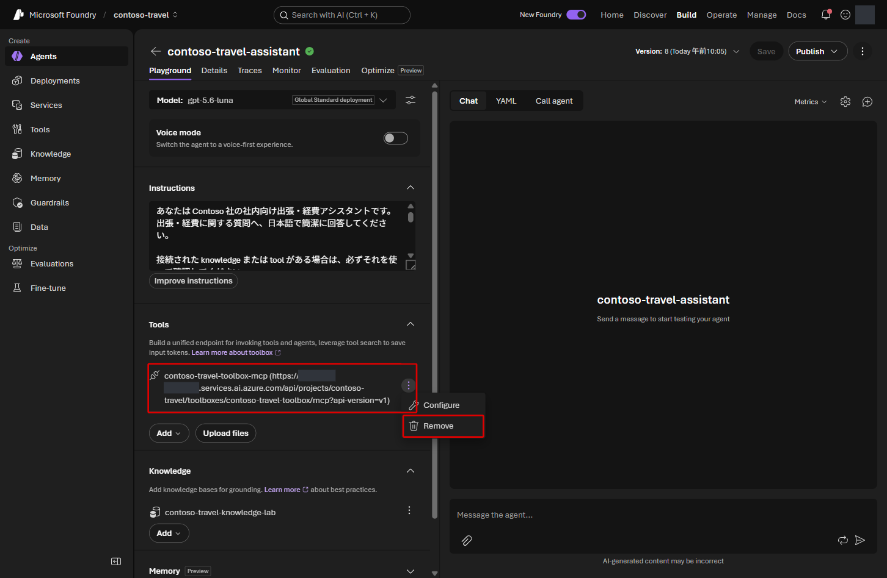
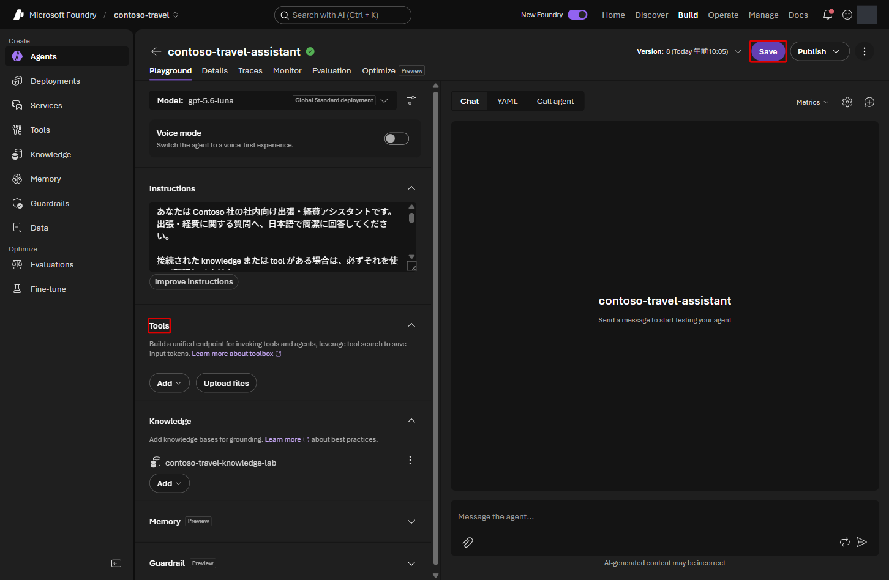
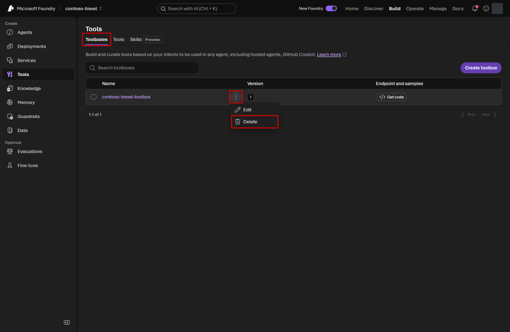
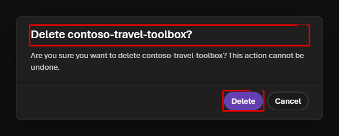
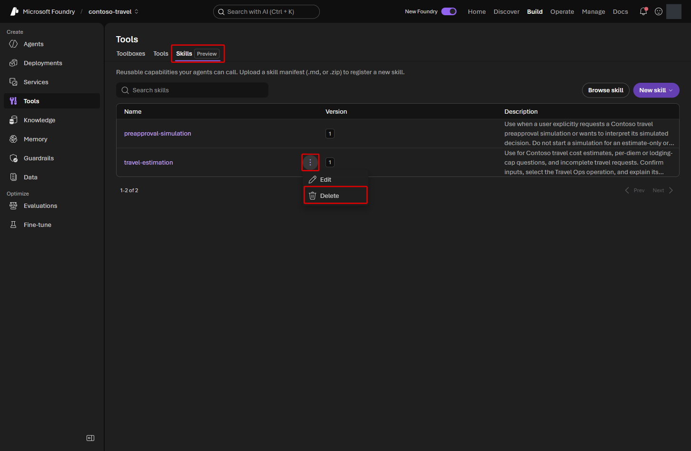
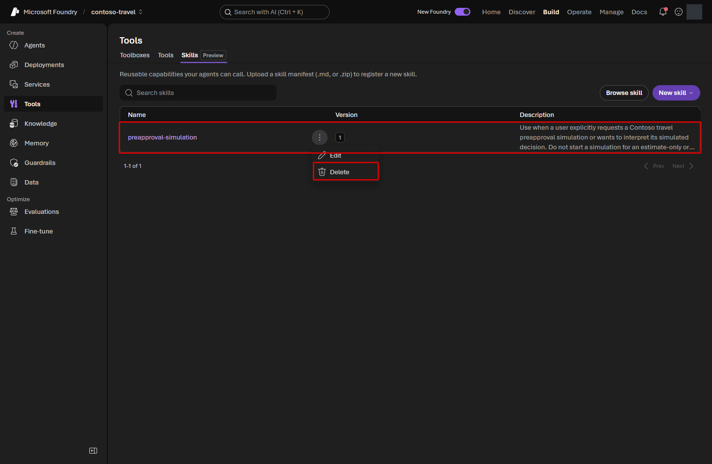
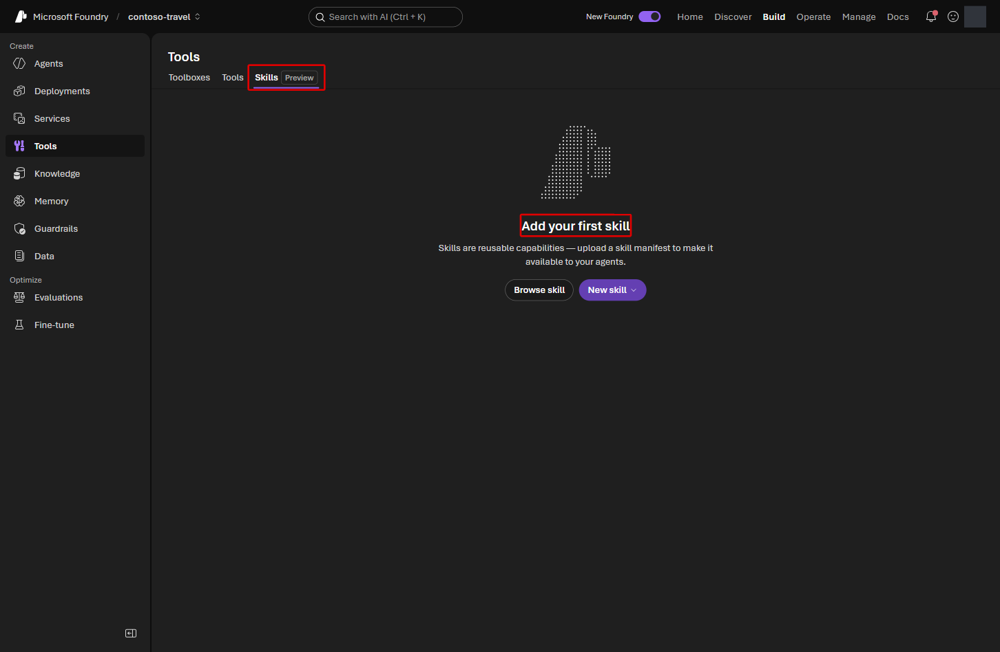

# 参加者向けトラブルシューティング

該当する症状だけを確認してください。Subscription scope の対応が必要な場合は
[管理者向けトラブルシューティング](../admin/troubleshooting.md)へ進みます。

## Preflight / setup

### Owner role がない

Subscription と resource group 名、`az account show` の user を確認します。
Role 付与直後は反映に数分かかることがあります。解消しない場合は管理者へ連絡します。

### Resource provider / quota で fail する

参加者は変更できません。`preflight.sh` の出力を管理者へ渡してください。

### Search の `InsufficientResourcesAvailable`

指定 region で新しい Azure AI Search service を作成できません。別 region で setup を
再実行します。

```bash
./scripts/setup.sh \
  --subscription "<subscription-id>" \
  --resource-group "<resource-group>" \
  --location swedencentral
```

### Setup が途中で失敗した

同じ command を再実行します。Terraform state、Azure resource、`.workshop/` を手動で
削除しないでください。Setup は作成済み resource を確認して続行します。

### `.workshop/context.json` がない

Setup が最後まで完了していません。`./scripts/setup.sh ...` を再実行します。

## Portal

### 教材と画面が違う

- `https://ai.azure.com` を開いている
- Foundry **new** を使っている
- `.workshop/context.json` と同じ account / project を開いている

を確認します。教材の画像は英語ですが、表示言語の変更は必須ではありません。
画面ラベルで迷う場合は講師に確認してください。

### Foundry IQ を選んでも knowledge base がない

**Build > Knowledge** で knowledge base を先に作成します。
2 つの source を保存し、**Use in an agent** から対象 Agent を選択してください。
この操作で Agent の新しい version が自動保存されるため、Save が無効でも異常ではありません。

### Foundry IQ の model を選べない

Portal の model picker が対応する deployment を選びます。このハンズオンでは
`.workshop/context.json` の `optimizer_model_deployment_name` を使います。
通常は `gpt-5.5` です。Agent 自体の `gpt-5.6-luna` とは別の選択です。
Agent の model picker に表示される deployment が、IQ の picker にも表示されるとは限りません。

### Web search などが最初から追加されている

[Lab 2](../../labs/02-prompt-agent.md) では Agent の既定の **Web search** を外します。
Toolbox 作成時にも推奨 tool が入る場合があります。
[Lab 4](../../labs/04-tools-toolbox.md) のとおり不要な tool を外し、
`travel_ops_api` と 2 つの Skills だけを残してください。Guardrail は削除しません。

## Citation link

### Foundry IQ の引用が `mcp://searchindex/...` になり、Web ページを開けない

これは Search index の MCP 取得結果を指す識別子であり、通常の Web URL ではありません。
リンクが開けないことだけを理由に setup をやり直したり、index の field を変更したりしません。
回答の **根拠資料** と `knowledge_base_retrieve` の Output にある文書名・category を
見比べます。元の規程を読むには [Lab 3](../../labs/03-rag-foundry-iq.md) の教材リンクを使います。

根拠資料が出ない場合は、[Lab 2](../../labs/02-prompt-agent.md) の instructions が保存済みか
確認し、**New chat** で質問してください。取得結果にない文書名・ID・URLを作らせません。

## Toolbox Portal

### Toolbox、OpenAPI、Skill の追加画面が見つからない

[Lab 4](../../labs/04-tools-toolbox.md) のスクリーンショットと比較します。
対象は Web の Foundry (new) Portal です。**Build > Tools > Create toolbox** の
**Toolboxes** タブを開くと **Create toolbox** があり、
作成画面の **Included > + Add** に **Add tool** と **Add skill** があります。
OpenAPI は **Select a tool > Custom > OpenAPI tool**、
Skill は **Select a skill > Configured > Add skill > Upload skill** です。

項目がない場合は、対象 project と権限を確認し、講師へ画面を共有してください。
Toolbox の SDK Notebook は補助用で、Skills の作成・利用まで代替するものではありません。

### OpenAPI の server がない／接続先が違う

`/openapi.json` をそのまま貼るのではなく、
`.venv/bin/python scripts/prepare_toolbox_assets.py` を実行し、
`.workshop/toolbox/travel-ops.openapi.json` を使います。
自分の context の API endpoint が `servers` に設定されます。
JSON 全体を貼り付け、code fence は含めません。

### Browser のアップロードでファイルが見えない

Codespace と手元の PC は別のファイルシステムです。VS Code Explorer の **Download** で
ZIP または各 `SKILL.md` を手元へ保存してからアップロードします。
ZIP は `SKILL.md` が直下にある、生成済みのものを使ってください。

### Upload skill の後に Add を押せない

新しい Skill は **Create** でアップロードすると、そのまま Toolbox の Included に入ります。
**All configured skills added** は追加済みの表示です。同じ ZIP を再アップロードせず、
Included の Skill 名を確認してください。

### Toolbox は公開できたが Agent から接続できない

Toolbox への認証は Entra ID/RBAC です。OpenAPI mock の **Anonymous** と混同しません。
**Microsoft Entra > Project Managed Identity**、
Audience = `https://ai.azure.com/` を確認します。UI の keyless 接続が利用できない場合は、公開後に
`.venv/bin/python scripts/connect_toolbox.py` を実行します。
新しい Toolbox は作らず、既存の Knowledge を保持して接続だけを追加します。
403 が続く場合は project と呼び出し identity の Foundry User 権限を講師へ確認します。

### Skill を追加したのに手順が反映されない

Toolbox の公開済み version に Skill が含まれること、参照先 Skill の version、
利用クライアントの MCP Resources／Skill provider 対応を確認します。
新しい会話または再接続で読み込み記録を確認し、API の成功だけを Skill の成功としません。
既存の Lab 7 workflow は Skill provider を含みません。
Skill を Agent の instructions にコピーする代替は、Toolbox 経由の利用とは区別してください。

## Toolbox Notebook

以下は任意の SDK 学習・補助経路だけのトラブルシューティングです。

### `Python (Foundry Workshop)` kernel がない

Codespace を rebuild します。急ぐ場合は terminal で次を実行します。

```bash
.venv/bin/python -m ipykernel install \
  --user \
  --name foundry-workshop \
  --display-name "Python (Foundry Workshop)"
```

### `context file not found`

Lab 1 の setup を完了し、repository 内の
`notebooks/04-create-toolbox.ipynb` を開いてください。

### OpenAPI の取得が timeout する

Container App の cold start 中です。Health check 後に該当 cell を再実行します。

```bash
curl -s "https://$(jq -r '.terraform_outputs.travel_api_fqdn.value' \
  .workshop/context.json)/health"
```

### Toolbox の作成が 403 になる

Role 反映に数分かかることがあります。少し待って cell を再実行します。解消しない場合は
Lab 1 の preflight 出力とともに管理者へ連絡します。

## Evaluation / Optimizer

### Synthetic data を生成できない

`Unable to create data source configuration from item schema` が表示される場合が
あります。Lab 5 は **Existing dataset** の `contoso-travel-eval-live-subset` を使ってください。
一覧に無い場合は Lab 1 の setup を同じ引数で再実行します。

### Evaluation が終わらない

**Evaluations** 一覧で status を確認し、数分後に refresh します。同じ run を重複して
submit しないでください。

### Evaluation が tool の承認待ちになる

[Lab 4](../../labs/04-tools-toolbox.md) の最後で、ハンズオン用
`contoso-travel-toolbox-mcp` だけに **Always auto-approve all tools** を設定して保存します。
ほかの MCP 接続に広げないでください。Entra ID 認証や Guardrail を無効にする設定ではありません。
Lab 5 ではこの変更を保存した Agent version を選択します。

### Evaluator の Response mapping が合わない

**TaskAdherence** と **ToolInputAccuracy** の Response は
`{{sample.output_items}}` です。最終回答の文章だけでなく tool 呼び出しも渡します。
**TaskCompletion** と **ToolSelection** は `{{sample.output_text}}` を使います。
[Lab 5](../../labs/05-evaluation.md) の各設定画像と比較してください。

### Completed / Partial なのに Error の行がある

Completed は run の終了を表し、全行が正常に採点できたという意味ではありません。
一部を採点できなかった run は、一覧に **Partial** と表示される場合もあります。
右側の **Error** 列を確認します。

| 表示 | 対応 |
|---|---|
| score の **Fail** と reason | 回答・tool の使い方の改善点として読む。実行エラーと区別する |
| `content_filter` | 意図的な攻撃文の行か確認する。保護機能で遮断された結果を記録し、採点できた行と区別する。Guardrail を弱めて通さない |
| `429` または IQ の `maximum runtime of 90 seconds` | 同時実行の終了を待ち、講師に共有 deployment の処理容量とレート制限を確認してもらう。原因を解消するまで run を増やさない |

処理容量の変更は quota の引き上げとは別です。参加者が Portal で Terraform 管理の
deployment を独自に変更せず、講師へ Error の内容を渡してください。

### Optimizer が candidate を生成しない

`.workshop/context.json` の `optimizer_model_deployment_name` の値を選んでいるか確認します。
Criteria は built-in evaluator ではなく **Contoso Travel Rubric** を選択します。
Service error の場合は run を増やさず講師へ連絡します。

### 評価モデルと Agent のモデルが違う

この教材では意図した設定です。回答する Prompt / Hosted Agent は `gpt-5.6-luna`、
Foundry IQ の検索計画、回答を採点する LLM judge、改善案を作る Optimizer は `gpt-5.5` を使います。
Lab 6 の **Evaluation model** と **Optimization model** は、どちらも
`optimizer_model_deployment_name` の値を選択します。

## Hosted Agent

### `Python (Foundry Hosted Agent)` kernel がない

Codespace を rebuild します。急ぐ場合は terminal で次を実行します。

```bash
src/hosted-agent/.venv/bin/python -m ipykernel install \
  --user \
  --name foundry-hosted-agent \
  --display-name "Python (Foundry Hosted Agent)"
```

### Notebook の model call が 404 になる

`.workshop/context.json` が現在の環境のものか確認し、Notebook を restart して上から
再実行します。

### Hosted Agent deploy が timeout / failed になる

**Build > Agents** で `contoso-travel-hosted-planner` の status と build error を確認します。
Source を変更せずに deploy command を何度も実行しないでください。

## Trace

### Trace が表示されない

Agent を 1 回実行し、数分待って対象 agent の **Traces** を開き直します。
Application Insights connection は setup で作成済みです。

Hosted Agent の **Log stream** に `Monitoring Metrics Publisher` または `Forbidden` が表示される
場合は、deploy 直後の role 反映を数分待ってから 1 回だけ再実行します。解消しない場合は
deploy command の出力を講師へ渡してください。

## Cleanup

### `destroy.sh` が失敗した

表示された原因を修正して、同じ command を再実行します。

```bash
./scripts/destroy.sh
```

Terraform state と `.workshop/` は cleanup 完了の確認に必要です。手動で削除しないでください。

### Toolbox / Skill の参照が原因で削除できない

`destroy.sh` は Portal で作成した Toolbox / Skills の個別削除を自動化していません。
エラーがこれらの参照を示す場合は、講師と対象を確認し、ハンズオン用 project 内だけで
次の順に操作します。

1. **Build > Agents > contoso-travel-assistant > Playground** の **Tools** で、
   `contoso-travel-toolbox-mcp` の **Actions > Remove** を選び、**Save** します。





2. **Build > Tools > Toolboxes** で `contoso-travel-toolbox` の行にポインターを重ね、
   表示された **… > Delete** を選び、
   確認画面の名前を確認して削除します。





3. **Skills** で、他の Toolbox が参照していない `travel-estimation` と
   `preapproval-simulation` を削除します。**確認画面が出ない場合があるため、
   Delete を選ぶ前に名前を確認してください。**





4. ブラウザーを再読み込みして対象が消えたことを確認し、`./scripts/destroy.sh` を再実行します。



削除 UI が利用できない場合は講師へ連絡し、SDK での削除を確認してから再実行してください。

## 戻る

[Lab 0 — 全体像と進め方](../../labs/00-overview.md)
