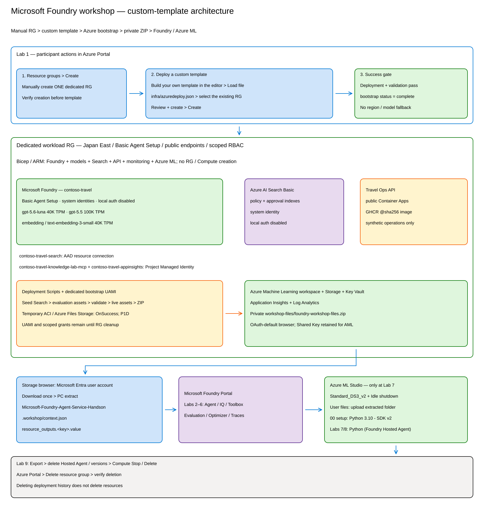

# Lab 0 — 全体像と進め方（5分）

## ゴール

このハンズオンで作るものと、Portal・Notebook・terminal の使い分けを確認します。

## 作るもの

1. 出張・経費規程を参照する **Prompt Agent**
2. Azure AI Search と **Foundry IQ** を使う knowledge retrieval
3. Travel Ops API と操作手順の **Skills** をまとめた **Toolbox**
4. Portal 上の evaluation と **Agent Optimizer**
5. Microsoft Agent Framework で作る **Hosted Agent**
6. Application Insights の trace と cleanup

## 操作面の使い分け

| 操作面 | このハンズオンで行うこと |
|---|---|
| Microsoft Foundry Portal | Agent、Knowledge、Toolbox と Skills の作成、Evaluation、Optimizer、Trace |
| Jupyter Notebook | Agent Framework workflow の理解と実行。Toolbox SDK 操作は任意 |
| Terminal | Azure 環境構築、Portal 用ファイルの準備、Hosted Agent deploy、cleanup |

参加者ごとに異なる resource 名や endpoint は
`.workshop/context.json` から取得します。教材の例に見える名前を推測して入力しないでください。

## 必ず守ること

> [!IMPORTANT]
> 規程、旅程、経費、評価質問はすべて架空の合成データです。
> 実在する個人情報、顧客情報、予約情報を入力しないでください。

> [!WARNING]
> Foundry IQ の Portal 操作、Skills、Agent Optimizer は preview を含みます。
> モデル推論、Search、評価、Hosted Agent には料金が発生します。
> 終了時は Lab 8 の cleanup を実行してください。

この教材は **Foundry (new)** を対象にしています。旧 Azure AI Studio / Foundry classic
の画面を開いている場合は手順と一致しません。

## 次の Lab

[Lab 1 — 環境構築](01-setup.md)
