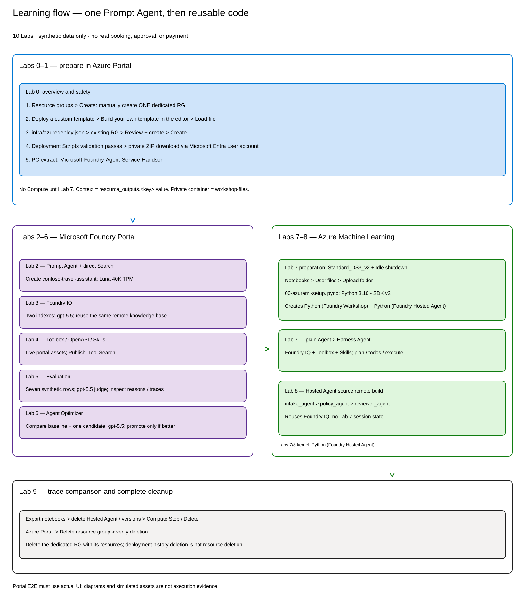

# Lab 0 — 全体像と進め方（5分）

## ゴール

架空の Contoso 社を題材に、**規程を調べ、費用を計算できる出張・経費アシスタント**を作ります。
さらに、役割の異なる 3 つの Agent をコードでつなぎ、回答を引き継ぐ workflow を体験します。

使う規程・旅程・質問集はすべて教材の合成データです。実際の予約や承認は行いません。

## どんな相談に答えるか

| 相談の例 | アシスタントに期待すること |
|---|---|
| 「大阪出張のホテル代は、1 泊いくらまで？」 | 規程を検索し、根拠とともに答える |
| 「東京から大阪へ、1 名で出張する場合の概算を出して」 | 必要な条件を確認し、API で費用を計算する |
| 「大阪出張の費用を教えて」 | 情報が足りなければ、推測せずに聞き返す |

## 学習の流れ

**Lab 2〜6 は同じ Prompt Agent を育てる演習**です。
**Lab 7 は別のアシスタントをコードで作る独立した演習**で、前の Lab の
Foundry IQ / Toolbox / Travel Ops API には接続しません。

| Lab | 体験すること | 到達点 |
|---|---|---|
| [Lab 1](01-setup.md) | 共通の Azure 環境を準備する | 自分の Foundry project を開ける |
| [Lab 2](02-prompt-agent.md) | Prompt Agent の役割と指示を設定する | Agent の基本設定を保存できる |
| [Lab 3](03-rag-foundry-iq.md) | 直接検索と Foundry IQ を比較する | 複数の規程を根拠に回答できる |
| [Lab 4](04-tools-toolbox.md) | API と Skills を Toolbox にまとめる | 検索に加えて費用計算を使える |
| [Lab 5](05-evaluation.md) | 同じ質問集で Agent を評価する | 点数と判定理由から改善点を見つける |
| [Lab 6](06-optimization.md) | 指示文の改善候補を比較する | 採用するか、元の設定を維持するか判断する |
| [Lab 7](07-hosted-multi-agent.md) | 3 Agent の workflow を作り、Hosted Agent にする | 規程確認 → 計画 → レビューの引き継ぎを追える |
| [Lab 8](08-observability-cleanup.md) | Trace を確認し、環境を片付ける | 実行の流れを確認し、演習用 resources を削除できる |

Azure 構成の詳細は [アーキテクチャ](../docs/architecture.md)を参照してください。

## 始める前に

[参加者向け前提条件](../docs/participant/prerequisites.md)に沿って Codespace を準備し、
講師から subscription ID と resource group 名を受け取ってください。

> [!WARNING]
> モデル・評価・最適化・Azure resources・Codespaces の利用には料金が発生します。
> 終了時は [Lab 8](08-observability-cleanup.md) の cleanup と Codespace の停止を行ってください。
> ブラウザーを閉じるだけでは、リソースは削除されません。

実在する個人・顧客・予約の情報や、認証情報・Terraform state は入力・共有しないでください。

## 次の Lab

[Lab 1 — 環境構築](01-setup.md)
