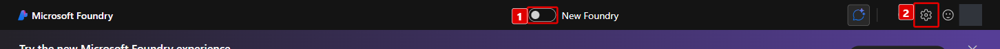
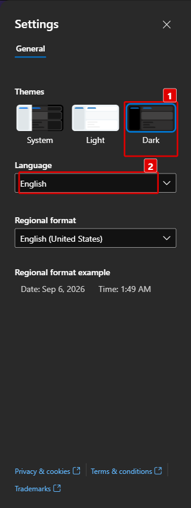
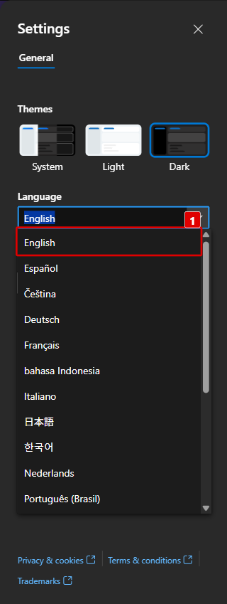
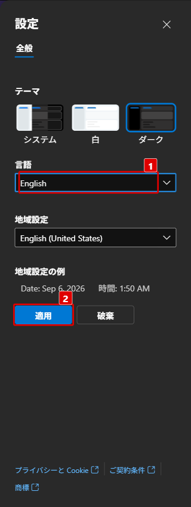

# Lab 1 — 環境構築（20分）

## ゴール

割り当てられた既存 resource group に、ハンズオン用の Foundry project と関連 resource
を構築します。

## 事前に用意する値

| 値 | 入手先 |
|---|---|
| `<subscription-id>` | 講師または管理者 |
| `<resource-group>` | 講師または管理者 |

詳しい条件は
[参加者向け前提条件](../docs/participant/prerequisites.md)を確認してください。

## 1. Azure にサインインする

Codespace の terminal で実行します。

```bash
az login --use-device-code
az account show --query "{subscriptionId:id, user:user.name}" -o table
```

表示された subscription が、割り当てられたものと一致することを確認します。

## 2. 事前確認を実行する

```bash
./scripts/preflight.sh \
  --subscription "<subscription-id>" \
  --resource-group "<resource-group>"
```

`overall_status` が `pass` なら次へ進みます。`fail` の場合は setup を実行せず、
[トラブルシューティング](../docs/participant/troubleshooting.md#preflight--setup)を確認してください。

## 3. 環境を構築する

```bash
./scripts/setup.sh \
  --subscription "<subscription-id>" \
  --resource-group "<resource-group>"
```

この処理は再実行できます。途中で失敗した場合も Terraform state や
`.workshop/` を手動で削除しないでください。

Azure AI Search の作成で `InsufficientResourcesAvailable` が表示された場合だけ、
別 region を指定して同じ setup を再実行します。

```bash
./scripts/setup.sh \
  --subscription "<subscription-id>" \
  --resource-group "<resource-group>" \
  --location swedencentral
```

## 4. 完了を確認する

成功時は account、project、Travel Ops API と `.workshop/context.json` が表示されます。
Lab 5 / 6 で使う合成 dataset と rubric evaluator も、この setup で登録されます。

```bash
jq -r '
  .terraform_outputs
  | {
      account: .ai_services_account_name.value,
      project: .foundry_project_name.value,
      search: .search_service_name.value,
      travel_api: .travel_api_fqdn.value
    }
' .workshop/context.json

curl -s "https://$(jq -r '.terraform_outputs.travel_api_fqdn.value' \
  .workshop/context.json)/health"
```

`"status":"ok"` が返れば構築完了です。

## 5. Foundry Portal を開く

1. Codespace は閉じず、別のタブで [Microsoft Foundry](https://ai.azure.com) を開きます。
2. **Sign in** が表示された場合は、`az login` と同じ Azure account でサインインします。
3. ホーム画面の右上にある歯車（**AI Foundry settings**）を開きます。
   以下では英語表示のラベルを使います。日本語では「AI Foundry の設定」です。



## 6. English・ダークモードに揃える

すでに同じ表示なら、この設定変更は不要です。

1. **Themes** で **Dark** のタイルを選択します。
2. **Language** のドロップダウンを開きます。



3. **English** を選択します。**Regional format** はそのままで構いません。



4. 言語を変更した場合は **Apply**（適用）を選択します。
   表示が変わらない場合は、ブラウザーを再読み込みしてください。



5. メニューが英語になり、背景が暗くなったことを確認して、設定パネルを閉じます。

## 7. 自分の project を選択する

1. ホーム画面の上部に **New Foundry** の切り替えがある場合はオンにします。
2. Project の選択画面で、手順 4 に表示された **account と project の組み合わせ**を
   選択します。同じ `contoso-travel` という名前の project が複数ある場合も、
   他の参加者の account を選ばないでください。
3. 自分の project の画面を開き、次の Lab で使う **Build > Agents** を確認します。

選択するのは「自分の既存 project」です。この画面で新しい project やモデルを
追加作成する必要はありません。見つからないときは、サインインした account、
directory、setup の完了結果を確認してください。

## 完了チェック

- `preflight.sh` が `pass`、Travel Ops API の応答が `ok` になった
- `.workshop/context.json` が作られ、自分の account / project 名を確認できた
- Foundry (new) で自分の project を開き、英語・ダークモードで操作できる

## 次の Lab

[Lab 2 — Prompt Agent](02-prompt-agent.md)
