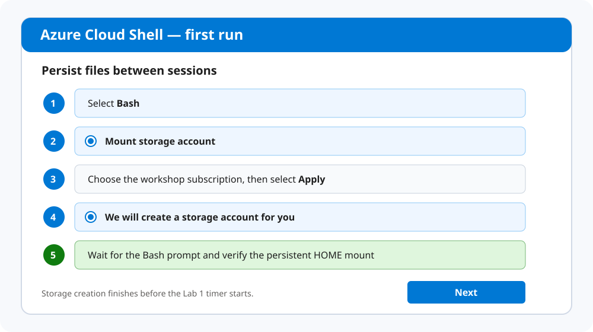
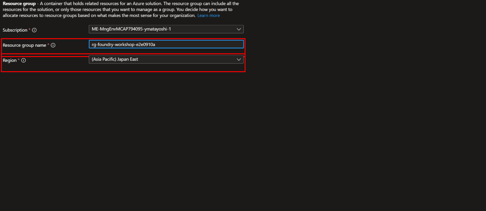
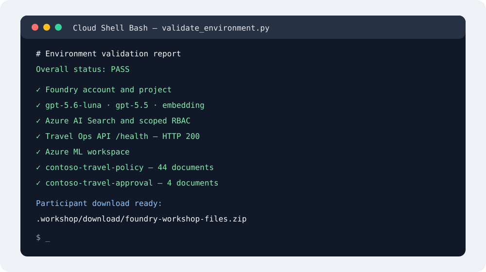
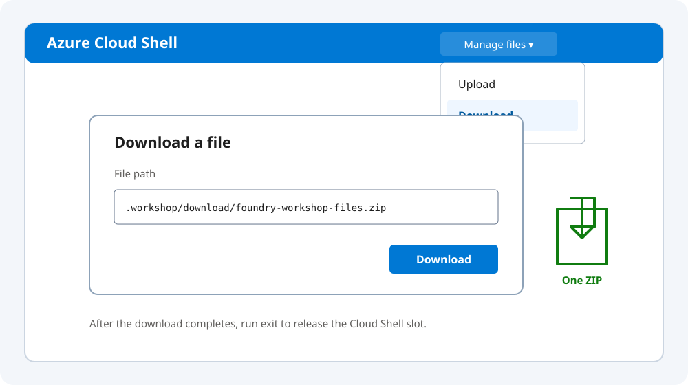

# Lab 1 — Cloud Shell provisioning と download（10〜15分）

## ゴール

Azure Portal で workload resource group を 1 個作り、永続化済み Azure Cloud Shell Bash
から Terraform provisioning、bootstrap、validation を完了します。最後に生成された ZIP を
PC へ 1 回だけ download し、直ちに Cloud Shell を終了します。

**10〜15分**が participant target です。**8〜10分**は準備済み/warm の best case です。
初回 Cloud Shell の Storage 作成と mount 確認はこの Lab に含めますが、計測はその完了後に
開始します。

## 0. 初回 Cloud Shell Storage を作成して永続 HOME を確認

Azure Portal で Cloud Shell を初めて開いた場合は、次の標準 UI だけを使います。

1. **Bash** を選択。
2. **Mount storage account** を選択。
3. workshop subscription を選び、**Apply**。
4. **We will create a storage account for you** を選び、**Next**。
5. Cloud Shell が専用 Storage resource group、Storage account、Azure Files share を
   自動作成し、Bash prompt が表示されるまで待つ。

advanced settings で既存 storage を手入力しません。作成と mount が完了してから
10〜15分の計測を開始します。

既に Cloud Shell Storage がある場合は新しく作り直さず、既存の Azure Files-backed HOME を
再利用します。どちらの場合も、次の provisioning を始める前に永続 HOME が正常であることを
確認します。

> [!CAUTION]
> **Azure Files mount に失敗した、HOME image backing を確認できない、または ephemeral
> session と表示された場合は停止してください。** provisioning を開始せず、講師/管理者へ
> 連絡します。`clouddrive` folder が見えるだけでは HOME 永続化の証明になりません。
> `.workshop` と Terraform state を ephemeral storage に置かないでください。



## 1. workload resource group を 1 個作る

1. [Azure Portal](https://portal.azure.com) で **Resource groups > Create**。
2. 指定 subscription、**Region = Japan East**、講師指定 name を入力。
3. **Review + create > Create**。



Cloud Shell storage resource group は workload resource group とは別 lifecycle です。
初回 UI が作成する storage を workload resource group 内へ移動しません。

## 2. Azure Cloud Shell Bash と subscription を確認

Section 0 から続く Cloud Shell **Bash**、または再度開いた Bash で、作成または再利用した
healthy persistent HOME が mount されていることを確認します。Azure CLI は Portal と同じ
account/subscription を使用します。

```bash
az account show --query "{subscription:id,user:user.name}" -o table
```

account が違う場合は続行しません。token、device code、credential を出力・共有しません。

## 3. repository を shallow clone

HOME 直下またはその子 folder に clone します。`clouddrive` 直下には clone しません。

```bash
cd ~
git clone --depth 1 --branch main --single-branch \
  https://github.com/matayuuu/Microsoft-Foundry-Agent-Service-Handson.git
cd Microsoft-Foundry-Agent-Service-Handson
```

既に同じ persistent repository がある場合は、講師が指定した revision であることを確認し、
新しい clone を重ねません。

## 4. 軽量 provisioning environment

```bash
bash scripts/setup-cloud-shell.sh
source scripts/activate-cloud-shell.sh
```

最初の command は built-in Python 3.12 を使う provisioning-only `.venv` を準備します。
成功メッセージに **No Jupyter, notebook kernels, Hosted Agent environment, Graphviz, or
web preview was installed** と表示されます。

storage validation が失敗したら、その安全な拒否を回避しません。別 folder や一時 HOME に
state を作らず、ここで停止します。

## 5. Terraform provisioning

```bash
./scripts/setup.sh \
  --subscription "<subscription-id>" \
  --resource-group "<resource-group>"
```

plan に自分の workload resource group だけが表示されることを確認して承認します。
処理中は同じ command を再送しません。Terraform は次を作成します。

- Foundry resource / project `contoso-travel` と Basic Agent Setup
- Luna 40K TPM、GPT-5.5 100K TPM、embedding 40K TPM
- Azure AI Search、monitoring、Container Apps Travel Ops API
- scoped RBAC と managed-identity connections
- Azure ML workspace、Storage、Key Vault、workspace-based Application Insights

Azure ML Compute instance は作成しません。Lab 7 で必要になった時点で作成します。
Travel Ops API image は setup が immutable digest を解決して pin し、mutable tag へ
fallback しません。public endpoints と system identities を使い、Foundry/Search の local
authentication は無効です。Cosmos DB、Agent capability host、ACR、private networking は
追加しません。

connections は direct Search／knowledge source 用の `contoso-travel-search`、
Foundry IQ MCP 用の `contoso-travel-knowledge-lab-mcp`、trace 用の
`contoso-travel-appinsights` です。後ろの 2 つは **Project Managed Identity** を使います。
Terraform が作る scoped RBAC:

| Principal | Scope | Roles |
|---|---|---|
| Participant | Foundry account / project | Foundry User; Foundry Project Manager |
| Participant | Search / monitoring | Search Service Contributor; Search Index Data Contributor; Log Analytics Reader; Privileged Monitoring Data Reader |
| Project MI | Foundry / Search / monitoring | Foundry User; both Search contributor roles; Monitoring Metrics Publisher; Log Analytics Reader; Privileged Monitoring Data Reader |
| Search MI | Foundry account | Cognitive Services OpenAI User |

setup は 2 Search indexes を seed し、evaluation assets を準備し、resources を検証し、
live OpenAPI / Skill assets と canonical `resource_outputs` context を作成します。



成功時は次のファイルが 1 個だけ download 対象として表示されます。

```text
.workshop/download/foundry-workshop-files.zip
```

ZIP には non-secret context、Portal assets、Notebooks、Hosted Agent source が含まれます。
Terraform state、token、`.env`、credential は含まれません。

## 6. 1 回だけ download して exit

1. Cloud Shell toolbar の **Manage files > Download**。
2. setup output に表示された
   `.workshop/download/foundry-workshop-files.zip` の absolute path を入力。
3. PC への download 完了を確認。
4. Terminal で直ちに実行:

```bash
exit
```



Cloud Shell で ZIP を展開したり、Notebook、Jupyter、Graphviz、web preview、Hosted
environment を起動したりしません。`exit` により tenant slot を解放します。

## 7. PC で展開

download した ZIP を PC で展開し、最上位 folder に `.workshop/context.json`、
`portal-assets/`、`labs/`、`notebooks/`、`src/` があることを確認します。
Labs 2〜6 は Foundry Portal で進め、Lab 4 はこの `portal-assets/` を使います。

## 完了チェック

- persistent HOME validation が pass
- Terraform / bootstrap / validation が成功
- `.workshop/context.json` の key が `resource_outputs`
- PC に ZIP を 1 回 download・展開
- Cloud Shell で `exit` 済み

## 次の Lab

[Lab 2 — Prompt Agent](02-prompt-agent.md)
