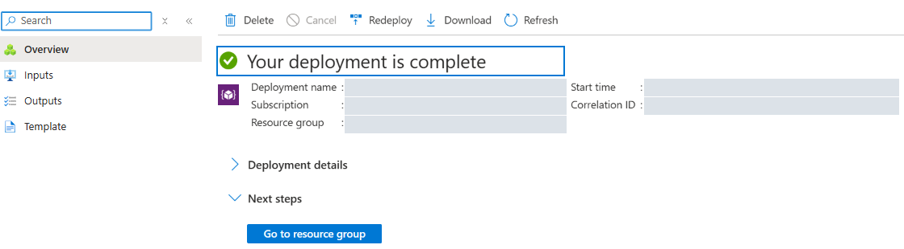

# Lab 1 — 環境を作り、初期化を確認する

Azure Portal で準備します。この Lab では CLI や Notebook は使いません。

## 始める前に

- [参加条件](../docs/participant/prerequisites.md)を確認します。
- 管理者からサブスクリプションと専用 RG 名の指定を受け取ります。
  テンプレートの既定値については[管理者向けガイド](../docs/admin/prerequisites.md#2-配布するテンプレートと既定値)を参照できます。
- 管理者指定の
  [azuredeploy.json](https://github.com/matayuuu/Microsoft-Foundry-Agent-Service-Handson/blob/dev-custom-template/infra/azuredeploy.json)
  を PC に保存します。Web ページではなく JSON 本体を保存してください。

モデルのバージョン、イメージのハッシュ、教材の SHA は設定済みです。
既定値を使い、推測して入力しません。

## 1. 専用 RG を 1 個手動作成する

1. [Azure Portal](https://portal.azure.com) でアカウントとサブスクリプションを確認します。
2. **Resource groups > Create** を開きます。
3. **Subscription** に指定のサブスクリプション、**Resource group** に自分専用の名前、
   **Region** に **Japan East** を指定します。
4. **Review + create > Create** を選択します。
5. 作成完了後、**Resource groups** で RG の名前を確認します。

**RG の作成が完了してから、次の手順へ進んでください。**

## 2. 作成済み RG にテンプレートを実行する

1. Azure Portal で **Deploy a custom template** を検索して開きます。
2. **Build your own template in the editor > Load file** を選びます。
3. 保存した `azuredeploy.json` を読み込み、**Save** を選びます。
4. **Subscription** と **Resource group** に、手順 1 の作成済み RG を選びます。
   **Create new** は使いません。
5. その他の項目は**既定値のまま**にします。自分自身がデプロイするため、
   **Participant Object Id Override** は空欄、**Bootstrap Run Id** は `1` のままです。
6. **Review + create > Create** を選びます。

## 3. 初期化の成功を待つ

1. RG の **Deployments** で、**Deployment Scripts による初期化を含む全体**が
   **Succeeded** になるまで待ちます。
2. **Outputs** の `workshopContext` を開き、`setup_status = complete` を確認します。
   Search のデータ投入、評価データ・rubric の準備、検証までが初期化に含まれます。
   リソースが作られただけでは準備完了ではありません。

画像はデプロイ完了 UI の参考です。この改訂の動作確認結果を示すものではありません。

失敗した場合は次へ進まず、[トラブルシューティング](../docs/participant/troubleshooting.md)を確認します。
実行中の処理を重複送信したり、別のリージョン・モデルへ変更したりしません。

## 4. Foundry Portal を開く

同じ **Outputs** で次を確認します。

| 出力 | 用途 |
|---|---|
| `foundryPortalUrl` | 開いて、`resourceOutputs` の Foundry resource と project `contoso-travel` を選ぶ |
| `resourceOutputs` | Labs 2〜6 で使う名前。各項目の `value` を参照 |
| `travelApiBaseUrl` | Lab 4 の共通 OpenAPI に設定する自分の API URL |

これで Lab 1 は完了です。環境別の教材一式をダウンロードする手順はありません。
[Lab 4](04-tools-toolbox.md) で共通ファイルを GitHub から取得し、
[Lab 7](07-agent-framework-harness.md) で Codespaces を準備します。

## 次の Lab

[Lab 2 — Prompt Agent](02-prompt-agent.md)
