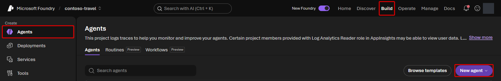
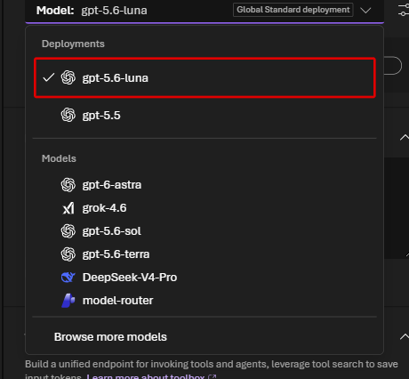
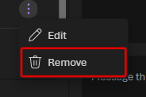
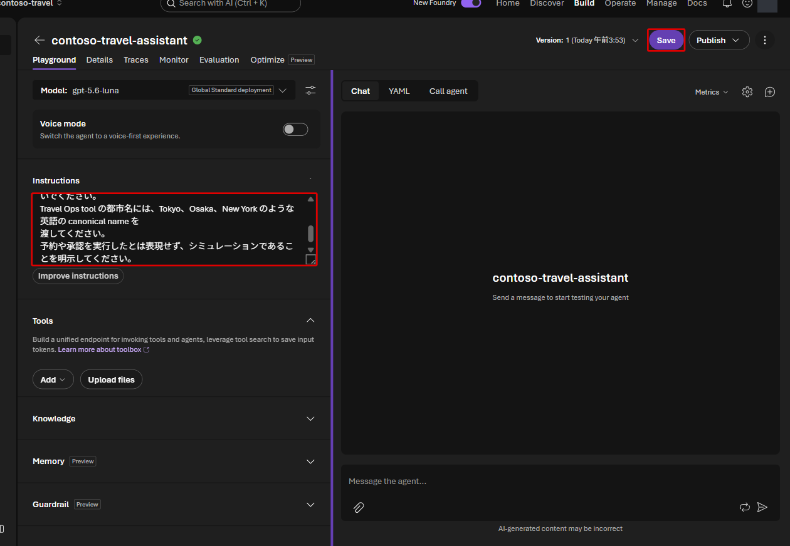

# Lab 2 — Prompt Agent（10分）

## ゴール

Microsoft Foundry Portal で、後続 Lab の knowledge と tool を接続する Prompt Agent
`contoso-travel-assistant` を作成します。

Prompt Agent は、**モデルと指示文を組み合わせたアシスタント**です。この Lab では
「何をする担当か」を設定します。社内規程を調べる機能は Lab 3、費用を計算する機能は
Lab 4 で追加します。

## 始める前に

Lab 1 の setup が完了し、自分の Foundry project を開いていることを確認します。
以後、同じ `contoso-travel-assistant` を編集して機能を追加します。
Lab ごとに別の Agent を作る必要はありません。

## 使用する値

```bash
jq -r '
  .terraform_outputs
  | {
      project: .foundry_project_name.value,
      model: .primary_model_deployment_name.value
    }
' .workshop/context.json
```

## 1. Prompt Agent を作成する

1. Microsoft Foundry Portal で対象 project を開きます。
2. 上部の **Build** を開き、左側の **Agents** を選択します。
3. **New agent** を選択します。



4. **Build an agent** を選択します。**Code an agent** は、この Lab では使いません。
5. **Agent name** の自動入力された名前を `contoso-travel-assistant` に置き換えます。
6. **Create and open playground** を選択します。

## 2. 作成済みのモデルを選択する

1. 設定欄の **Model** を開きます。
2. **Deployments** の中から、`primary_model_deployment_name` の値を選択します。



通常、Model に選ぶ deployment 名は **`gpt-5.6-luna`** です。
すでに選ばれていれば変更不要です。下側の **Models** は新しいモデルを選ぶための
一覧なので、この演習では使いません。`gpt-5.5` は後で評価・最適化に使います。
Luna が見つからない場合は、対象 project と setup の完了を確認してください。

## 3. 自動追加された Web search を外す

新規 Agent に **Web search** が追加されている場合があります。
このハンズオンでは用意した規程と API だけを使うため、質問を送る前に外します。

1. **Tools** の **Web search** 行の右端にある **Actions for Web search** を開きます。
2. **Remove** を選択します。



Tools に Web search がなければ操作は不要です。**Guardrail** など、ほかの設定は
変更しません。最後の Save で、この変更もまとめて保存します。

## 4. Instructions を設定して保存する

**Instructions** に次を貼り付けます。

```text
あなたは Contoso 社の社内向け出張・経費アシスタントです。
出張・経費に関する質問へ、日本語で簡潔に回答してください。

接続された knowledge または tool がある場合は、必ずそれを使って確認してください。
規程を参照した回答には出典を付け、確認できない値は推測しないでください。
Travel Ops tool の都市名には、Tokyo、Osaka、New York のような英語の canonical name を
渡してください。
予約や承認を実行したとは表現せず、シミュレーションであることを明示してください。

規程を参照した回答の末尾に「根拠資料」を設け、実際に参照した取得結果に含まれる title（文書名）と category を示してください。
文書IDを求められた場合は取得結果の id を使ってください。URLが取得結果にある場合だけ、そのURLをそのまま併記してください。取得できない出典名・ID・URLは推測して作らないでください。
```

モデル・Web search の削除・Instructions を確認し、**Save** でまとめて保存します。



## 完了チェック

- Agents の一覧に `contoso-travel-assistant` が表示される
- Agent の model と instructions が保存されている
- Knowledge と Tools はまだ空である

この Lab ではまだ質問を送信しません。続けて knowledge を接続します。

## 次の Lab

[Lab 3 — Azure AI Search と Foundry IQ](03-rag-foundry-iq.md)
