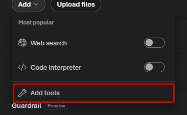
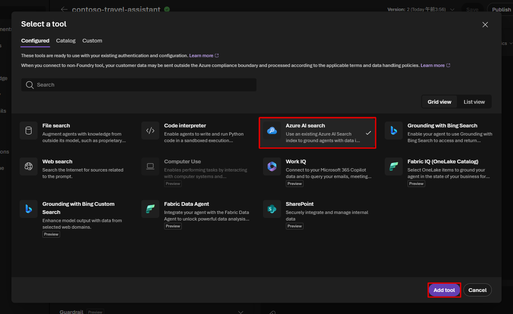
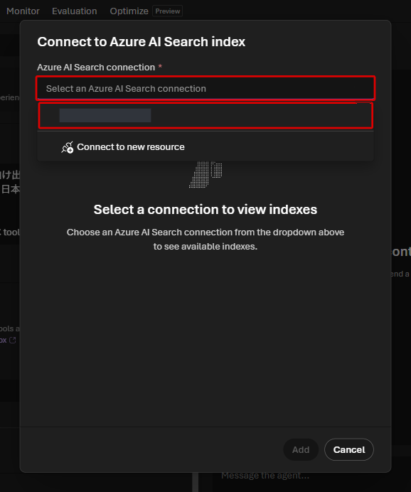
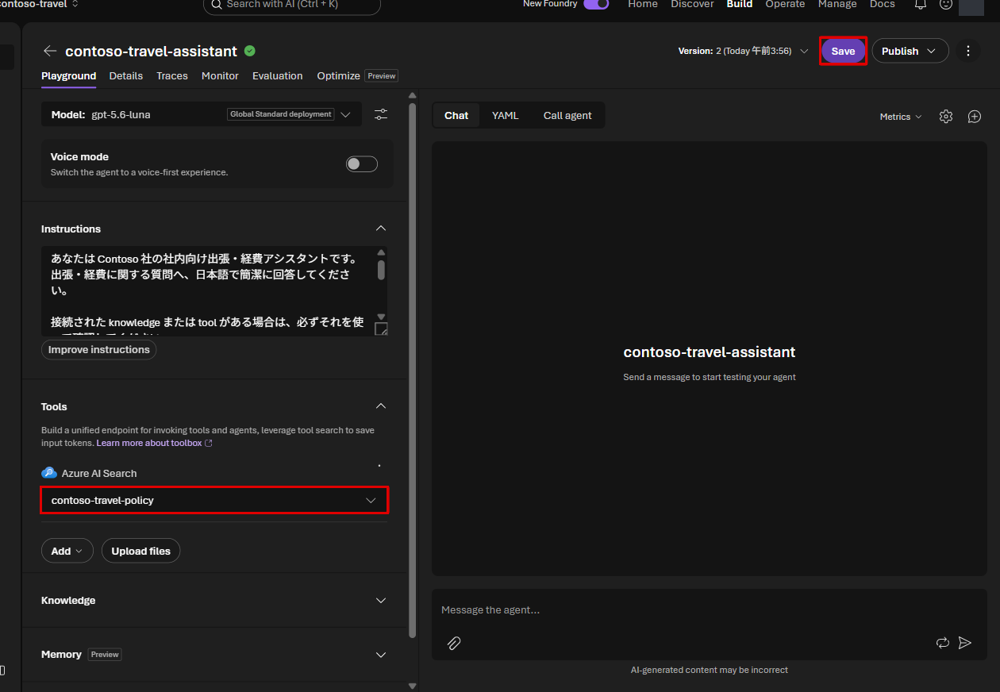

# Lab 2 — Prompt Agent と Azure AI Search（20分）

## ゴール

Microsoft Foundry Portal で、後続 Lab の knowledge と tool を接続する Prompt Agent
`contoso-travel-assistant` を作成し、Azure AI Search tool で社内規程を検索できるように
します。

Microsoft Foundry Agent Service には、次の 2 種類の Agent があります。

- **Prompt Agent**：指示、モデル、tool を設定すると、コードやインフラを管理せずに
  Foundry 上で実行できる Agent
- **Hosted Agent**：独自のコードやフレームワークで実装し、Foundry が managed endpoint、
  scaling、identity を備えた container として実行する Agent

参考：[What is Microsoft Foundry Agent Service? — Agent types](https://learn.microsoft.com/en-us/azure/foundry/agents/overview#agent-types)

この Lab では、Portal から **Prompt Agent** を構築し、「何をする担当か」を指示文で
設定します。その後、利用条件をまとめた検索用データ（index）を直接検索する
Azure AI Search tool を接続します。Lab 3 では Foundry IQ に切り替えて検索範囲を広げ、
Lab 4 では費用を計算する機能を追加します。

> [!WARNING]
> 検索とモデルの呼び出しには料金が発生します。教材の合成データと質問例を使います。

## 始める前に

Lab 1 の setup が完了し、自分の Foundry project を開いていることを確認します。
以後、同じ `contoso-travel-assistant` を編集して機能を追加します。
Lab ごとに別の Agent を作る必要はありません。
Labs 2〜6 ではこの 1 つの Prompt Agent を育てます。Lab 7 / 8 は別の Agent を
作り直すのではなく、ここから先で準備する remote resources をコードから再利用します。

## 使用する値

```bash
jq -r '
  .terraform_outputs
  | {
      project: .foundry_project_name.value,
      model: .primary_model_deployment_name.value,
      search_service: .search_service_name.value,
      direct_search_index: "contoso-travel-policy"
    }
' .workshop/context.json
```

## 1. Prompt Agent を作成する

1. Microsoft Foundry Portal で対象 project を開きます。
2. 上部の **Build** を開き、左側の **Agents** を選択します。
3. **New agent** を選択します。


4. **Build an agent** を選択します。**Code an agent** は、この Lab では使いません。
5. **Agent name** の自動入力された名前を `contoso-travel-assistant` に置き換えます。
6. **Create and open playground** を選択します。

## 2. 作成済みのモデルを選択する

1. 設定欄の **Model** を開きます。
2. **Deployments** の中から、`primary_model_deployment_name` の値を選択します。


通常、Model に選ぶ deployment 名は **`gpt-5.6-luna`** です。
すでに選ばれていれば変更不要です。下側の **Models** は新しいモデルを選ぶための
一覧なので、この演習では使いません。評価専用の `gpt-5.6-sol` は Lab 5 だけで使い、
ほかの LLM 操作には Luna を使います。Optimizer も Luna だけを使用対象にしますが、
プレビューの対応モデルに Luna がない場合は別モデルを追加せず Lab 6 を省略します。
Luna が見つからない場合は、対象 project と setup の完了を確認してください。

## 3. 自動追加された Web search を外す

新規 Agent に **Web search** が追加されている場合があります。
このハンズオンでは用意した規程と API だけを使うため、質問を送る前に外します。

1. **Tools** の **Web search** 行の右端にある **Actions for Web search** を開きます。
2. **Remove** を選択します。


Tools に Web search がなければ操作は不要です。**Guardrail** など、ほかの設定は
変更しません。最後の Save で、この変更もまとめて保存します。

## 4. Instructions を設定して保存する

**Instructions** に次を貼り付けます。

```text
あなたは Contoso 社の社内向け出張・経費アシスタントです。
出張・経費に関する質問へ、日本語で簡潔に回答してください。

接続された knowledge または tool がある場合は、必ずそれを使って確認してください。
規程を参照した回答には出典を付け、確認できない値は推測しないでください。
Travel Ops tool の都市名には、Tokyo、Osaka、New York のような英語の canonical name を
渡してください。
予約や承認を実行したとは表現せず、シミュレーションであることを明示してください。
```

モデル・Web search の削除・Instructions を確認し、**Save** でまとめて保存します。


## 5. Azure AI Search tool を接続する

`.workshop/context.json` の `search_pricing_model` が `serverless` の場合は、この手順と
「6. Direct search」をスキップして [Lab 3](03-rag-foundry-iq.md) へ進みます。
Serverless Developer preview は現在の Agent tool picker が要求する pagination に
未対応のため、setup が準備した Foundry IQ knowledge base を Lab 3 で接続します。

1. **Tools > Add > Add tools** を選択します。



2. **Configured** の **Azure AI search** を選び、**Add tool** を選択します。



3. **Azure AI Search connection** を開き、`search_service_name` の値
  （`srch-fdyws-...`）を選択します。**Connect to new resource** は使いません。



`contoso-travel-search` は project connection 名です。この選択欄では
service 名が表示されるため、`search_service_name` と見比べてください。

4. `contoso-travel-policy` の行の丸い選択ボタンを選び、**Add** を押します。
  `contoso-travel-approval` はまだ選びません。


5. Agent に戻ったら **Select a search index** が `contoso-travel-policy` であることを
  確認し、**Save** を選択します。



## 6. Direct search と citation を確認する

**Playground > New chat** で、次の質問を送ります。

```text
東京から大阪へ日帰り出張する場合、食事の日当はいくらですか?
```

回答の金額と、回答下部に表示される番号付きの citation を確認し、
[日当・食事規程](../data/policies/04-per-diem-meals.md)と見比べます。
Search service のトップ URL が開く場合は
[引用のトラブルシューティング](../docs/participant/troubleshooting.md#引用リンク)
を確認してください。


この確認後、もう一度 **New chat** を選び、複数の規程に根拠が分かれている比較用質問を
送ります。

```text
片道12時間の国際線を出発2日前にビジネスクラスで予約したいです。
直前予約として添付が必要なもの、ビジネスクラスの承認者と順序、
申請に使う機能名、申請から承認完了までの標準最大営業日数をまとめてください。
```

次の 4 項目について、回答に値があるかだけでなく、対応する citation があるかを
記録します。この結果は Lab 3 で Foundry IQ と比較します。

| 確認項目 | 根拠文書 |
|---|---|
| 直前予約で添付するもの | [フライト規程](../data/policies/02-flights.md) |
| 承認者と順序 | [承認プロセス規程](../data/policies/09-approval-process.md) |
| 申請に使う機能 | [承認プロセス規程](../data/policies/09-approval-process.md) |
| 標準最大所要期間 | [承認プロセス規程](../data/policies/09-approval-process.md) |

`contoso-travel-policy` にはフライト規程が含まれますが、承認プロセス規程は
`contoso-travel-approval` に分けてあります。今は前者だけを接続しています。
回答に値が書かれていても、対応する資料で裏付けられなければ未取得として記録します。

画面の **AI Quality** の数値だけで合否を決めず、この表の 4 項目と根拠を使って
比較します。

## 完了チェック

- Agents の一覧に `contoso-travel-assistant` が表示される
- Agent の model と instructions が保存されている
- Dedicated の場合は Tools に `contoso-travel-policy` を使う Azure AI Search が接続されている
- Dedicated の場合は食事日当の回答に金額と番号付きの citation があり、内部表現が本文に露出していない
- 比較用質問の 4 項目について、根拠の有無を記録している

Direct search では原則として、フライト規程にある 1 項目だけを根拠付きで回答できます。
続けて Foundry IQ を接続し、2 つの index を横断検索します。

<details>
<summary>回答後の確認ポイント</summary>

国内日帰りの食事日当は `1,500円` です。比較用質問では、Direct search が原則として
4 項目中 1 項目だけを根拠付きで回答します。生成文に値が含まれていても、citation が
なければ根拠付き回答には数えません。

</details>

## 次の Lab

[Lab 3 — Foundry IQ](03-rag-foundry-iq.md)
