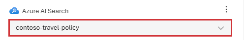
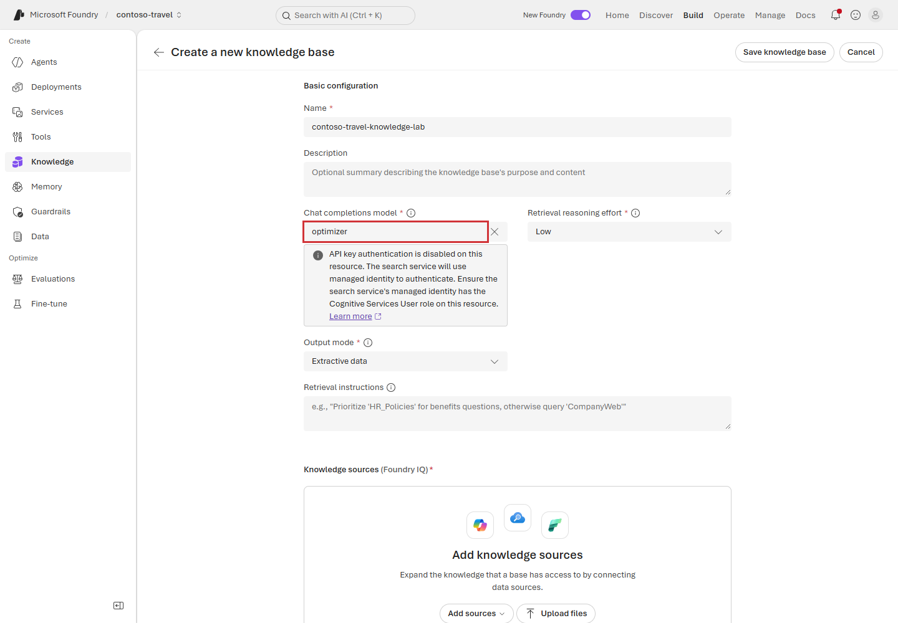
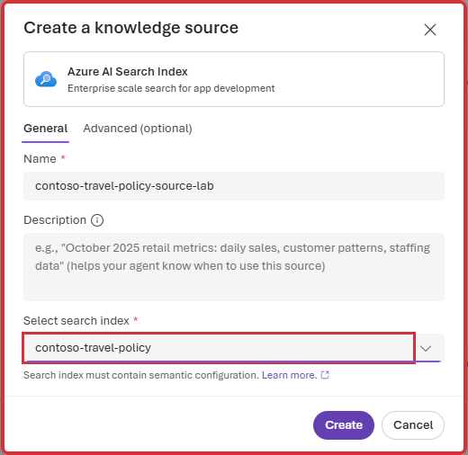

# Lab 3 — Azure AI Search と Foundry IQ（35分）

## ゴール

同じ規程 index を 2 つの方法で agent に接続し、検索過程と引用を比較します。

1. **Azure AI Search tool**: index を直接検索
2. **Foundry IQ knowledge base**: 質問を分解して agentic retrieval

> [!WARNING]
> Microsoft Foundry Portal から作成する Foundry IQ の agentic retrieval は preview です。
> 実行ごとに Search と query-planning model の料金が発生します。

## 使用する値

```bash
jq -r '
  .terraform_outputs
  | {
      search_service: .search_service_name.value,
      search_connection: "contoso-travel-search",
      search_index: "contoso-travel-policy",
      knowledge_model: .optimizer_model_deployment_name.value
    }
' .workshop/context.json
```

## 1. Azure AI Search tool を接続する

1. **Build > Agents** から `contoso-travel-assistant` を開きます。
2. **Tools > Add > Add tools** を選択します。
3. **Azure AI search** を選び、**Add tool** を選択します。
4. Search service の選択画面が表示された場合は
   `search_service_name` の値（例: `srch-fdyws-...`）を選択します。
5. **Select a search index** で `contoso-travel-policy` を選択します。

   

   `contoso-travel-search` は project connection 名です。Agent の tool picker で
   service 名を求められた場合は、connection 名ではなく `search_service_name` を使います。

6. **Save** を選択します。

## 2. Direct search と citation を確認する

**Playground** で次の質問を送ります。

```text
東京から大阪へ日帰り出張する場合、食事の日当はいくらですか?
```

回答が `1,500円` で、引用が表示されることを確認します。引用を開くと、
この repository の `data/policies/04-per-diem-meals.md` が表示されます。
Search service のトップ URL が開く場合は
[citation のトラブルシューティング](../docs/participant/troubleshooting.md#citation-link)
を確認してください。

続けて比較用の質問を送ります。

```text
国際線でビジネスクラスを利用するには、片道飛行時間が何時間以上である必要があり、
誰の事前承認が必要ですか?
```

この時点の回答と引用数を確認しておきます。直接検索でも正答する場合があります。
次の手順では、回答だけでなく query decomposition を比較します。

## 3. Foundry IQ knowledge base を作成する

> [!IMPORTANT]
> Agent の **Knowledge > Add** から先に **Foundry IQ** を選んでも、knowledge base が
> まだ無いため何も表示されません。最初に **Build > Knowledge** で作成します。

1. 左 navigation の **Build > Knowledge** を開きます。
2. **Connection** に `contoso-travel-search` を選択します。
3. **Create a knowledge base** を選択します。
4. **Basic configuration** を次のように設定します。

   | 項目 | 値 |
   |---|---|
   | Name | `contoso-travel-knowledge-lab` |
   | Chat completions model | `optimizer_model_deployment_name` の値 |
   | Retrieval reasoning effort | **Low** |
   | Output mode | **Extractive data** |

   

5. **Knowledge sources (Foundry IQ) > Add sources > Azure AI Search Index** を選択します。
6. ダイアログを次のように設定し、**Create** を選択します。

   | 項目 | 値 |
   |---|---|
   | Knowledge source name | `contoso-travel-policy-source-lab` |
   | Search index | `contoso-travel-policy` |

   

7. **Save knowledge base** を選択します。
8. 一覧で `contoso-travel-knowledge-lab` の Status が **Active** になるまで待ちます。

`primary` の `gpt-4.1` は Prompt Agent では利用できますが、2026-09-01 時点の
Portal の knowledge-base model picker では対象外です。この Lab では Portal が
サポートする `optimizer` の `gpt-5` deployment を使います。
**Extractive data** を選ぶことで、knowledge base は取得した原文を返し、最終回答は
Prompt Agent が作成します。

## 4. Knowledge base を agent に接続する

1. **Build > Agents > contoso-travel-assistant** に戻ります。
2. 比較条件を揃えるため、**Tools** の **Azure AI Search** で
   **Actions > Remove** を選び、**Save** します。
3. `contoso-travel-knowledge-lab` の詳細画面へ戻ります。
4. **Use in an agent > contoso-travel-assistant** を選択します。
5. Agent 画面の **Knowledge** に knowledge base が表示されたら、**Save** を選択します。

## 5. Agentic retrieval を確認する

Playground で同じ質問を送ります。

```text
国際線でビジネスクラスを利用するには、片道飛行時間が何時間以上である必要があり、
誰の事前承認が必要ですか?
```

## 完了チェック

- 回答に「片道 10 時間以上」が含まれる
- 「マネージャー」と「部門 VP」の両方が含まれる
- フライト規程と承認プロセス規程の citation がある
- Activity の `knowledge_base_retrieve` で複数の query / source が表示される

操作ラベルは 2026-09-01 時点の Foundry (new) を基準にしています。
背景仕様は
[What is Foundry IQ?](https://learn.microsoft.com/azure/foundry/agents/concepts/what-is-foundry-iq)
と
[Connect Agents to Foundry IQ](https://learn.microsoft.com/azure/foundry/agents/how-to/foundry-iq-connect)
を参照してください。

## 次の Lab

[Lab 4 — Travel Ops API の Toolbox](04-tools-toolbox.md)
