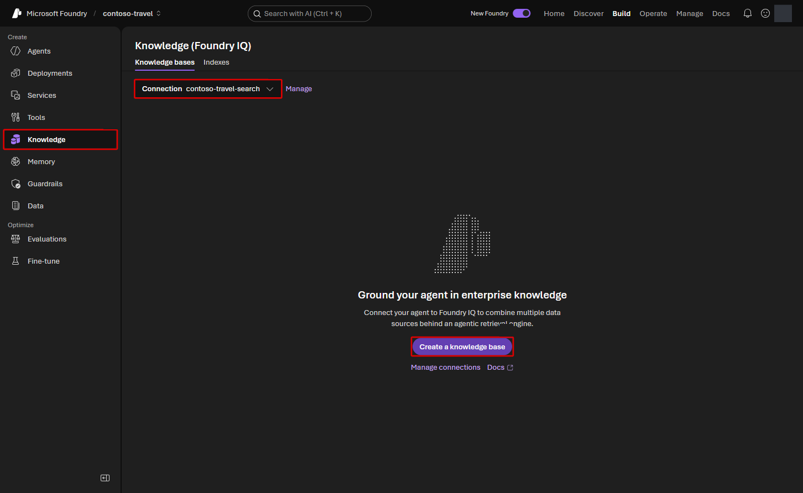
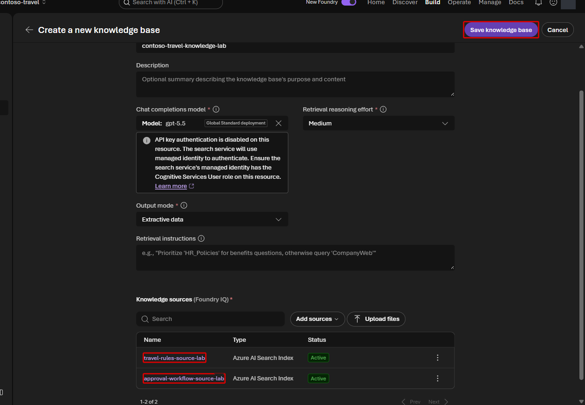
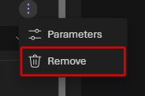

# Lab 3 — Foundry IQ（25分）

## ゴール

Lab 2 では、Azure AI Search tool から利用条件をまとめた 1 つの index を直接検索しました。
この Lab では **Foundry IQ knowledge base** を作成して Prompt Agent に接続し、質問を
分解しながら利用条件と承認手続きの 2 つの検索先（source）を横断検索します。

たとえば「ビジネスクラスに乗れるか」と「誰にどの順番で承認してもらうか」は、
別の規程に書かれています。Lab 2 と同じ質問を送り、Direct search と比べて
**回答の根拠が増えること**を確認します。文書を検索して回答の根拠にする仕組みを
RAG と呼びます。

ここで作る `contoso-travel-knowledge-lab` は Prompt Agent だけの一時状態ではありません。
Lab 7 の plain / Harness Agent と Lab 8 の Hosted workflow も、同じ remote knowledge base
をコードから参照します。

> [!WARNING]
> 検索とモデルの呼び出しには料金が発生します。教材の合成データと質問例を使います。

## 使用する値

```bash
jq -r '
  .terraform_outputs
  | {
      search_connection: "contoso-travel-search",
      policy_search_index: "contoso-travel-policy",
      approval_search_index: "contoso-travel-approval",
      knowledge_model: .primary_model_deployment_name.value
    }
' .workshop/context.json
```

## 1. Foundry IQ knowledge base を作成する

Agent に接続する前に、**Build > Knowledge** で knowledge base を作成します。

> [!IMPORTANT]
> `.workshop/context.json` の `search_pricing_model` が `serverless` の場合、setup が
> `contoso-travel-policy-source`、`contoso-travel-approval-source` と
> `contoso-travel-knowledge-lab` を REST API で準備済みです。現在の Portal では
> Serverless の index picker が paging パラメーターを渡さず、Luna も新規作成時の
> model picker に表示されないためです。**Create a knowledge base** は選ばず、一覧で
> knowledge base と2 source が **Active** であることを確認して手順2へ進みます。

1. 左 navigation の **Build > Knowledge** を開きます。
2. **Connection** に `contoso-travel-search` を選択します。
3. **Create a knowledge base** を選択します。



4. **Basic configuration** を次のように設定します。

   | 項目 | 値 |
   |---|---|
   | Name | `contoso-travel-knowledge-lab` |
   | Chat completions model | `primary_model_deployment_name` の値（通常 `gpt-5.6-luna`） |
   | Retrieval reasoning effort | **Medium** |
   | Output mode | **Extractive data** |

   

**Chat completions model** は **Deployments** の `gpt-5.6-luna` を選びます。
**Retrieval reasoning effort** は初期値の Minimal から **Medium** に変更します。
**Description** と **Retrieval instructions** は、この演習では空のままで構いません。

> [!NOTE]
> Dedicated Search でも、Portal の model picker にデプロイ済みの Luna が出ない場合が
> あります（2026-09-10 の実機確認）。GPT-5.5 への変更やモデルの追加はせず、作成画面を
> **Cancel** で閉じます。選んだ実行環境の repository root の Terminal で次を実行し、
> 一覧を再読み込みしてください。
>
> ```bash
> bash scripts/prepare_serverless_foundry_iq.sh --terraform-outputs .workshop/context.json
> ```
>
> スクリプト名は旧 Serverless 手順との互換性のための名前ですが、Dedicated でも使えます。
> このハンズオン専用の knowledge base と、`contoso-travel-policy-source` /
> `contoso-travel-approval-source` を準備します。Luna、Medium、Extractive data は上の設定と
> 同じです。既に編集した同名の knowledge base を上書きする目的では使わないでください。
> 成功後は source と knowledge base の **Active** を確認し、手順2へ進みます。
> [公式の対応モデルと API](https://learn.microsoft.com/azure/search/agentic-retrieval-how-to-create-knowledge-base#supported-models)
> に従い、認証は Microsoft Entra ID のままです。

5. **Knowledge sources (Foundry IQ) > Add sources > Azure AI Search Index** を選択します。

6. ダイアログを次のように設定し、**Create** を選択します。

   | 項目 | 値 |
   |---|---|
   | Name | `travel-rules-source-lab` |
   | Description | `出張の利用条件、フライト・宿泊・日当・領収書などの規程。承認手続きは別の source を参照する。` |
   | Select search index | `contoso-travel-policy` |

   

7. もう一度 **Add sources > Azure AI Search Index** を選び、次を追加します。

   | 項目 | 値 |
   |---|---|
   | Name | `approval-workflow-source-lab` |
   | Description | `事前承認の申請機能、承認者と順序、標準処理日数を確認するための規程。` |
   | Select search index | `contoso-travel-approval` |

両方の source で **Advanced (optional)** は変更しません。

8. 2 つの source が一覧にあることを確認して、**Save knowledge base** を選択します。



9. 一覧で `contoso-travel-knowledge-lab` の Status が **Active** になるまで待ちます。


## 2. Knowledge base を agent に接続する

1. **Build > Agents > contoso-travel-assistant** に戻ります。
2. 比較条件を揃えるため、**Tools** の **Azure AI Search** で
   **Actions > Remove** を選び、**Save** します。



Search service や index を削除する操作ではありません。接続方法だけを切り替えます。
Serverless では Lab 2 で直接検索 tool を追加していないため、この Remove 操作は不要です。

3. **Knowledge** の一覧から `contoso-travel-knowledge-lab` を開きます。
4. **Use in an agent > contoso-travel-assistant** を選択します。
5. Agent 画面の **Knowledge** に knowledge base が表示されることを確認します。
   この操作で自動保存される場合があります。**Save** が有効なら押し、無効ならそのまま
   次へ進みます。

## 3. Agentic retrieval を確認する

Playground で **New chat** を選び、Lab 2 と同じ質問を送ります。Direct search の回答が
会話履歴から混入しないよう、必ず新しい会話で比較してください。

```text
片道12時間の国際線を出発2日前にビジネスクラスで予約したいです。
直前予約として添付が必要なもの、ビジネスクラスの承認者と順序、
申請に使う機能名、申請から承認完了までの標準最大営業日数をまとめてください。
```

回答内容と citation を、次の根拠文書と照合します。

| 確認項目 | 根拠文書 |
|---|---|
| 直前予約で添付するもの | [フライト規程](../data/policies/02-flights.md) |
| 承認者と順序 | [承認プロセス規程](../data/policies/09-approval-process.md) |
| 申請に使う機能 | [承認プロセス規程](../data/policies/09-approval-process.md) |
| 標準最大所要期間 | [承認プロセス規程](../data/policies/09-approval-process.md) |

## 4. 回答の根拠を確認する

回答末尾の **根拠資料** に、フライト規程と承認プロセス規程が含まれることを確認します。
category はそれぞれ `flights` と `approval_process` です。追加の FAQ などが
含まれていても構いません。

Search index 型の Foundry IQ では、引用が `mcp://searchindex/...` という内部識別子で
表示されることがあります。これは通常の Web URL ではないため、ブラウザーで直接
開けることを成功条件にはしません。元資料は上の比較表の文書リンクから確認できます。

1. **Traces** で今回の **Trace ID** を開きます。
2. **Trajectories > Find in trace** で `knowledge_base_retrieve` を検索し、
   該当する処理の **Input + Output** を開きます。
3. **Input** の質問と、**Output** に含まれる `flights` / `approval_process` の文書を確認します。
   取得した文書と回答を見比べ、Lab 2 で記録した結果と比較してください。

## 完了チェック

- 4 項目すべてが正しく、Direct search より根拠付き回答数が増えている
- 引用と根拠資料に、フライト規程と承認プロセス規程が含まれる
- Traces の `knowledge_base_retrieve` 出力に `flights` と `approval_process` の文書がある

<details>
<summary>回答後の確認ポイント</summary>

比較用質問は次の 4 項目を確認します。

| 確認項目 | 規程に基づく内容 |
|---|---|
| 直前予約で添付するもの | Contoso Expense にマネージャーの承認コメントを添付 |
| 承認者と順序 | マネージャー、次に部門 VP |
| 申請に使う機能 | `事前承認リクエスト` |
| 標準最大所要期間 | 4 営業日 |

期待する比較結果は、Direct search が原則 1/4、Foundry IQ が 4/4 です。生成文の表現は
変動しても、根拠文書を index 間で分離しているため citation coverage で同じ判定ができます。

</details>

背景仕様は
[What is Foundry IQ?](https://learn.microsoft.com/azure/foundry/agents/concepts/what-is-foundry-iq)、
[Connect Agents to Foundry IQ](https://learn.microsoft.com/azure/foundry/agents/how-to/foundry-iq-connect)、
[Retrieval reasoning effort](https://learn.microsoft.com/azure/search/agentic-retrieval-how-to-set-retrieval-reasoning-effort)、
[MCP の応答形式](https://learn.microsoft.com/azure/search/agentic-retrieval-how-to-retrieve#review-the-mcp-response)
を参照してください。

## 次の Lab

[Lab 4 — Travel Ops API の Toolbox](04-tools-toolbox.md)
