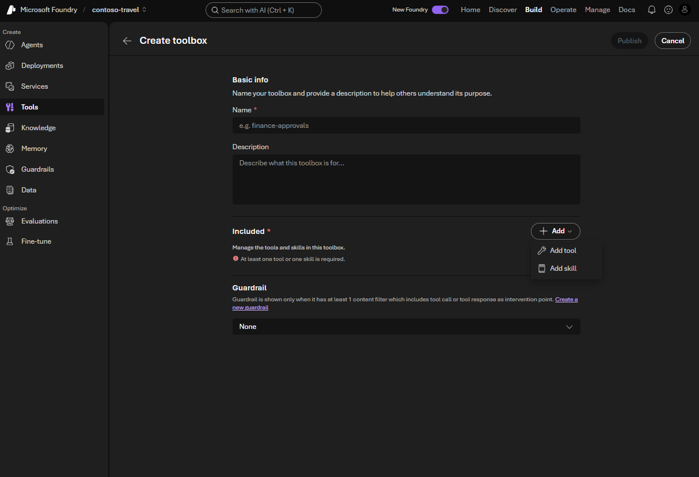
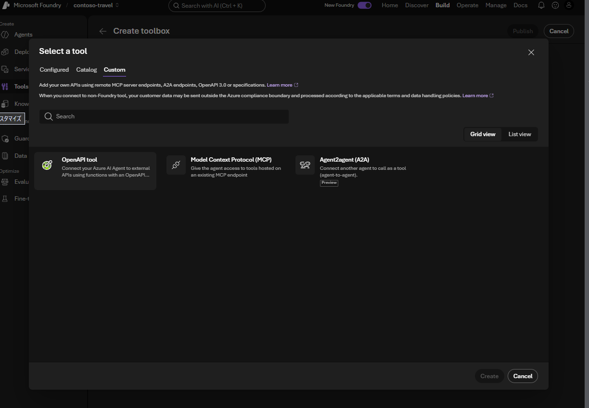
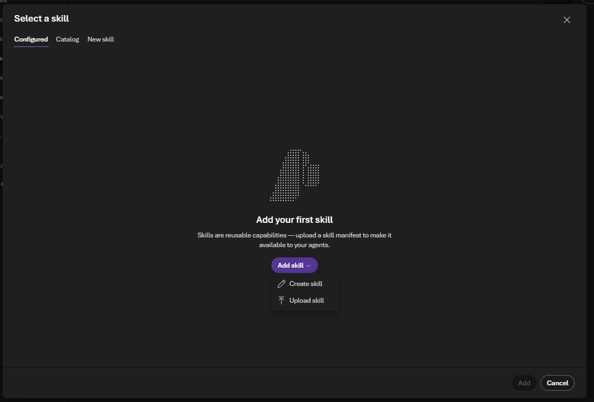

# Lab 4 — Portal で Toolbox と Skills を作成する（30分）

## ゴール

Microsoft Foundry **Portal の UI** で、Travel Ops API と操作手順の Skills を
`contoso-travel-toolbox` にまとめて公開します。Notebook は本編では使いません。

Lab 3 では「規程を調べる」機能を追加しました。この Lab では「日当を照会する」
「費用を計算する」機能を追加します。Tool は実行する機能、Skill はその使い方を説明した
手順書、Toolbox は両方をまとめて Agent に渡す入れ物です。

| 要素 | 役割 |
|---|---|
| Foundry IQ | 規程と根拠を調べる。Lab 3 の Knowledge をそのまま残す |
| Travel Ops API | 日当照会・費用計算・事前承認シミュレーションを実行する |
| `travel-estimation` Skill | 不足情報を確認し、照会・見積もり API を使い分け、費用内訳を説明する |
| `preapproval-simulation` Skill | 実行意思を確認し、合成の承認結果と実際の承認を区別する |
| Toolbox | 実行機能と操作手順を一緒に配布する。Agent ごとの複製を避ける |

> [!WARNING]
> Skill は操作手順であり、認可や強制的な承認制御の代わりではありません。
> モデル・API の利用には料金が発生し、外部 tool へ送るデータは Foundry の境界外で
> 処理されます。このラボでは合成データだけを使い、実際の予約・承認は行いません。

## 1. 貼り付け・アップロード用ファイルを用意する

Codespace の repository root の terminal で次を実行します。

```bash
.venv/bin/python scripts/prepare_toolbox_assets.py
```

これは **ローカルの素材準備だけ**です。実際の Travel Ops API から OpenAPI 3.1 定義を
読み、`servers` にデプロイ先を設定します。Toolbox、Skill、Agent は作成・更新しません。
API schema を教材へコピーして固定化せず、Lab 1 の `.workshop/context.json` を使います。

| ファイル | 用途 |
|---|---|
| `.workshop/toolbox/travel-ops.openapi.json` | Portal の schema editor へ内容を貼り付ける |
| `.workshop/toolbox/travel-estimation.zip` | 見積もり Skill のアップロード。ZIP 直下に `SKILL.md` |
| `.workshop/toolbox/preapproval-simulation.zip` | 承認シミュレーション Skill のアップロード |
| `.workshop/toolbox/portal-values.json` | 自分の環境の Toolbox MCP endpoint などを確認する |

Browser のファイル選択ダイアログは Codespace 内を直接参照できません。
アップロードする ZIP を VS Code Explorer で右クリックし、**Download** で手元へ保存します。
UI が `.md` を要求する場合は、次の元ファイルをそれぞれダウンロードしてください。

- [`travel-estimation/SKILL.md`](../data/skills/travel-estimation/SKILL.md)
- [`preapproval-simulation/SKILL.md`](../data/skills/preapproval-simulation/SKILL.md)

## 2. Portal で Toolbox の作成画面を開く

1. 対象 project の **Build > Tools** で **Create toolbox** を開きます。
2. **Name** に `contoso-travel-toolbox` を入力します。
3. **Description** に次を入力します。

```text
Contoso Travel Ops API and reusable skills for estimates and preapproval simulations.
```



**Included** には tool と skill の両方を追加できます。
この演習では **Guardrail** は既定のままにします。組織で必須の設定がある場合は従い、
既存の guardrail を削除しないでください。

再実行時は同名 Toolbox を増やさず、既存のものを開いて構成を確認・編集します。

## 3. OpenAPI tool を追加する

1. **Included > + Add > Add tool** を選択します。
2. **Select a tool > Custom > OpenAPI tool** を選択します。



**Create an OpenAPI tool** の入力を次に揃えます。

| 項目 | 入力 |
|---|---|
| **Name** | `travel_ops_api` |
| **Description** | `Contoso Travel Ops API for per-diem, estimates, and simulated preapproval.` |
| **Authentication method** | `Anonymous` |
| **OpenAPI 3.0+ schema** | `.workshop/toolbox/travel-ops.openapi.json` の内容全体 |


**Create tool** を選択し、Included に追加されたことを確認します。
`OpenAPI 3.0+` という UI ラベルですが、貼り付ける教材の定義は **3.1.0** です。
`servers[0].url` が自分の Travel Ops API になっていることも確認してください。

> [!NOTE]
> `Anonymous` は公開された合成データ専用 mock API の認証方式です。
> **Agent から Foundry Toolbox への認証まで Anonymous にする、という意味ではありません。**
> Toolbox 側は Microsoft Entra ID/RBAC を使います。

## 4. 2 つの Skills をアップロードする

1. **Included > + Add > Add skill** を選択します。
2. **Select a skill** の **Configured** で **Add skill > Upload skill** を選択します。
3. `travel-estimation.zip` をアップロードします。拡張子が制限されている UI では
   対応する `SKILL.md` を使います。
4. 同様に `preapproval-simulation.zip` をアップロードします。
5. Configured の一覧から 2 つの Skills を選択し、**Add** で Toolbox に含めます。



すでに登録済みなら、アップロードを繰り返さず Configured から既存 Skill を選びます。
Skill は同じ Foundry project 内に作成してください。別 project への参照は使いません。

アップロード前後に `SKILL.md` を開き、次の役割分担を確認します。

- `description` は **いつ使うか**を示す。日当・見積もりと承認シミュレーションを区別する。
- 本文は **どう使うか**を示す。入力確認、API の選択、結果の説明を記述する。
- 規程の金額や承認条件を複製しない。Foundry IQ と API を情報源にする。
- 見積もり依頼だけで承認シミュレーションを実行しない。

## 5. 公開し、Prompt Agent に接続する

1. Included に `travel_ops_api` と 2 つの Skills があることを確認します。
2. 右上の **Publish** を選択します。
3. 公開後に Toolbox を開き直し、3 つの項目と公開済み version を確認します。
   ローカルファイルを編集しただけでは公開内容は変わりません。
4. **Build > Agents > contoso-travel-assistant** の **Tools** から、
   公開した Toolbox を追加します。Lab 3 の **Knowledge** は削除しません。
   選択項目や接続方法は Portal のバージョンにより異なります。

接続先には、`.workshop/toolbox/portal-values.json` の `toolbox_mcp_endpoint` を使います。
これは default version を参照する consumer endpoint です。
認証入力が必要な画面では project managed identity を使い、audience は
`https://ai.azure.com/` とします。API key や手動で取得した bearer token を貼り付けません。

Toolbox の選択や keyless 接続が UI に表示されない場合に限り、次の補助コマンドを使えます。

```bash
.venv/bin/python scripts/connect_toolbox.py
```

このコマンドは **公開済み Toolbox への接続だけ**を行います。
`az login` の認証で `contoso-travel-toolbox-mcp` connection を用意し、
既存の Knowledge を残して Agent に追加します。Toolbox の作成・Skill の変更は行いません。

## 6. API の実行と Skill の利用を区別して確認する

Playground の新しい会話で次を送ります。

```text
東京からニューヨークへ2026-07-10〜2026-07-15の出張で、
1名、ビジネスクラス利用を前提に費用見積もりを出してください。
予約や承認シミュレーションは不要です。
```

Activity / trace で API の呼び出しを開きます。

- `createTripEstimate` が呼ばれる（公開名の例: `travel_ops_api___createTripEstimate`）
- `origin_city=Tokyo`、`destination_city=New York`、`traveler_count=1`
- `start_date=2026-07-10`、`end_date=2026-07-15`、`cabin_class=business`
- 合計が `781,000円` で、実際の予約・承認ではないと明記される
- `createPreapproval` は呼ばれない

**Skill の登録成功と、Agent がその Skill を読み込んだことは別です。**
本編では、Toolbox に 2 つの Skills を登録・公開できたことと、Agent が API を呼べることを
必須の到達点にします。Skill の読み込み記録がない場合は「登録・公開済み／利用は未確認」
と記録して次へ進めます。API が動いただけで Skill も読み込まれたとは判断しません。

<details>
<summary>Skill の読み込みをさらに確認する場合</summary>

Skills は `tools/list` の API tool ではなく、MCP の `resources/list` / `resources/read`
で公開される resources です。利用側に対応する Skill provider が必要です。
Toolbox の選択だけで Prompt Agent が自動利用すると断定しないでください。

対応クライアントでは Skill の読み込み記録（例: `load_skill` または resource read）と
回答を確認します。記録を確認できない場合は「登録・公開済み／利用は未確認」として、
回答が手順に似ているだけで Skill の効果と判断しません。
対応実装の例は公式の [Agent Framework Toolbox Skills sample](https://github.com/microsoft-foundry/foundry-samples/tree/main/samples/csharp/hosted-agents/agent-framework/foundry-toolbox-mcp-skills)
を参照してください。本編 Lab 7 の workflow は、この Skill provider をまだ実装していません。
公式の [Prompt Agent サンプル](https://github.com/Azure/azure-sdk-for-python/blob/f90b55500941d7b161afb94b9ba45e53a865c4e2/sdk/ai/azure-ai-projects/samples/agents/tools/sample_toolbox_with_shipping_skill.py)
にはダウンロードした Skill を instructions へ明示的に組み込む方式もありますが、
これは Toolbox の MCP resource を自動取得する方式とは異なります。

読み込みを確認できる環境では、次の依頼も別々の会話で試します。

| 依頼 | Skill の手順として期待する挙動 |
|---|---|
| 「東京からニューヨークへの出張費を見積もって」 | 日程・座席クラスを確認し、値を推測して呼ばない |
| 「大阪の2026-09-10の日当と宿泊上限を教えて」 | `getPerDiem` を選び、承認処理は呼ばない |
| 「東京から大阪へ2026-09-10〜11、1名、economy。事前承認をシミュレーションして」 | `createPreapproval` を使い、`simulated_` の意味と免責を説明する |

</details>

## 完了チェック

- Portal で Toolbox を公開できた
- OpenAPI tool と 2 つの Skills が公開済み Toolbox に含まれる
- 各 Skill の本文を確認し、規程と操作手順の違いを説明できる
- Agent の Knowledge を残したまま API を呼び出せた
- Skill の登録状態と、利用側での読み込み確認の有無を区別して記録した

## 任意: SDK で同じ構成を扱う

[`notebooks/04-create-toolbox.ipynb`](../notebooks/04-create-toolbox.ipynb) は SDK 学習用の補助です。
OpenAPI の更新時に既存 Skills・他の tools・guardrail を保持しますが、
Skill 自体のアップロードは上の Portal 手順で行います。
UI の作成操作を体験する前に Notebook で Toolbox を作る必要はありません。

公式仕様: [Toolbox](https://learn.microsoft.com/azure/foundry/agents/how-to/tools/toolbox) /
[Skills](https://learn.microsoft.com/azure/foundry/agents/how-to/tools/skills)。
困った場合は [Toolbox のトラブルシューティング](../docs/participant/troubleshooting.md#toolbox-portal)
を参照してください。

## 次の Lab

[Lab 5 — Portal で Agent evaluation](05-evaluation.md)
