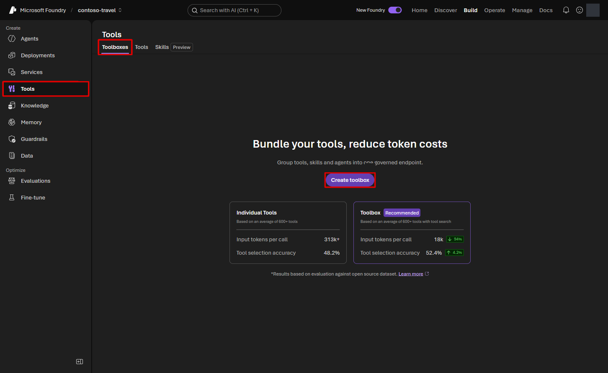
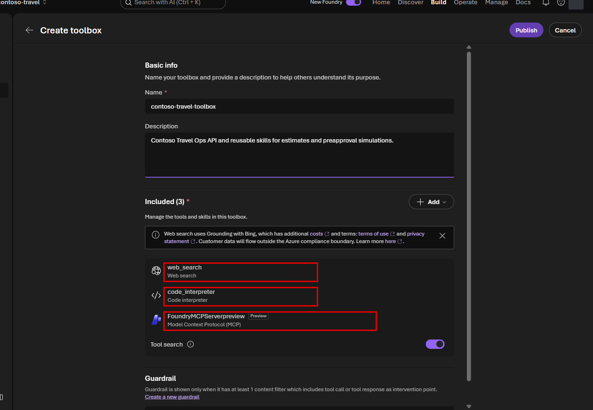
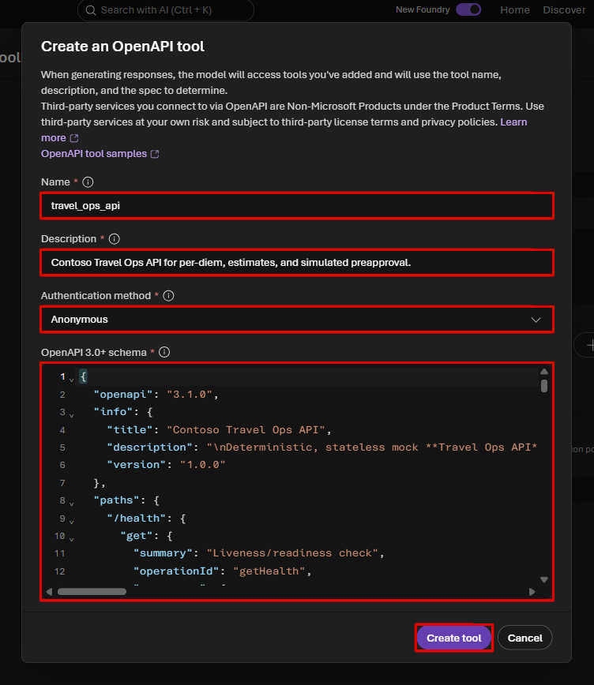
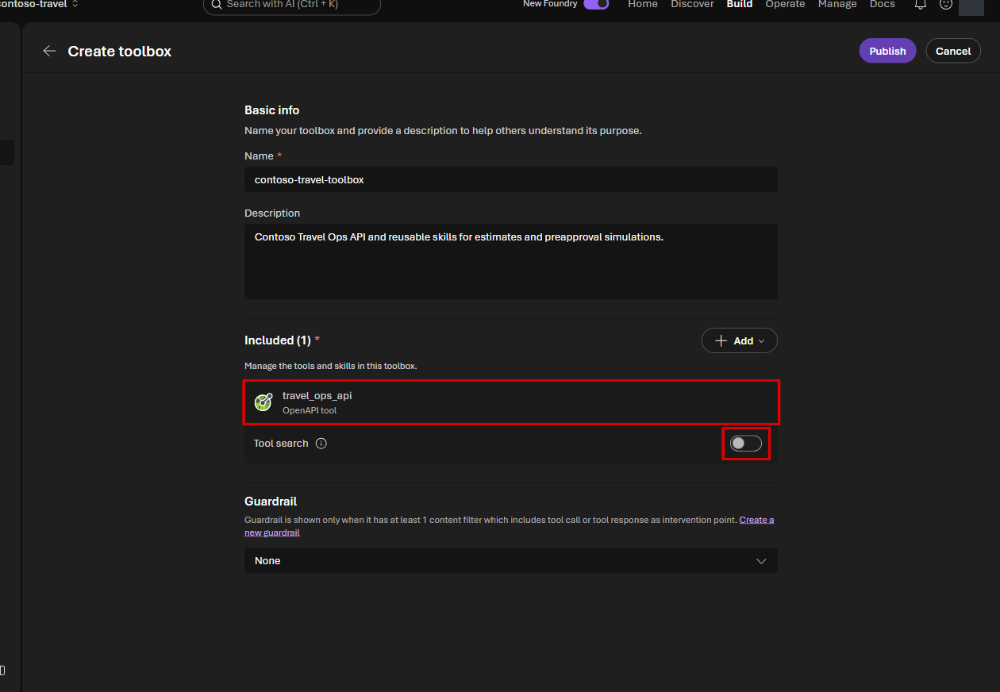
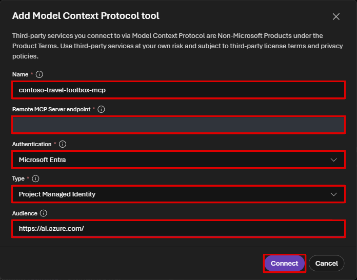
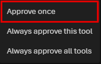
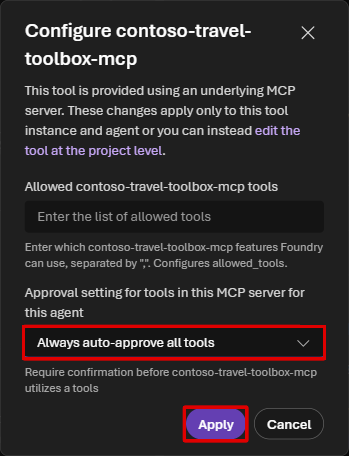

# Lab 4 — Portal で Toolbox と Skills を作成する（30分）

## ゴール

Microsoft Foundry **Portal の UI** で、Travel Ops API と操作手順の Skills を
`contoso-travel-toolbox` にまとめて公開します。Notebook は本編では使いません。

Lab 3 の規程検索を残したまま、API による費用計算と、Skills による操作手順の共有を追加します。

| 要素 | 役割 |
|---|---|
| Travel Ops API | 日当照会・費用計算・事前承認シミュレーションを実行する |
| `travel-estimation` Skill | 不足情報を確認し、照会・見積もり API を使い分け、費用内訳を説明する |
| `preapproval-simulation` Skill | 実行意思を確認し、合成の承認結果と実際の承認を区別する |

> [!WARNING]
> Skill は操作手順であり、認可や強制的な承認制御の代わりではありません。
> モデル・API の利用には料金が発生し、外部 tool へ送るデータは Foundry の境界外で
> 処理されます。このラボでは合成データだけを使い、実際の予約・承認は行いません。

## 1. 貼り付け・アップロード用ファイルを用意する

Codespace の repository root の terminal で次を実行します。

```bash
.venv/bin/python scripts/prepare_toolbox_assets.py
```

実際の Travel Ops API と `.workshop/context.json` から、自分の環境用の素材を生成します。
この時点では Toolbox、Skill、Agent は作成・更新しません。

| ファイル | 用途 |
|---|---|
| `.workshop/toolbox/travel-ops.openapi.json` | Portal の schema editor へ内容を貼り付ける |
| `.workshop/toolbox/travel-estimation.zip` | 見積もり Skill のアップロード。ZIP 直下に `SKILL.md` |
| `.workshop/toolbox/preapproval-simulation.zip` | 承認シミュレーション Skill のアップロード |
| `.workshop/toolbox/portal-values.json` | 自分の環境の Toolbox MCP endpoint などを確認する |

Browser のファイル選択ダイアログは Codespace 内を直接参照できません。
アップロードする ZIP を VS Code Explorer で右クリックし、**Download** で手元へ保存します。
この演習では生成された 2 つの ZIP を使います。本文を読むときは次の元ファイルを開きます。

- [`travel-estimation/SKILL.md`](../data/skills/travel-estimation/SKILL.md)
- [`preapproval-simulation/SKILL.md`](../data/skills/preapproval-simulation/SKILL.md)

## 2. Portal で Toolbox の作成画面を開く

1. 対象 project の **Build > Tools** を開きます。
2. **Toolboxes** タブを選び、**Create toolbox** を選択します。



3. **Name** に `contoso-travel-toolbox` を入力します。
4. **Description** に次を入力します。

```text
Contoso Travel Ops API and reusable skills for estimates and preapproval simulations.
```

**Included** に最初から推奨 tool が入っている場合は、この演習で使わないものを外します。
`web_search`、`code_interpreter`、`FoundryMCPServerpreview` がある場合、それぞれの
右端の **Actions** から **Remove** を選択してください。



これらが最初から入っていなければ削除操作は不要です。
この演習では **Guardrail** は既定のままにします。組織で必須の設定がある場合は従い、
既存の guardrail を削除しないでください。

## 3. OpenAPI tool を追加する

1. **Included > + Add > Add tool** を選択します。
2. **Select a tool > Custom > OpenAPI tool** を選択します。
3. ダイアログ下部の **Create** を選択します。

**Create an OpenAPI tool** の入力を次に揃えます。

| 項目 | 入力 |
|---|---|
| **Name** | `travel_ops_api` |
| **Description** | `Contoso Travel Ops API for per-diem, estimates, and simulated preapproval.` |
| **Authentication method** | `Anonymous` |
| **OpenAPI 3.0+ schema** | `.workshop/toolbox/travel-ops.openapi.json` の内容全体 |



**Create tool** を選択し、Included に追加されたことを確認します。
`OpenAPI 3.0+` という UI ラベルですが、貼り付ける教材の定義は **3.1.0** です。
`servers[0].url` が自分の Travel Ops API になっていることも確認してください。

追加後は **Tool search** を **Off** にします。この演習では API が 1 つなので、
利用できる関数を直接確認する構成にします。



> [!NOTE]
> `Anonymous` は公開された合成データ専用 mock API の認証方式です。
> **Agent から Foundry Toolbox への認証まで Anonymous にする、という意味ではありません。**
> Toolbox 側は Microsoft Entra ID/RBAC を使います。

## 4. 2 つの Skills をアップロードする

1. **Included > + Add > Add skill** を選択します。
2. **Select a skill** の **Configured** で **Add skill** を選択します。

3. メニューから **Upload skill** を選択します。
4. **Browse** を押し、手元の PC にダウンロードした `travel-estimation.zip` を選びます。
5. 表示されたファイル名と **Name = travel-estimation** を確認し、**Create** を押します。
   Name と Description は、ZIP 内の `SKILL.md` から読み取られます。
6. Toolbox の画面に戻り、Included に Skill が増えたことを確認します。
7. 同じ **Add skill > Upload skill** の手順で `preapproval-simulation.zip` を選択します。
   Name が **preapproval-simulation** であることを確認して **Create** を押します。

アップロードした Skill は自動で Included に入ります。
登録済みの Skill を使う場合は、同じ project の **Configured** から選んで **Add** します。

アップロード前後に `SKILL.md` を開き、次の役割分担を確認します。

- `description` は **いつ使うか**を示す。日当・見積もりと承認シミュレーションを区別する。
- 本文は **どう使うか**を示す。入力確認、API の選択、結果の説明を記述する。
- 規程の金額や承認条件を複製しない。Foundry IQ と API を情報源にする。
- 見積もり依頼だけで承認シミュレーションを実行しない。

## 5. Toolbox を公開する

1. Included が **travel_ops_api / travel-estimation / preapproval-simulation の 3 つ**
   で、Tool search が Off であることを確認します。
2. 右上の **Publish** を選択します。

3. 公開後に Toolbox を開き直し、3 つの項目と公開済み version を確認します。

## 6. Prompt Agent に keyless 接続する

Toolbox は MCP という共通の接続方式で Agent から呼び出します。
**Lab 3 の Knowledge は削除しません。**

1. 公開済み Toolbox の **Call this toolbox > Endpoint** を **Copy endpoint** でコピーします。
   同じ値は `.workshop/toolbox/portal-values.json` の `toolbox_mcp_endpoint` でも確認できます。
2. **Build > Agents > contoso-travel-assistant** を開きます。
3. **Tools** 側の **Add > Add tools** を開きます。Knowledge 側の Add ではありません。
4. **Custom > Model Context Protocol (MCP)** を選択し、**Create** を押します。

5. 接続画面を次の値に揃えます。

| 項目 | 値 |
|---|---|
| Name | `contoso-travel-toolbox-mcp` |
| Remote MCP Server endpoint | コピーした自分の `toolbox_mcp_endpoint` |
| Authentication | **Microsoft Entra** |
| Type | **Project Managed Identity** |
| Audience | `https://ai.azure.com/` |

6. 各項目を確認して **Connect** を選択します。



7. Tools に接続が増え、Knowledge に `contoso-travel-knowledge-lab` が残っていることを
   確認して **Save** を押します。

API key や手動で取得した bearer token は使いません。

<details>
<summary>keyless 接続の選択肢が表示されない場合だけ使う補助コマンド</summary>

上の接続設定を UI で選べない場合に限り、公開済み Toolbox に接続する次のコマンドを使えます。

```bash
.venv/bin/python scripts/connect_toolbox.py
```

このコマンドは **公開済み Toolbox への接続だけ**を行います。
`az login` の認証で `contoso-travel-toolbox-mcp` connection を用意し、
既存の Knowledge を残して Agent に追加します。Toolbox の作成・Skill の変更は行いません。

</details>

## 7. API の実行と Skill の利用を区別して確認する

Playground の **New chat** で新しい会話を作り、次を入力して **Send** を押します。

```text
東京からニューヨークへ2026-07-10〜2026-07-15の出張で、
1名、ビジネスクラス利用を前提に費用見積もりを出してください。
予約や承認シミュレーションは不要です。
```

Tool の確認が表示されたら、関数名が **createTripEstimate** であり、
都市・日程・座席クラス・人数が依頼どおりであることを確認します。
そのうえで **Approve > Approve once** を選択します。



`createPreapproval` など、依頼していない処理を求められた場合は承認せず、
送った質問と接続した tool を確認してください。

回答と、必要に応じて **Traces** の tool 呼び出しを確認します。

- `createTripEstimate` が呼ばれる（公開名の例: `travel_ops_api___createTripEstimate`）
- `origin_city=Tokyo`、`destination_city=New York`、`traveler_count=1`
- `start_date=2026-07-10`、`end_date=2026-07-15`、`cabin_class=business`
- API の内訳・合計が回答に反映され、実際の予約・承認ではないと明記される
- `createPreapproval` は呼ばれない

**Traces** でこの質問の実行を開き、詳細を拡大します。
**Find in trace** に `createTripEstimate` と入力し、
`execute_tool ...travel_ops_api___createTripEstimate` の **Input + Output** を選びます。

**Output** の `total_estimate` と回答の合計を見比べます。
`manager_preapproval_required` などは「承認が必要」という条件であり、
承認を実行・取得したという意味ではありません。

Agent 側の `execute_tool` と Toolbox 側の `tools/call` が別々に記録される場合があります。
最後に **Find in trace** を空に戻し、`createPreapproval` の呼び出しがないことも確認します。

**Skill の登録成功と、Agent がその Skill を読み込んだことは別です。**
読み込み記録がない場合は「登録・公開済み／利用は未確認」と記録して次へ進みます。
本編の到達点は、Skills の登録・公開と Agent からの API 呼び出しです。

<details>
<summary>Skill の読み込みをさらに確認する場合</summary>

Skills は MCP の `resources/list` / `resources/read` で公開され、対応する Skill provider が必要です。
対応クライアントでは `load_skill` または resource read の記録を確認します。
対応実装の例は公式の [Agent Framework Toolbox Skills sample](https://github.com/microsoft-foundry/foundry-samples/tree/main/samples/csharp/hosted-agents/agent-framework/foundry-toolbox-mcp-skills)
を参照してください。本編 Lab 7 の workflow は、この Skill provider をまだ実装していません。
公式の [Prompt Agent サンプル](https://github.com/Azure/azure-sdk-for-python/blob/f90b55500941d7b161afb94b9ba45e53a865c4e2/sdk/ai/azure-ai-projects/samples/agents/tools/sample_toolbox_with_shipping_skill.py)
には Skill を instructions へ組み込む例もありますが、MCP resource の自動取得とは別の方式です。

</details>

## 8. 次の自動評価に備える

Lab 5 / 6 は質問集を自動で実行するため、毎回の操作承認で止まらないよう設定します。
対象は **このハンズオン専用の合成データ API を含む MCP 接続だけ**です。
一般の業務 API や、初期追加の管理用 tool にこの設定を適用しません。

1. Agent の Tools で **contoso-travel-toolbox-mcp** の **Actions > Configure** を開きます。
2. **Approval setting for tools in this MCP server for this agent** で
   **Always auto-approve all tools** を選択します。

3. **Apply** を押し、Agent 画面で **Save** を押します。



これは model が tool を呼ぶ際の操作確認の設定です。Microsoft Entra の認証・RBAC を
無効にするものでも、実際の出張承認を与えるものでもありません。

## 完了チェック

- Portal で Toolbox を公開できた
- OpenAPI tool と 2 つの Skills が公開済み Toolbox に含まれる
- 各 Skill の本文を確認し、規程と操作手順の違いを説明できる
- Agent の Knowledge を残したまま API を呼び出せた
- Skill の登録状態と、利用側での読み込み確認の有無を区別して記録した
- 次の評価用に、この mock MCP 接続の自動承認設定を保存した

## 任意: SDK で同じ構成を扱う

[`notebooks/04-create-toolbox.ipynb`](../notebooks/04-create-toolbox.ipynb) は SDK 学習用の補助です。
OpenAPI の更新時に既存 Skills・他の tools・guardrail を保持しますが、
Skill 自体のアップロードは上の Portal 手順で行います。
UI の作成操作を体験する前に Notebook で Toolbox を作る必要はありません。

公式仕様: [Toolbox](https://learn.microsoft.com/azure/foundry/agents/how-to/tools/toolbox) /
[Skills](https://learn.microsoft.com/azure/foundry/agents/how-to/tools/skills)。
困った場合は [Toolbox のトラブルシューティング](../docs/participant/troubleshooting.md#toolbox-portal)
を参照してください。

## 次の Lab

[Lab 5 — Portal で Agent evaluation](05-evaluation.md)
