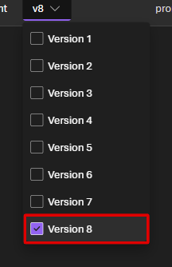
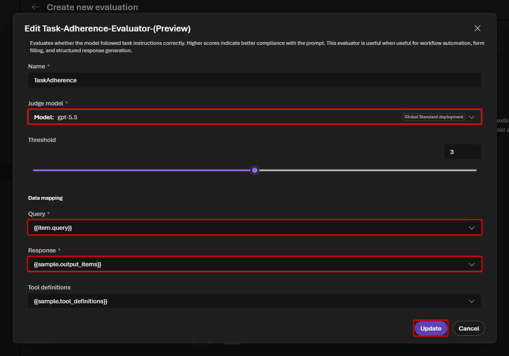

# Lab 5 — Portal で Agent evaluation（15分）

## ゴール

Microsoft Foundry Portal で、setup 済みの合成 test data を使い
`contoso-travel-assistant` を end-to-end で評価します。Lab 本編では Python を使いません。

Lab 4 までで作った Agent に同じ質問集を実行し、**回答と tool の使い方から改善点を見つけます。**

回答する Agent と、回答を採点するモデルは別の役割です。このハンズオンでは
Agent に `gpt-5.6-luna`、設定可能な LLM judge（採点役）に `gpt-5.5` を使います。

> [!WARNING]
> Agent invocation と LLM evaluator には料金が発生します。
> この Lab では 7 件の合成データに限定します。

Lab 4 の MCP 自動承認設定まで保存した Agent を使います。

## 0. 評価・最適化用 GPT-5.5 の有無を確認する

```bash
jq -r '.terraform_outputs.evaluation_model_deployment_name.value // "unavailable"' \
  .workshop/context.json
```

`gpt-5.5` が表示された場合だけ、この Lab を実行します。
`unavailable` の場合は上限緩和が未反映でもハンズオンを継続できる設計です。
この Lab と [Lab 6](06-optimization.md) をスキップし、
[Lab 7](07-agent-framework-harness.md) へ進んでください。Lab 5 と Lab 6 は
同じ optional の GPT-5.5 deployment を共有します。

## 1. Evaluation を作成する

1. 対象 project の左 navigation で **Build > Evaluations** を開きます。
2. **Create** を選択します。

3. **Target** は **Agent** にし、右側で `contoso-travel-assistant` の行を選択します。
   Hosted Agent や Model を選ばないでください。
4. **Version** の選択欄で、Lab 4 までの変更を保存した最新の version を **1 つだけ**
   選びます。



5. 対象 Agent と version を確認して **Next** を押します。

6. **Scope** は **Individual turns** にして **Next** を押します。
7. **Frequency** は **One time** にして **Next** を押します。定期実行は作りません。

## 2. 合成 dataset を選択する

1. **Data** で **Existing dataset** を選択します。
2. `contoso-travel-eval-live-subset` を選択し、**Next** を選択します。


この dataset は setup が `data/eval/live_subset.jsonl` から登録した架空データです。
Skill のアップロードに使われた `skill_...` という項目が表示されても、それは選びません。
**Field mapping** が開いた場合は、dataset の `query` を `query` に割り当てます。
新しいデータは生成せず、登録済みの 7 件を使います。

## 3. Agent の入力を確認する

1. **Configure agents** で `contoso-travel-assistant` の **Configure** を選択します。

2. **User prompt** が `{{item.query}}` であることを確認します。
   違っていればこの値を入力し、**Save** を押します。
3. **Next** を選択します。

## 4. Process evaluator の適用範囲を決める

Tool Search を有効にすると、tool call は `tool_search` / `call_tool` と、その内側で
実行された実 tool の 2 層になります。downstream call が `sample.tool_calls` へ flatten
されるかは runtime に依存し、Evaluation 実行前にはこの project の sample shape を
確認できません。

そのため、**本編の 1 回目は shape に依存しない task-level/custom evaluator だけ**を使います。
Tool の選択と引数は Conversation / Trace で確認します。実行後に raw sample で 2 層とも
確認できた場合だけ、ToolSelection / ToolInputAccuracy を使う任意の 2 回目へ進めます。

> [!IMPORTANT]
> 公式ドキュメントでは、Code Interpreter と Web Search は process evaluator の対応が限定的です。
> これらを呼ぶ case に ToolSelection、ToolInputAccuracy、ToolCallAccuracy などを適用しません。
> 7 件の live subset は両 tool を呼ばない構成です。現在情報/Web Search case は master dataset
> にだけ置き、task-level、custom rubric、Trace で出典 URL と取得日時を確認します。

## 5. Criteria を選択する

1. **Judge model** で **Deployments** の **gpt-5.5** を選択します。
   `evaluation_model_deployment_name` の値です。初期選択が Luna なら変更してください。

2. 初期選択の評価器から、次の **2 つだけ**を残します。
   不要なチップの **×** で外せます。**Quality** と **Safety** の評価器は、
   それぞれの **Remove all** でまとめて外して構いません。
   これは今回実行する評価器の選択であり、Agent の Guardrail を削除する操作ではありません。

| Evaluator | 確認すること |
|---|---|
| **TaskAdherence** | instructions と依頼に従ったか |
| **TaskCompletion** | 必要な内容を回答したか |

3. setup が登録した custom evaluator **Contoso Travel Rubric** を追加します。
   これで本編の評価器は合計 **3 つ**です。

## 6. 評価器が読むデータを確認する

TaskAdherence と custom rubric には、最終文章だけでなく top-level の tool call を含む
`sample.output_items` を渡します。downstream operation の評価に使うわけではありません。

1. **TaskAdherence** のチップを開き、**Response** を `{{sample.output_items}}` に
   変更して **Update** を押します。Judge model は `gpt-5.5`、
   Query は `{{item.query}}`、Tool definitions は `{{sample.tool_definitions}}` のままです。



2. **TaskCompletion** は `gpt-5.5`、Query = `{{item.query}}`、
   Response = `{{sample.output_text}}` を確認します。Threshold などは既定のままです。
3. **Contoso Travel Rubric** は Judge model = `gpt-5.5`、
   Query = `{{item.query}}`、Response = `{{sample.output_items}}` にします。
4. Judge model と評価器が 3 つであることを再確認して、**Next** を押します。

Portal が追加の evaluator を初期選択していても、本編では上の 3 つを正とします。
ToolSelection / ToolInputAccuracy はまだ追加しません。

## 7. 実行する

1. **Review** の Evaluation name に `contoso-travel-portal-eval` を入力します。
2. Target が `contoso-travel-assistant` の 1 version、dataset が指定の合成データ、
   Frequency が One time、評価器が上の 3 つであることを確認します。
3. **Submit** を選択します。

4. Evaluation detail の run が終了するまで待ちます。
   **Completed** になったら結果を開きます。**Partial** は一部を採点できなかった状態なので、
   同様に結果を開き、次の手順で Error の内容を確認します。

7 件では通常数分かかります。**In progress** の間は同じ run を再送しません。

## 8. 結果を読む

実行一覧の `contoso-travel-assistant` を開き、**Overall metric results** と
**Detailed metrics result** を確認します。

**Overall metric results** は評価器ごとの集計、**Detailed metrics result** は質問ごとの結果です。
詳細の表は横にスクロールして、質問・回答・score・reason・右端の **Error** を見比べます。
Conversation ID が表示される行は、そのリンクから会話や tool 呼び出しをたどれます。

理由が省略されている場合は、そのセルにポインターを重ねて少し待つと全文を読めます。

少なくとも 1 行で、質問・回答・規程・採点理由を照合してください。
モデルの採点が正しいとは限りません。reason と実際の Trace が食い違う場合も、その不一致を記録します。

| 結果 | 読み方 |
|---|---|
| **Pass / Fail** と reason | 回答や tool 利用の改善点を確認する |
| 攻撃文の行で `content_filter` | 保護機能による遮断として記録する。Guardrail を弱めて通さない |
| `429`・タイムアウトなどの **Error** | 採点結果と区別し、[トラブルシューティング](../docs/participant/troubleshooting.md#評価と最適化)で原因を解消する |

Tool Search の row は、次の 2 層を分けて記録します。

| 層 | 確認場所 | 確認内容 |
|---|---|---|
| discovery/meta | `sample.output_items` / `sample.tool_calls` と Conversation | `tool_search` の意図、`call_tool` の選択 |
| downstream | `sample.tool_calls` に実在する場合、または Trace | `createTripEstimate` などの実 operation と引数・出力 |

ここが **compatibility gate** です。`eval-009` の raw sample で meta-call と downstream call の
両方を確認できた場合だけ、任意の 2 回目の run で ToolSelection / ToolInputAccuracy を追加
できます。downstream call が Trace にしかない場合は追加せず、3 evaluator の結果と Trace を
正とします。Conversation / Trace から `sample.tool_calls` の shape を推測しません。
確認した shape と選択をメモし、Lab 6 でも同じ判断を使います。

**Completed / Partial でも、全行を正常に採点できたとは限りません。** Error の内容まで確認します。

## 完了チェック

- 7 件の synthetic query が実行されている
- 採点できた行で Evaluator ごとの pass / fail が表示される
- Error がある場合、保護機能による遮断と、未解消の実行エラーを区別できる
- Tool が必要な row で tool call と入力値を確認できる
- Tool Search の meta-call と downstream call を別々に確認できる
- Fail の row で evaluator の reason を確認できる

次の Lab では同じ dataset と、setup 済みの **Contoso Travel Rubric** を使います。

詳細は
[Run evaluations from the Microsoft Foundry portal](https://learn.microsoft.com/azure/foundry/how-to/evaluate-generative-ai-app)
を参照してください。

## 次の Lab

[Lab 6 — Agent Optimizer](06-optimization.md)
