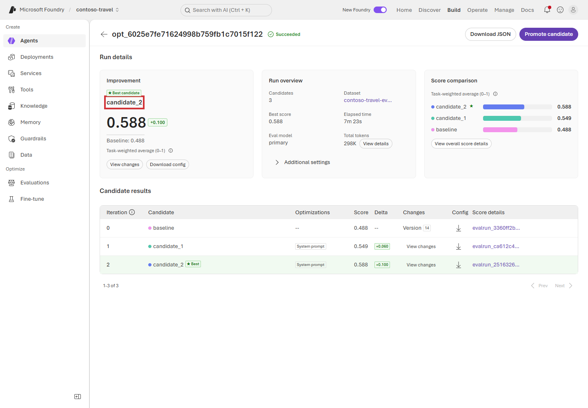

# Lab 6 — Agent Optimizer（20分）

## ゴール

Lab 5 と同じ評価データを使って Prompt Agent の構成候補を生成し、
baseline より良い候補だけを agent に反映します。

> [!WARNING]
> Agent Optimizer は preview です。Agent と tool を dataset の各行で繰り返し実行するため、
> model と外部 tool の料金が発生します。

## 使用する値

```bash
jq -r '
  .terraform_outputs
  | {
      evaluation_model: .primary_model_deployment_name.value,
      optimization_model: .optimizer_model_deployment_name.value
    }
' .workshop/context.json
```

## 1. Optimization wizard を開く

1. **Build > Agents > contoso-travel-assistant** を開きます。
2. **Optimize** tab を選択します。
3. 初回は **Optimize my agent**、2 回目以降は **Create optimization run** を選択します。

## 2. Target を設定する

**Target** step で次を設定します。

| 項目 | 値 |
|---|---|
| Agent version | 既定で選択される最新の保存内容 |
| Optimization model | `optimizer_model_deployment_name` の値 |
| Max candidates | `2` |
| Evaluation model | `primary_model_deployment_name` の値 |
| Compare across models | Off |

設定後、**Dataset** へ進みます。

## 3. Dataset を選択する

1. `contoso-travel-eval-live-subset` を選択します。
2. **Next** を選択します。

## 4. Criteria を選択する

Optimizer の Criteria は **Custom only** です。setup が登録した
**Contoso Travel Rubric** を選択し、**Next** を選択します。


## 5. Cost estimate を確認して実行する

**Review** で次を確認します。

- Agent と dataset
- Evaluation / optimization model
- Candidate 数
- Evaluator
- **Estimated cost**

見積もりの表示を待ちます。これは上限ではありません。
内容を確認して **Submit** を選択します。

## 6. Candidate を比較する

Run detail の status が **Succeeded** になるまで待ちます。実行中は
**Working on iteration 1 of 1** と表示されます。同じ run を再送しないでください。

1. **Improvement**、**Baseline**、**Best score** を比較します。
2. **Candidate results** の **View changes** で変更前後を確認します。
3. Candidate の evaluation run を開き、rubric の score と reason を確認します。



Score 差が `0.03` 未満なら noise の可能性があります。すべての candidate が baseline より
低い場合は、現在の agent を維持してください。

## 7. 改善した candidate を反映する

明確に改善した candidate がある場合だけ実行します。

1. **Promote candidate** を選択します。
2. Best candidate と baseline の score 差、変更内容を再確認します。
3. 確認ダイアログの **Promote to agent version** を選択します。

**Promoted** の表示を確認します。参加者が version 番号を記録する必要はありません。

詳細は
[Quickstart: Optimize a prompt agent](https://learn.microsoft.com/azure/foundry/agents/quickstarts/quickstart-optimize-prompt-agent)
を参照してください。

## 次の Lab

[Lab 7 — Agent Framework の Hosted Agent](07-hosted-multi-agent.md)
