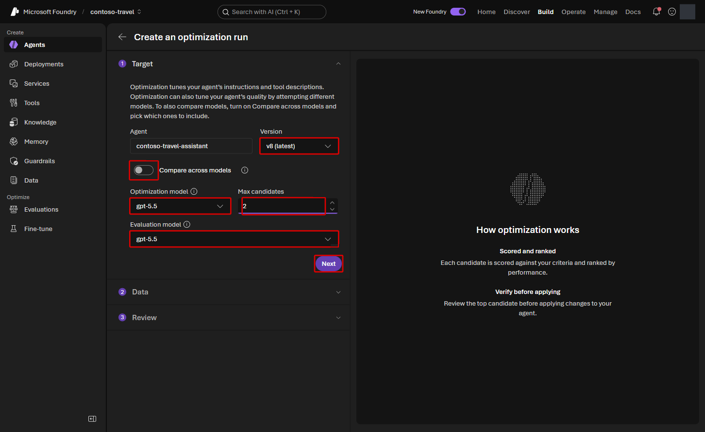
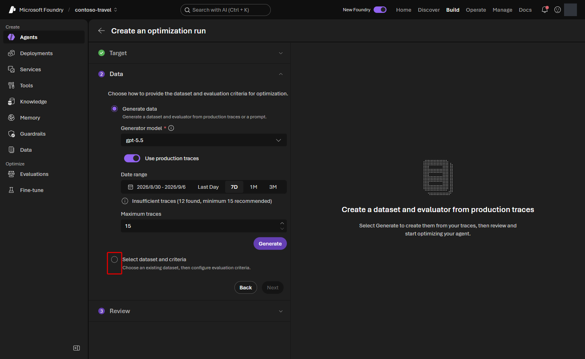
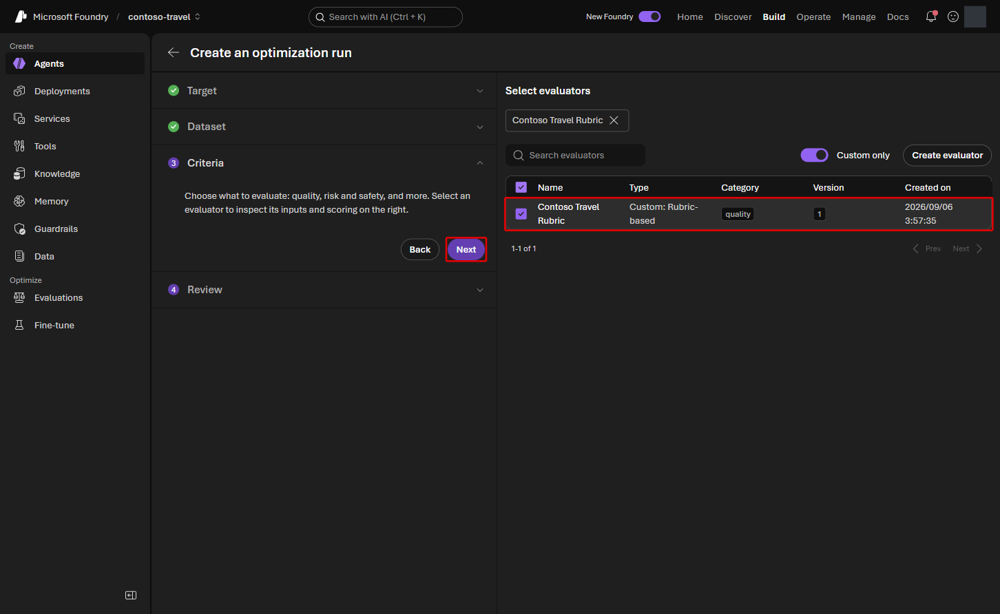

# Lab 6 — Agent Optimizer（20分）

## ゴール

Lab 5 と同じ評価データを使って Prompt Agent の構成候補を生成し、
baseline より良い候補だけを agent に反映します。

改善前の **baseline** と、生成された **candidate** を同じ質問集・採点基準で比較し、
変更内容と結果から採用を判断します。

> [!WARNING]
> Agent と tool を dataset の各行で繰り返し実行するため、
> model と外部 tool の料金が発生します。

## 使用する値

```bash
jq -r '
  .terraform_outputs
  | {
      evaluation_model: .optimizer_model_deployment_name.value,
      optimization_model: .optimizer_model_deployment_name.value
    }
' .workshop/context.json
```

## 1. Optimization wizard を開く

1. **Build > Agents > contoso-travel-assistant** を開きます。
2. **Optimize** tab を選択します。
3. 初回は **Optimize my agent**、2 回目以降は **Create optimization run** を選択します。

## 2. Target を設定する

**Target** step で次を設定します。

| 項目 | 値 |
|---|---|
| Version | Lab 4 までの変更を保存した最新の version |
| Optimization model | `optimizer_model_deployment_name` の値（通常 `gpt-5.5`） |
| Max candidates | `2` |
| Evaluation model | `optimizer_model_deployment_name` の値（通常 `gpt-5.5`） |
| Compare across models | Off |

**Evaluation model** の初期値が `gpt-5.6-luna` なら、選択欄を開いて
**gpt-5.5** に変更します。`embedding` は選びません。

設定を確認して **Next** を押します。



**Optimization model** は改善案を作る役、**Evaluation model** は回答を採点する役です。
この演習では両方に同じ `gpt-5.5` deployment を選びます。
評価対象の Agent 自体は `gpt-5.6-luna` のままで、ここでは変更しません。

## 3. Dataset を選択する

1. **Data** では **Select dataset and criteria** を選択します。
   初期選択の **Generate data** は使いません。質問集を新たに生成する必要はありません。



2. 右側の一覧で `contoso-travel-eval-live-subset` の行にチェックを付けます。
   `skill_...` のデータは選びません。
3. **Next** を選択します。

`Insufficient traces` が表示されても、既存 dataset を選ぶこの手順では
トレースを増やすための追加実行は不要です。

## 4. Criteria を選択する

**Criteria** では、setup が登録したカスタム評価器 **Contoso Travel Rubric** の行に
チェックを付け、**Next** を選択します。この演習では、ほかの評価器は追加しません。



## 5. Cost estimate を確認して実行する

**Review** で Agent、dataset、モデル、候補数、評価器と **Estimated cost** を確認し、
**Submit** を選択します。見積もりの **Maximum** は請求額の上限ではありません。

## 6. Candidate を比較する

Run detail の status が **Succeeded** になるまで待ちます。同じ run を再送しないでください。

1. **Improvement**、**Baseline**、**Best score** を比較します。
2. **Candidate results** の **View changes** で変更前後を確認し、**Close** で閉じます。
3. 表の右端の **Score details** にある `evalrun_...` のリンクを開きます。
   確認したい candidate の行を選んでください。

**Max candidates = 2** では、生成した候補 2 つに baseline を加えた 3 行が表示される場合があります。

`system_prompt` の変更と回答を読み、次を確認します。

- 不足情報を確認する指示や、予約・承認を実行したと誤認させない指示が残っている
- 規程の金額・承認条件・処理日数が指示文へ書き写され、検索結果より優先される構成になっていない
- 正しい回答ができていた質問で、不要な確認質問が増えていない
- 参照していない出典や、実行していない tool の結果を作らせていない

Evaluation run を開いたら、**Detailed metrics result** のスコア横の詳細ボタン
（**View rubric details**）を選びます。

観点ごとの重み・スコア・理由を確認し、**Done** で閉じて比較画面へ戻ります。
少数の質問による評価なので、点数が上がっても、内容や安全性が悪化していれば採用しません。
小さなスコア差だけで改善を判断することも避けてください。

採用できる改善案がなくても、ここまで比較できればこの Lab の目的は達成しています。
その場合は次の「反映する」を飛ばし、Lab 7 へ進みます。

## 7. 改善した candidate を反映する

明確に改善した candidate がある場合だけ実行します。

1. **Promote candidate** を選択します。
2. Best candidate と baseline の score 差、変更内容を再確認します。
3. 確認ダイアログの **Promote to agent version** を選択します。

**Promoted** の表示を確認します。
Agent に戻り、モデルが `gpt-5.6-luna`、Knowledge と Toolbox の接続が残っていることを
確認します。**New chat** で Lab 3 / 4 の質問を試し、規程確認と見積もりが引き続きできるか確認してください。

詳細は
[Quickstart: Optimize a prompt agent](https://learn.microsoft.com/azure/foundry/agents/quickstarts/quickstart-optimize-prompt-agent)
を参照してください。

## 次の Lab

[Lab 7 — Agent Framework の Hosted Agent](07-hosted-multi-agent.md)
