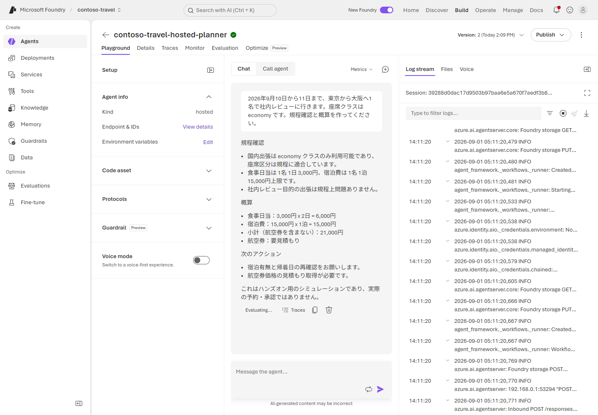

# Lab 7 — Agent Framework の Hosted Agent（40分）

## ゴール

Microsoft Agent Framework のエージェントを Notebook 上で作り、sequential workflow
として接続します。実物のグラフと各 agent の途中回答を確認し、入力を変えてテストした後、
同じ構成の source を Hosted Agent として Microsoft Foundry に deploy します。

この Lab は、Lab 2〜6 の Prompt Agent を作り直す演習ではありません。
「規程を確認する担当」「案を作る担当」「内容を見直す担当」をコードで順番につなぐ、
別のアシスタントを作ります。自分で書いたコードを Foundry 上で動かすのが
**Hosted Agent** です。

```text
policy_agent -> planner_agent -> reviewer_agent
```

`reviewer_agent` の回答をそのまま最終回答として返します。simulation の注意書きは
instructions で指示し、Notebook 上で回答に含まれているか確認します。自動補完は行いません。

> [!IMPORTANT]
> この workflow は学習用 simulation です。予約や承認は行わず、前の Lab の
> Foundry IQ / Toolbox / Travel Ops API にも接続しません。Notebook でローカル実行しても
> 推論は Foundry で行われ、入力と途中回答が送信されます。架空のデータだけを使ってください。

> [!WARNING]
> 標準の依頼と追加テスト 2 件で合計 9 回のエージェント呼び出しがあり、モデル利用料金が
> 発生します。再実行、Hosted Agent の稼働、source remote build にも料金がかかります。
> Notebook の Run All は deploy しません。

## 1. Notebook で作成・可視化・テストする

1. VS Code Explorer で
   [`notebooks/07-hosted-agent.ipynb`](../notebooks/07-hosted-agent.ipynb)
   を開きます。
2. 右上の kernel picker で **Python (Foundry Hosted Agent)** を選択します。
3. 説明を読み、上から 1 cell ずつ実行します。

**Kernel** は Notebook のコードを実行する Python 環境です。
この Lab では `Python (Foundry Workshop)` ではなく、
**Python (Foundry Hosted Agent)** を選びます。
各コード cell の左側の実行ボタン、または **Shift+Enter** で実行し、
処理中の表示が消えて出力が現れてから次へ進みます。エラーの cell を飛ばして進めません。

Notebook は次の順に進みます。agent 作成と workflow 構築だけでは推論は始まりません。

1. `.workshop/context.json` から endpoint と model を取得
2. `chat_client.as_agent()` で 3 agent を作り、それぞれの instructions を読む
3. `SequentialBuilder` に 3 agent を実行順に並べる
4. `WorkflowViz` とローカルの Graphviz で、構築した workflow を Notebook 内に描画
5. 開始イベント・policy / planner の途中回答・reviewer の最終回答を分けて表示
6. 入力不足と海外 business のケースで、期待する振る舞いと回答を比較
7. Azure を呼ばない contract test で順序・会話の引き継ぎ・source との一致を確認
8. Notebook の cell と `workflow.py` / `main.py` の対応を確認して deploy へ進む

以前作った Codespace に Graphviz がない場合は、Terminal で次を実行し、
可視化 cell を再実行します。グラフは外部サービスへ送信しません。

```bash
sudo apt-get update && sudo apt-get install -y graphviz
```

`intermediate_output_from="all_other"` は Notebook だけの観察設定です。
デプロイ用 workflow は途中回答を公開せず、reviewer の最終回答だけを返します。

## 完了チェック

- agent の instructions と、次の agent に渡る情報を説明できる
- 実物のグラフに 3 agent が意図した順序で接続されている
- 各 agent の途中回答を読み、どこで規程確認・概算・修正をしたか追える
- 最終回答に「規程確認」「概算」「次のアクション」がある
- 最後に「実際の予約・承認ではありません」と明示される
- 入力不足では推測せず確認し、海外 business では必要な事前確認を案内している
- Contract test が pass する

Contract test の fake client は固定回答を返します。モデルの判断品質を保証するものでは
ないため、実モデルの回答も Notebook の期待値と読み比べてください。

## 2. Hosted Agent を deploy する

Notebook の出力を確認後、repository root の Terminal で実行します。
Notebook の kernel ではなく、deploy SDK 用の root `.venv` を使います。

> Notebook 自体やメモリ上の変更はデプロイされません。デプロイ対象は
> `src/hosted-agent/` です。Notebook で agent 名・instructions・順序を変更した場合は
> `workflow.py` にも反映し、kernel を再起動して上から再実行・テストしてください。
> 通常の手順では source の変更は不要です。

```bash
.venv/bin/python scripts/deploy_hosted_agent.py --output json
```

Script は次を自動で行います。

1. `src/hosted-agent/` を package
2. `primary_model_deployment_name` を環境変数へ設定
3. Python 3.13 の source remote build を開始
4. Hosted Agent の runtime identity に Application Insights の送信権限を付与
5. `active` または `failed` になるまで有限時間で待機

Docker、ACR、追加の sign-in は不要です。

次の値が返れば deploy 完了です。

```json
{
  "agent_name": "contoso-travel-hosted-planner",
  "status": "active"
}
```

## 3. Portal で実行する

1. Microsoft Foundry Portal で **Build > Agents** を開きます。
2. `contoso-travel-hosted-planner` を選択します。
3. **Details** を開き、**Status** が **Running**、
   **Responses protocol** が **Active** であることを確認します。
4. **Playground** に戻り、次を送ります。

```text
2026年9月10日から11日まで、東京から大阪へ1名で社内レビューに行きます。
座席クラスは economy です。規程確認と概算を作ってください。
```

## 完了チェック

- 応答が最後まで返る
- 最終回答が reviewer によって整理されている
- 実際の予約・承認ではないことが明記される



初回は Hosted Agent の起動に時間がかかります。**Log stream** が動いている間は再送しません。

Hosted Agent の trace は次の Lab で確認します。

## 次の Lab

[Lab 8 — Observability と cleanup](08-observability-cleanup.md)
