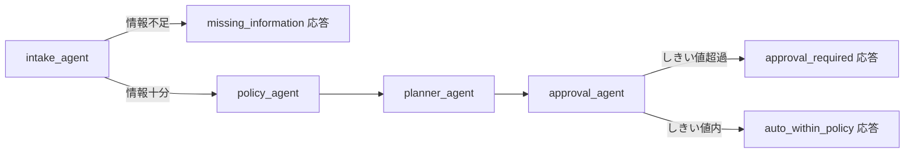

# Lab 7 — Agent Framework workflow の Hosted Agent 配布（45分）

## ゴール

`src/hosted-agent/` に用意された Microsoft Agent Framework の
sequential workflow（`intake_agent` → `policy_agent` → `planner_agent` →
`approval_agent`）を Codespaces でローカル実行して仕組みを理解したうえで、
`scripts/deploy_hosted_agent.py` を使って実際に Microsoft Foundry の
**Hosted Agent** としてソースコードから直接デプロイし、portal の
Hosted Agent Playground で multi-turn の会話・ストリーミング・version 管理・
trace を確認します。

> [!IMPORTANT]
> この workflow は**出張プランの試算・社内規程チェックのシミュレーション**
> だけを行います。実際の予約や承認は一切行いません（フライト実額の見積もりも
> 簡略化された仮の運賃です）。最終応答には常に
> 「これはシミュレーションであり、実際の予約・承認ではありません」という
> 断り書きが含まれます。

## 前提

- Lab 1 の `./scripts/setup.sh` が完了し、`.workshop/context.json` が存在すること。
- `az login` 済みであること（本 Lab も `az login` 以外の認証情報は一切使いません
  — API キーやサービスプリンシパルのシークレットは不要です）。
- Codespaces（またはローカルの devcontainer）で Python 3.13 が使えること。
- **この workflow は実際に Foundry のモデルデプロイを呼び出します**
  （後述の通り、4 つの named agent すべてが本物の LLM 呼び出しです）。
  そのためローカル実行には `FOUNDRY_PROJECT_ENDPOINT` と
  `AZURE_AI_MODEL_DEPLOYMENT_NAME` の 2 つの環境変数が必要です
  （§1 で設定します）。

## Hosted Agent とは何か、なぜ Agent Framework を使うのか

[docs/feature-support-matrix.md](../docs/feature-support-matrix.md) の通り、
Foundry には 2 系統のエージェント実行モデルがあります。

| 種類 | 実体 | 作成方法 | Lab |
|---|---|---|---|
| Prompt Agent | Foundry がホストする LLM 呼び出しの設定（instructions・tools） | portal | Lab 2〜6 |
| **Hosted Agent** | **参加者が書いた任意の Python コード**を Foundry がコンテナとして実行 | **SDK（本 Lab）** | **Lab 7** |

Hosted Agent は「エージェントのオーケストレーション自体を自分のコードで書きたい」
場合の実行モデルです。かつては **Workflow Designer**（portal のビジュアル
オーケストレーション編集画面）がこの役割を担っていましたが、
**Workflow Designer は 2026-12-01 に廃止予定**です
（[feature-support-matrix.md](../docs/feature-support-matrix.md) 参照）。
本 Lab では廃止予定の Workflow Designer には触れず、その後継として
Microsoft がガイドする **Microsoft Agent Framework**（コードとしての
workflow 定義）を最初から使います。

| 観点 | Workflow Designer（廃止予定） | Microsoft Agent Framework（本 Lab） |
|---|---|---|
| 定義方法 | portal のビジュアル編集 | Python コード（`WorkflowBuilder`） |
| バージョン管理 | portal 内の履歴のみ | 通常の git（このリポジトリの `src/hosted-agent/`） |
| ローカルテスト | 不可（portal 前提） | 可能（本 Lab の §1。pytest は擬似 chat client で Azure 接続不要、`python main.py` での対話確認は要 Azure） |
| 分岐・条件 | portal 上のノード接続 | `add_switch_case_edge_group` 等の明示的な API |
| 提供状況 | 2026-12-01 に廃止 | GA（[feature-support-matrix.md](../docs/feature-support-matrix.md)） |

## この workflow の構成

`src/hosted-agent/` はこの Lab のために用意された scaffold です。
決定論的なテスト（pytest）は擬似 chat client により Azure 接続なしで実行
できますが、`python main.py` によるライブのスモークテストは実際に
Foundry のモデルデプロイを呼び出すため、`az login` と2つの環境変数
（`FOUNDRY_PROJECT_ENDPOINT`/`AZURE_AI_MODEL_DEPLOYMENT_NAME`）が必要です。

```
src/hosted-agent/
├── domain.py       # 純粋なビジネスロジック（Azure/agent_framework 非依存）
├── workflow.py      # agent_framework を使った実際の配線（唯一 agent_framework をimportするファイル）
├── main.py          # エントリポイント（Responses protocol, port 8088）
├── requirements.txt # 固定バージョンの依存関係（REMOTE_BUILD が読む）
├── .agentignore     # デプロイ zip から除外するファイル（gitignore 風構文）
└── README.md        # ローカル実行・スモークテスト手順の詳細
```

`workflow.py` が実装する sequential workflow と 2 つの分岐は次の通りです。



- **intake_agent**: 本物の `agent_framework.Agent`（`AgentExecutor` として
  workflow の `start_executor` になっています）が会話を読み、構造化された
  trip request を JSON で抽出します。行き先・出発日・目的などの必須項目が
  欠けているかどうかは、モデルの判断ではなく **決定論的な
  `domain.parse_trip_request`**（`IntakeGateExecutor` が仲介）が最終判定
  します。欠けていれば**missing-information 分岐**に入り、何が足りないかを
  日本語で伝えて終了します。
- **policy_agent**: `data/policies/` の規程文書から抜粋した合成データ
  （`domain.py` にバンドル済み。出張規程の tier・per-diem 表・承認しきい値
  `DOMESTIC_MANAGER_APPROVAL_THRESHOLD_JPY = 100,000` 円 は Travel Ops API
  ([src/travel-api](../src/travel-api/)) と同じ数値です）と、
  **決定論的に**照合した結果（`domain.check_policy`）を、本物の
  `policy_agent`（`agent_framework.Agent`）に渡し、その結果を要約する
  日本語 1 文を生成させます。
- **planner_agent**: tier ベースの簡易運賃表から**決定論的に**
  概算コストプラン（`domain.estimate_cost`）を作り、本物の `planner_agent`
  にその結果を要約する日本語 1 文を生成させます。
  **この運賃は簡略化された仮の数値であり、Travel Ops API の実際の運賃
  カタログ（`src/travel-api/travel_api/domain/routes_catalog.py`）とは
  一致しません。** 本 Lab の後半（§6）で両者を突き合わせて確認します。
- **approval_agent**: 金額がしきい値を超えるかどうかを**決定論的に**判定し
  （`domain.decide_approval`）、**approval-required 分岐**（要マネージャー
  承認、という*シミュレーション*結果）と **auto-within-policy 分岐**
  （規程内、という*シミュレーション*結果）に分かれます。本物の
  `approval_agent` がその判定を要約する日本語 1 文を生成しますが、
  どちらの分岐でも「これは実際の承認ではない」という断り書き
  （`SIMULATION_DISCLAIMER_JA`）を必ず含みます。

`Executor`/`WorkflowContext`/`add_switch_case_edge_group`/`Agent`/
`AgentExecutor`/`FoundryChatClient` などの API は、すべて Microsoft Agent
Framework（`agent-framework-core`/`agent-framework-foundry`）が提供する
本物の API です。**この workflow は実際に Foundry のモデルデプロイを
呼び出します** — 4 つの named agent（intake/policy/planner/approval）は
すべて `agent_framework.Agent` のインスタンスであり、`AZURE_AI_MODEL_
DEPLOYMENT_NAME` で指定したモデルに対して実際に推論リクエストを送ります。
ただし、**分岐判定に使われる数値・しきい値・承認可否は一切モデルに
委ねません** — それらはすべて `domain.py` の純粋関数が決定し、各 agent は
「すでに決まった結果」を日本語で説明する役割に限定されています
（instructions で新しい数値や事実を発明しないよう明示的に指示しています）。
そのため:

- **決定論的なテスト**は Azure 資格情報なしで行えます
  （`tests/contract/hosted_agent/fakes.py` の擬似 chat client を使い、
  `agent_framework` の `Agent`/`AgentExecutor`/`WorkflowBuilder` の
  実コードパスを実行しつつ、ネットワーク呼び出しだけを差し替えます —
  詳細は [src/hosted-agent/README.md](../src/hosted-agent/README.md) の
  "Testing without Azure"）。
- Foundry portal の **trace** を開くと、1 回のリクエストにつき
  `intake_agent`/`policy_agent`/`planner_agent`/`approval_agent` という
  **4 つの独立したモデル呼び出し（sub-agent span）** が記録されているのを
  確認できます（§3 で確認します）。それぞれ instructions・構造化出力
  スキーマが異なる、本物の別々の agent 呼び出しです。

## 1. ローカルで Responses protocol のスモークテストを行う（Codespaces）

`agent-framework-foundry`（`FoundryChatClient`）が要求する
`azure-ai-projects<2.4.0` は、Lab 1 でセットアップ済みのリポジトリ直下
`.venv`（`azure-ai-projects>=2.5.0` が必要な `deploy_hosted_agent.py` 用）
と競合するため、`src/hosted-agent/` 専用の**別の仮想環境**を作ります
（`src/hosted-agent/` はリポジトリのルート `pyproject.toml` には登録されて
いません — `src/travel-api/` と同じ「自己完結した `src/*` サブプロジェクト」の
方針です。詳細は [src/hosted-agent/README.md](../src/hosted-agent/README.md)
の "Two Python environments"）。

```bash
cd src/hosted-agent
python3.13 -m venv .venv
source .venv/bin/activate
pip install -r requirements.txt
az login   # 未実施の場合。Codespaces では az login --use-device-code
cp .env.example .env
```

`.env` を編集し、以下の 2 つを必ず設定してください
（`FOUNDRY_PROJECT_ENDPOINT` はデプロイ後の Hosted Agent には Foundry
platform が自動注入しますが、ローカル実行では手動設定が必要です）。

```bash
# .workshop/context.json から値を確認できます
jq -r '.terraform_outputs.foundry_project_endpoint.value' ../../.workshop/context.json
jq -r '.terraform_outputs.primary_model_deployment_name.value' ../../.workshop/context.json
```

```
FOUNDRY_PROJECT_ENDPOINT=https://<account>.services.ai.azure.com/api/projects/<project>
AZURE_AI_MODEL_DEPLOYMENT_NAME=<primary_model_deployment_name の値>
```

```bash
python main.py
```

`main.py` は既定で **port 8088** で Responses protocol サーバーを起動します
（Foundry の Hosted Agent が実際に listen するのと同じ port・プロトコルです）。
このサーバーは起動すると実際に Foundry のモデルデプロイを呼び出します。
別のターミナルから、規程内に収まるリクエストを送ってみます。

```bash
curl -s http://localhost:8088/responses \
  -H "content-type: application/json" \
  -d '{"input": "{\"origin\":\"Tokyo\",\"destination\":\"Osaka\",\"departure_date\":\"2026-05-10\",\"return_date\":\"2026-05-11\",\"cabin_class\":\"economy\",\"purpose\":\"internal review\"}"}'
```

応答の `output_text` に、`policy_agent`/`planner_agent`/`approval_agent` を経た
最終応答（コスト試算・判定・断り書き、および `agent_narratives` に各 agent が
生成した日本語の説明文）が**有効な JSON 文字列**として含まれることを
確認してください（`json.loads`/`jq` でパースできることを確認するとよい
でしょう — これは以前の実装にあった「JSON のようで実は Python の repr
文字列だった」という不具合が修正されている証拠です）。

次に、必須項目を欠いたリクエスト（例: `destination` を省略）と、しきい値を
超える高額なリクエスト（例: `cabin_class: "business"` の海外出張）を送り、
それぞれ missing-information 分岐・approval-required 分岐に正しく入ることを
確認してください。具体的なペイロード例は
[src/hosted-agent/README.md](../src/hosted-agent/README.md) にあります。

> [!NOTE]
> **確認する順番に注意してください。** `conversation`/`agent_session_id`
> を指定しない匿名リクエストは、この hosting SDK（beta）では毎回新しい
> ランダムな `agent_session_id` が払い出されますが、ローカル実行
> （`is_hosted=False`）では、それでもなお直前のリクエストの会話履歴が
> `intake_agent` に引き継がれてしまうことがあります。実際に確認された
> 挙動として、**必須項目を満たした完全なリクエストを送った直後に**
> `destination` を省略したリクエストを送ると、省略した項目が前のリクエスト
> から引き継がれて missing-information 分岐に入らないことがあります。
> 先に不完全なリクエスト（missing-information 分岐）を送ってから完全な
> リクエストを送るか、`python main.py` を再起動してから次のケースを試す
> ことで、それぞれの分岐を確実に個別に確認できます。これは
> `workflow.py`/`domain.py` のバグではなく、beta の hosting SDK が
> セッション識別子なしのローカル実行を「ひとつづきの会話」として扱う際の
> 挙動です — `tests/contract/hosted_agent/test_workflow_agents.py` の
> multi-turn テストは、明示的に用意した会話を使って同じ「複数ターンに
> またがるフィールド結合」の挙動を決定論的に検証しており、影響を受けません。

サーバーを `Ctrl+C` で止めたら、この venv のまま pytest/ruff も実行して
おきます（このディレクトリの正確な依存関係・Python 3.13 の下でテストする
ための、hosted agent 専用の隔離環境コマンドです — グローバル/リポジトリ
ルートの環境に古い `agent-framework-core` などが入っていて collection が
失敗する場合は、必ずこちらの隔離環境を使ってください）。

```bash
pip install pytest ruff   # 未導入の場合
python -m pytest ../../tests/unit/hosted_agent ../../tests/contract/hosted_agent -q
ruff format . && ruff check .
deactivate
```

このテスト自体は擬似 chat client（`tests/contract/hosted_agent/fakes.py`）
を使うため、実際の Azure 接続は発生しません — `agent_framework` の
`Agent`/`AgentExecutor`/`WorkflowBuilder` の実コードパスを実行しつつ、
ネットワーク呼び出しの部分だけを差し替えています。リポジトリルートの
`.venv`（`agent-framework-foundry` が入っていない環境）からも同じテストを
実行できます — 本番用の `FoundryChatClient` は、テストが常に差し替える
チャットクライアントの唯一の遅延 import 箇所（`workflow._default_chat_client`）
にしかないためです。

```bash
cd ../..   # リポジトリルートへ戻る
.venv/bin/python -m pytest tests/unit/hosted_agent tests/contract/hosted_agent -q
```


## 2. `scripts/deploy_hosted_agent.py` で直接デプロイする

コード修正なしでそのままデプロイする場合、リポジトリルートの `.venv`
（Lab 1 でセットアップ済みの `azure-ai-projects` を含む venv）から実行します。

```bash
.venv/bin/python scripts/deploy_hosted_agent.py --output json
```

このスクリプトは（`--subscription`/`--resource-group` は受け取りません —
`.workshop/context.json` の `foundry_project_endpoint` 出力をそのまま使います。
Lab 1 の `setup.sh` を実行済みであれば追加の指定は不要です):

1. `.workshop/context.json` から project endpoint を読み込みます。
2. `AZURE_AI_MODEL_DEPLOYMENT_NAME` を、`.workshop/context.json` の
   `primary_model_deployment_name` Terraform output から**自動的に**
   コンテナの環境変数へ設定します（`--env AZURE_AI_MODEL_DEPLOYMENT_NAME=...`
   を明示的に渡した場合はそちらが優先されます）。`FOUNDRY_PROJECT_ENDPOINT`
   はここでは設定しません — デプロイ後、Foundry の Hosted Agent platform が
   コンテナに自動注入します。
3. `src/hosted-agent/.agentignore` を読み、`.venv/`・`__pycache__/`・`.env`
   などローカル専用のファイルを除いて `src/hosted-agent/` を zip 化します
   （**Docker・ACR・コンテナビルドは一切使いません** — zip をそのまま
   Foundry にアップロードする「source deploy」です）。
4. 必須ファイル（`main.py`・`requirements.txt`・`domain.py`・`workflow.py`）が
   zip に含まれているか、`--cpu`/`--memory` が有効な組み合わせかを、
   ネットワーク呼び出しの**前に**検証します。
5. `azure-ai-projects` の `create_version_from_code` を呼び、
   `runtime="python_3_13"`・`entry_point=["python", "main.py"]`・
   `dependency_resolution=REMOTE_BUILD`・
   `protocol_versions=[responses@1.0.0]` の **immutable な新しい version**
   を作成します（既存 version を上書きすることはありません）。
6. version が `active`（デプロイ成功）または `failed`
   （リモートビルド失敗など）になるまで、**上限付きで**ポーリングします
   （既定 10 分。`--timeout` で変更可）。

> [!NOTE]
> **リモートビルド待ち activity**: ステップ 5 のポーリング中、
> `requirements.txt` に書かれた依存関係を Foundry 側のビルド環境が実際に
> インストールしています。この待ち時間の間に、上の「Workflow Designer vs
> Agent Framework」の比較表を振り返ってみてください。Workflow Designer は
> portal 上でノードを繋ぐだけで見た目上は「即座」に見えますが、実行時の
> ロジックは portal の内部実装に閉じ込められ、git 管理もローカルテストも
> できません。Agent Framework はビルド待ちという明示的なステップがある
> 代わりに、コードとして完全にバージョン管理・テスト可能です。

成功すると、次のような JSON が出力されます（値は環境によって異なります）。

```json
{
  "agent_name": "contoso-travel-hosted-planner",
  "version": "1",
  "status": "active",
  "succeeded": true,
  "project_endpoint": "https://<account>.services.ai.azure.com/api/projects/<project>",
  "portal_url": "https://ai.azure.com",
  "ai_services_account_name": "<account>",
  "foundry_project_name": "<project>"
}
```

> [!NOTE]
> `azure-ai-projects` の SDK は Hosted Agent の Playground への
> **直接リンク（deep link）を返しません**（`infra/outputs.tf` の
> `foundry_portal_url` 出力も同じ理由で汎用 URL に留めています —
> 執筆時点で確認できた公式なリンク形式がなかったためです）。
> 上の `portal_url` を開いたあと、`ai_services_account_name` の account →
> `foundry_project_name` の project → **Agents** タブ → `agent_name` →
> 表示された `version` の順に手動で辿ってください。

デプロイが `failed` になった場合、SDK が返す version の `error` フィールドに
構造化された失敗詳細（`code`/`message` など）が入っていれば、それが JSON の
`error` フィールドと人向け出力の `note:` 行にそのまま表示されます。
サービス側がまだ `error` を populate していないケースでは、代わりに汎用的な
`failure_hint`（「Foundry portal の version ページか Application Insights の
トレースを確認してください」という案内）が表示されます。いずれの場合も、
Foundry portal の該当 version ページや Application Insights のトレース
（Lab 8）でリモートビルド／実行時エラーの一次情報を確認できます。

## 3. Hosted Agent Playground で確認する

Foundry portal で、上記の手順で辿り着いた agent version を開き、
**Playground** タブでリクエストを送ります。確認するポイント:

- **ストリーミング**: レスポンスがストリーミングで返ってくることを確認します。
- **Multi-turn**: 1 回目のリクエストで `destination` を省略し
  missing-information 応答を受け取ったら、続けて欠けていた情報だけを
  追加したメッセージを送ってみます。`intake_agent` は同じ会話（session）内の
  これまでのメッセージ全体から必須項目を組み立てるため、2 回目のメッセージが
  欠けていた項目だけを含んでいても、1 回目に送った項目と合わせて計画が
  進みます（`tests/contract/hosted_agent/test_workflow_agents.py` の
  multi-turn テストで実際に検証済みの挙動です）。新しい会話（session）を
  開始した場合は履歴が引き継がれないため、その場合は完全な JSON を
  改めて送り直す必要があります。
- **Version 切り替え**: 後述の§4で新しい version を作成した場合、
  Playground 上で version を切り替えて動作の違いを比較します。
- **Trace**: 送ったリクエストの trace が記録され、Lab 8 で
  Application Insights から参照できることを確認します（詳細は
  [Lab 8](08-observability-cleanup.md)）。

## 4. コードを変更して再デプロイする

`src/hosted-agent/domain.py` の承認しきい値やコピー文言を編集してみてください
（例: `DOMESTIC_MANAGER_APPROVAL_THRESHOLD_JPY` を変更する、
`missing_info_response` の日本語メッセージを調整する、など）。編集後:

```bash
# 変更が正しいか、ローカルでまず確認
.venv/bin/python -m pytest tests/unit/hosted_agent tests/contract/hosted_agent -q

# 再デプロイ（新しい immutable version が追加される。既存 version は残る）
.venv/bin/python scripts/deploy_hosted_agent.py --output json
```

同じ `agent_name` に対して実行するたびに、**新しい version 番号**が
発行されます（既存 version は自動的には消えません）。Playground で
新旧 version を切り替えて挙動の違いを比較してください。

## 5. `azd`（任意サイドバー）

`azd ai agent` コマンドラインでも同様のデプロイができますが、
**本ハンズオンの中核手順ではありません**（[docs/feature-support-matrix.md](../docs/feature-support-matrix.md)
の通り、Hosted Agent Optimizer など一部の任意機能で azd/SDK 統合が
使われる程度です）。

**`azd` が任意サイドバー扱いなのは、`azd` 自体が `az login` とは別の
独自の認証（`azd auth login`）を必要とするためです**。本ハンズオンの
中核手順（`scripts/deploy_hosted_agent.py`・`scripts/delete_hosted_agent.py`
を含む Python SDK 側）は一貫して `az login` の資格情報
（`DefaultAzureCredential`/`AzureCliCredential`）のみで完結し、
別途 `azd auth login` やクライアントシークレットは要求しません
（[AGENTS.md](../AGENTS.md) の non-negotiable constraints を参照）。
`azd` を試す場合は、中核手順とは別に `azd auth login` を実行し、
`az login` とは独立した認証状態を用意する必要がある点に注意してください。
時間に余裕がある場合のみ、`azd auth login` を実行したうえで
`azd ai agent show --output json` を実行し、`deploy_hosted_agent.py` と
同じ agent/version情報が取得できることを確認してみてください。

## 6. Travel Ops API との比較（任意・時間があれば）

`planner_agent` が使う運賃表は簡略化された仮の数値です。実際の
Travel Ops API（Lab 4 で toolbox 経由で接続したもの）の運賃カタログと
比較してみましょう。

```bash
curl -s "$(jq -r '.terraform_outputs.travel_api_fqdn.value' .workshop/context.json | sed 's#^#https://#')/openapi.json" \
  | jq '.paths | keys'
```

`src/travel-api/travel_api/domain/routes_catalog.py` の実際の都市ペア運賃と、
`src/hosted-agent/domain.py` の `ILLUSTRATIVE_FLIGHT_FARE_JPY`
（tier ベースの簡易表）を見比べ、実運用では Hosted Agent の
`planner_agent` から Travel Ops API を直接呼び出す（あるいは同じ
toolbox を workflow の中から呼び出す）ことで、より正確なプランが作れる
ことを確認してください（本 Lab の scaffold では、ローカルテストのしやすさを
優先してこの呼び出しはあえて行っていません）。

## トラブルシューティング

| 症状 | 対処 |
|---|---|
| `deploy_hosted_agent.py` が `context file not found` で失敗 | Lab 1 の `./scripts/setup.sh` を先に実行してください。 |
| `unsupported --cpu/--memory combination` | 有効な組み合わせは `0.5`/`1Gi`、`1`/`2Gi`、`2`/`4Gi` の3種類のみです。 |
| ローカル `python main.py` が `FOUNDRY_PROJECT_ENDPOINT`/`AZURE_AI_MODEL_DEPLOYMENT_NAME` 未設定で失敗 | `src/hosted-agent/.env` に両方の値を設定し、`az login` 済みか確認してください（§1 参照）。 |
| 隔離venv での pytest が古い `agent-framework` の collection エラーで失敗 | グローバル/ルート venv の古い `agent-framework-core` を拾っている可能性があります。必ず `src/hosted-agent/.venv` を `source .venv/bin/activate` してから実行してください。 |
| `is missing required file(s)` | `--source-dir` が `src/hosted-agent/` を指しているか、`.agentignore` が必要なファイルまで除外していないか確認してください。 |
| ポーリングが `did not reach a terminal state within ...` で timeout | `--timeout` を大きくして再実行するか、Foundry portal で version の状態を直接確認してください。リモートビルドが混雑時間帯で遅い場合があります。 |
| version が `failed` になる | Foundry portal の該当 version ページ、または Lab 8 で扱う Application Insights のトレースでビルド／起動時のエラーを確認してください。 |
| ローカルの `python main.py` が port 8088 で起動しない | 別プロセスが port を使っていないか確認するか、`PORT` 環境変数で別の port を指定してください。 |

## Cleanup（`delete_hosted_agent.py`）

この Lab で作成した Hosted Agent とその version は、Terraform が管理する
Foundry project を削除する**前に**、明示的に削除する必要があります
（削除しないまま `terraform destroy` を実行すると、Foundry project の削除が
失敗する可能性があります）。この手続きは、Lab 8 で実行する
`./scripts/destroy.sh` から自動的に呼び出されます。

```bash
./scripts/destroy.sh
```

`destroy.sh` は内部で次のように `delete_hosted_agent.py` を呼び出します
（この呼び出し方は固定の contract です — 手元で単独実行する場合も
同じ引数を渡してください）。

```bash
.venv/bin/python scripts/delete_hosted_agent.py --subscription "<subscription-id>" --resource-group "<resource-group>"
```

- Hosted Agent が存在しない場合（この Lab を実施しなかった環境など）は、
  エラーにならず `action: "not_found"` として正常終了します
  （何度実行しても安全です）。
- 存在する場合は、その agent のすべての version を削除したうえで、
  agent 自体を削除します。
- 認証は他のスクリプトと同じく `az login`（既定）または
  `DefaultAzureCredential`（`--credential default`）のみです。

削除後の詳しい観測性の確認・最終的な `terraform destroy` の流れは
[Lab 8 — Observability・governance・cleanup](08-observability-cleanup.md)
に進んでください。
