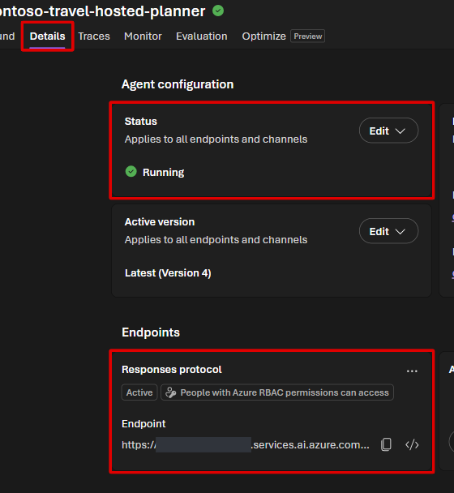

# Lab 8 — Harness Agent を組み込んだ Hosted workflow（40分）

## ゴール

Lab 7 と同じ checked-in Harness Agent factory を sequential workflow の participant
として再利用します。intake、Harness Agent、reviewer の引き継ぎを確認した後、
workflow 全体の source を Hosted Agent として Microsoft Foundry に deploy します。

Lab 2〜6 で準備した Foundry IQ と Toolbox の Tools / Skills を、コードの Harness Agent
から利用します。

```text
intake_agent -> travel_harness_agent -> reviewer_agent
```

`travel_harness_agent` は execute mode で todo / memory / bounded loop を使い、
Foundry IQ、Toolbox Skills、Tool Search、Travel Ops API、必要な計算を組み合わせます。
`reviewer_agent` はその結果を根拠と照合し、最終回答を返します。Lab 7 のような対話的な
plan 承認は workflow の途中では行いません。

> [!IMPORTANT]
> この workflow は学習用 simulation です。予約や承認は行いません。Lab 3 の Foundry IQ と
> Lab 4 の Toolbox / Skills / Travel Ops API に接続するため、送信するのは架空のデータだけに
> してください。Notebook でローカル実行しても推論と remote tool 呼び出しは Azure 上で行われます。
>
> **Lab 8 は Lab 7 の Notebook を実行していなくても完了できます。** デプロイ対象は
> checked-in の `src/hosted-agent/travel_agents.py` と `workflow.py` であり、必要なのは
> Lab 3 / 4 で作成した remote resources です。Lab 7 の session、todo、memory、出力は
> 引き継ぎません。

> [!WARNING]
> Notebook のモデル呼び出し、Foundry IQ、Toolbox、Hosted Agent の稼働、
> source remote build には料金がかかります。
> Notebook の Run All は deploy しません。

## 1. Notebook で作成・可視化・テストする

1. 選んだ実行環境のファイルブラウザーで
   [`notebooks/08-hosted-agent.ipynb`](../notebooks/08-hosted-agent.ipynb)
   を開きます。

2. Notebook の本文と toolbar が表示されるまで待ち、kernel に
   **Python (Foundry Hosted Agent)** を選びます。
   パスが `src/hosted-agent/.venv/bin/python` であることも確認してください。
   root の **Python (Foundry Workshop)** は選びません。
   画面固有の操作は [Codespaces](../docs/participant/environments/codespaces.md#notebook) /
   [Cloud Shell の JupyterLab](../docs/participant/environments/cloud-shell.md#notebook) を参照してください。
3. 説明を読み、上から 1 cell ずつ実行します。エラーの cell を飛ばして進めません。

Notebook は次の順に進みます。agent 作成と workflow 構築だけでは推論は始まりません。

1. `travel_agents.py` の shared Harness factory と remote resources の接続を確認
2. `intake_agent`、`travel_harness_agent`、`reviewer_agent` を `SequentialBuilder` で接続
3. `WorkflowViz` と Graphviz で workflow の構造と引き継ぎを確認
4. 標準依頼を実行し、intake / Harness の途中回答と reviewer の最終回答を比較
5. Contract test と `workflow.py` / `main.py` との対応を確認

Graphviz は環境準備時にインストールします。描画できない場合は
[Codespaces の Graphviz](../docs/participant/environments/codespaces.md#graphviz) /
[Cloud Shell の環境準備](../docs/participant/environments/cloud-shell.md#setup) を確認し、
kernel を再起動して必要なセルを再実行します。グラフは外部サービスへ送信しません。

`intermediate_output_from="all_other"` は Notebook だけの観察設定です。
デプロイ用 workflow は途中回答を公開せず、reviewer の最終回答だけを返します。

## 完了チェック

- intake、Harness、reviewer の instructions と、次の agent に渡る情報を説明できる
- 実物のグラフに 3 participant が意図した順序で接続されている
- Foundry IQ の根拠、Toolbox Skills、Travel Ops API の結果が Harness Agent で再利用される
- 最終回答に「規程確認」「概算」「次のアクション」がある
- 最後に「実際の予約・承認ではありません」と明示される
- 予約・承認シミュレーション不要の依頼で `createPreapproval` が呼ばれていない
- Contract test が pass する

Contract test の fake client は固定回答を返します。モデルの判断品質を保証するものでは
ないため、実モデルの回答も Notebook の期待値と読み比べてください。

## 2. Hosted Agent を deploy する

source とテストを確認後、repository root の Terminal で実行します。
Notebook の kernel ではなく、deploy SDK 用の root `.venv` を使います。

> Notebook 自体や Lab 7 の session state はデプロイされません。デプロイ対象は
> `src/hosted-agent/` の checked-in source です。通常の手順では source の変更は不要です。

```bash
.venv/bin/python scripts/deploy_hosted_agent.py --output json
```

Script は次を自動で行います。

1. `src/hosted-agent/` を package
2. model、Search endpoint、knowledge base、Toolbox 名を環境変数へ設定
3. Python 3.13 の source remote build を開始
4. Hosted Agent の runtime identity に **Search Index Data Reader** を付与
5. 同じ identity に Toolbox Skills 用の **Foundry User** と、
   trace 送信用の **Monitoring Metrics Publisher** を resource scope で付与
6. `active` または `failed` になるまで有限時間で待機

Docker、ACR、追加の sign-in は不要です。

次の値が返れば deploy 完了です。

```json
{
  "agent_name": "contoso-travel-hosted-planner",
  "status": "active"
}
```

## 3. Portal で実行する

1. Microsoft Foundry Portal で **Build > Agents** を開きます。
2. `contoso-travel-hosted-planner` を選択します。
3. **Details** を開き、**Status** が **Running**、
   **Responses protocol** が **Active** であることを確認します。
   再デプロイした場合は、Version の選択欄が最新のデプロイ結果と一致することも確認します。



4. **Playground** に戻り、次を入力します。前の会話が残っていれば **New chat** を選びます。

```text
2026年9月10日から11日まで、東京から大阪へ1名で社内レビューに行きます。
座席クラスは economy、予算は100,000円です。規程の根拠、費用見積もり、
予算との差額と消化率をまとめてください。予約や承認シミュレーションは不要です。
```

5. **Send** を押し、応答が最後まで返るのを待ちます。

## 完了チェック

- 応答が最後まで返る
- 規程確認・概算・次のアクションが整理され、規程には Foundry IQ の根拠がある
- 金額が Travel Ops API の結果に沿い、予算との差額・消化率が確認できる
- Trace で `load_skill`、`tool_search`、`call_tool` と選択された実 tool を確認できる
- `createPreapproval` と Web Search が呼ばれていない
- 実際の予約・承認ではないことが明記される

初回は Hosted Agent の起動に時間がかかります。**Log stream** が動いている間は再送しません。
deploy 直後の最初の呼び出しだけ Search または Toolbox の `403` になった場合は、
role assignment の反映を待って同じ依頼を再送してください。新しい version を作り直しません。

Prompt Agent と Hosted workflow の trace は次の Lab で比較します。

## 次の Lab

[Lab 9 — Trace の比較と cleanup](09-observability-cleanup.md)
