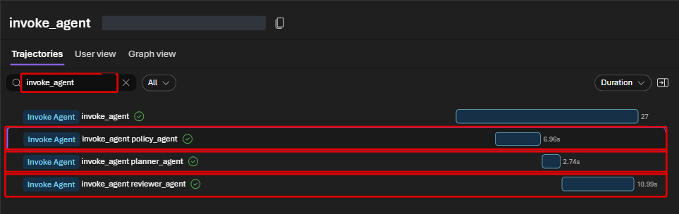
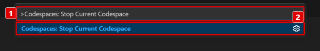
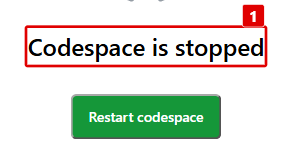

# Lab 8 — Observability と cleanup（10分）

## ゴール

Prompt Agent と Hosted Agent の trace を確認し、ハンズオンで作成した Azure resources
を削除します。

Trace は、**1 回の依頼がどの順番で処理されたかをたどる記録**です。
回答だけでは分からない検索・tool 呼び出し・各 agent の処理を確認します。
確認が終わったら、費用が発生し続けないようにリソースを片付けます。

## 1. Trace を開く

1. Microsoft Foundry Portal で **Build > Agents** を開きます。
2. 対象 agent を選択します。
3. 上部の **Traces** tab を選択します。

Application Insights connection は Lab 1 の setup で作成済みです。
Trace が見えない場合は数分待って browser を再読み込みします。

## 2. Prompt Agent の trace を確認する

`contoso-travel-assistant` の **Traces** で、Lab 4 または Lab 5 の行を選択します。

- Model の input / output と token 数
- Foundry IQ の retrieval
- `travel_ops_api` の tool call と引数
- 各 span の latency と status

## 3. Hosted Agent の trace を確認する

`contoso-travel-hosted-planner` の **Traces** で、Lab 7 の最新行を選択します。
Trace detail の **Trajectories** で、必要に応じて **Graph view** に切り替えます。



画像は以前の構成で取得した参考例です。現在の Lab 7 は 3 agent の構成で、
reviewer の後に独自の後処理ステップはありません。

## 完了チェック

- `policy_agent`、`planner_agent`、`reviewer_agent` の model call が順番に表示される
- 最後の output が reviewer の回答になっている
- `workflow.run` と 3 つの `invoke_agent` が **Success** になっている

Cold start の最初に state store の `GET` が 1 回だけ `404` になり、直後の `POST` が
**Success** になる場合があります。これは state store の新規作成確認であり、
workflow の失敗ではありません。

Trace には prompt、response、tool の引数が保存されます。実データや secret を入力しないで
ください。詳細は
[Set up tracing](https://learn.microsoft.com/azure/foundry/observability/how-to/trace-agent-setup)
を参照してください。

## 4. Cleanup を実行する

Lab 4 で作成したものは、まず Portal で次の順に片付けます。
対象はこのハンズオン用 project 内のものだけです。

1. Prompt Agent の Tools から workshop Toolbox の接続を外します。
2. **Build > Tools** で `contoso-travel-toolbox` を削除します。
3. 他の Toolbox が参照していないことを確認して、`travel-estimation` と
   `preapproval-simulation` の Skills を削除します。

Skill の参照を残したまま先に Skill を削除しません。削除 UI が利用できない場合は講師へ
連絡し、SDK での削除を確認してから進みます。既存 `destroy.sh` はこれらの専用削除を
自動化していないため、Portal で作成した Skill が削除済みとは表示だけで判断しません。

repository root の terminal で実行します。

```bash
./scripts/destroy.sh
```

確認画面で対象 resource を確認し、削除を承認します。

`destroy.sh` は Hosted Agent などの data-plane object を先に削除し、その後 Terraform
resources を削除します。**割り当てられた resource group 自体は削除しません。**

## Cleanup の完了チェック

- Command が exit code `0` で終了する
- Workshop 管理 resource が resource group に残っていない
- Cleanup 成功後に `.workshop/` の生成 context が削除される

失敗した場合は Terraform state や `.workshop/` を手動で消さず、
[cleanup troubleshooting](../docs/participant/troubleshooting.md#cleanup)を確認して
同じ command を再実行してください。

## 5. Codespace を停止する

Azure の cleanup が完了したら、Codespace の稼働も止めます。
**Codespace を停止するだけでは Azure resources は削除されません。**
必ず上の cleanup の完了を先に確認してください。

1. 残しておきたい Notebook などの作業を保存します。
2. **Ctrl+Shift+P**（macOS は **Cmd+Shift+P**）で Command Palette を開きます。
3. `Codespaces: Stop Current Codespace` と入力し、同名の項目を選択します。



4. 停止処理が終わり、**Codespace is stopped** と表示されることを確認します。
   **Stopping codespace...** の表示が続く場合は、ブラウザーを再読み込みして確認します。



5. **Restart codespace** は押さず、ブラウザーのタブを閉じます。

これは今開いている Codespace の停止です。GitHub repository や、ほかの Codespace は
削除しません。保存した作業は、あとで同じ Codespace を開き直すと続けられます。

## 完了

これでハンズオンは終了です。
