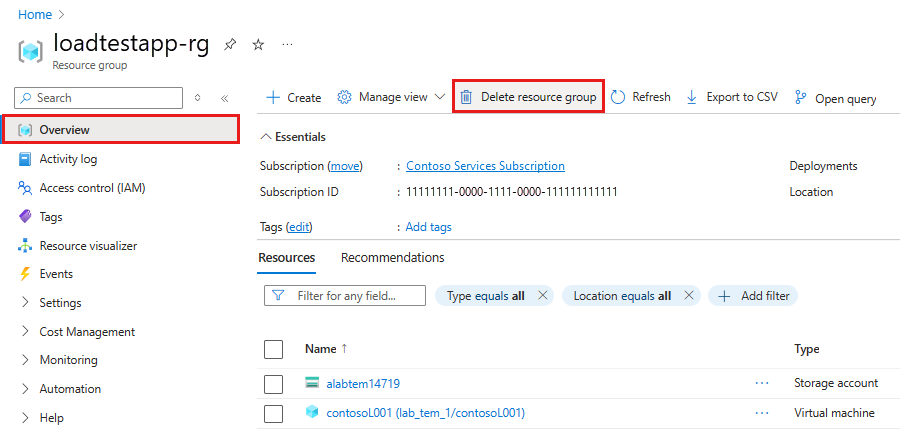

# Lab 9 — Observability と cleanup（20分）

## ゴール

Prompt / Hosted Agent traces を比較し、Hosted data plane、Azure ML Compute、Terraform
resources、workload resource group の順で完全に cleanup します。

## 1. Trace を比較

Foundry Portal の **Build > Agents > Traces** で Lab 4 と Lab 8 の実行を開きます。

- Prompt Agent: Foundry IQ、`tool_search`、`call_tool`、選択された実 tool
- Hosted Agent: `intake_agent` → `policy_agent` → `reviewer_agent`
- `policy_agent` だけの `knowledge_base_retrieve`
- latency、status、token usage、reviewer output

trace には prompt、response、tool arguments が残ります。secret や実データを入力していない
ことを再確認します。

## 2. Export と Hosted Agent cleanup

Azure ML **User files** から必要な Notebook / safe result を PC へ **Export** します。
`.workshop/context.json`、credential、token は配布しません。

**Python (Foundry Hosted Agent)** で Notebook の cleanup cell を実行するか、Azure ML
Terminal の同じ environment から次を実行します。

```bash
conda run --name foundry-hosted-agent python scripts/delete_hosted_agent.py \
  --subscription "<subscription-id>" \
  --resource-group "<resource-group>" \
  --output json
```

全 Hosted Agent versions と agent が deleted / not found になったことを確認します。
成功前に parent Foundry resource を削除しません。

## 3. Compute を Stop / Delete

Azure ML Studio の **Compute > Compute instances** で対象 instance を選びます。

1. **Stop** を選び、status **Stopped** まで待つ。
2. **Delete** を選び、Compute が一覧から消えるまで待つ。

> [!CAUTION]
> Terraform destroy より先に Compute を削除します。必要な Notebook を Export せずに
> Compute/workspace を削除しません。

## 4. 同じ persistent Cloud Shell に戻る

Azure Portal から Azure Cloud Shell **Bash** を開き、Lab 1 と同じ persistent HOME、
repository、`.workshop`、Terraform state であることを確認します。

```bash
cd ~/Microsoft-Foundry-Agent-Service-Handson
source scripts/activate-cloud-shell.sh
./scripts/destroy.sh
```

storage validation / activation / state recovery が失敗した場合は destroy を推測で続けません。
一時 HOME に clone し直した repository から実行せず、講師へ連絡します。

## 5. workload resource group を確認・削除

destroy 成功後、Azure Portal の workload resource group を開き、resource inventory が空で
あることを確認します。残っている場合は Activity log と destroy output を確認し、先に解消します。

空であることを確認後:

1. **Delete resource group**。
2. workload resource group name を入力して確定。
3. **Resource groups** list から消えるまで待つ。



画面例には sample resources が表示されていますが、このハンズオンでは必ず resource inventory
が空であることを確認してから **Delete resource group** を選択します。

Cloud Shell terminal で:

```bash
exit
```

## 6. Cloud Shell storage lifecycle

Cloud Shell storage は workload resource group と別です。dedicated storage であり、workload
cleanup が成功し、組織 policy が許可する場合だけ別途削除します。shared/existing storage、
他用途の HOME、別 participant の storage は削除しません。

## 完了チェック

- traces を比較
- Notebook を Export
- Hosted Agent / versions を削除
- Compute を Stop / Delete
- same persistent repository/state で `destroy.sh` 成功
- workload RG が空であることを確認後、Portal で削除
- Cloud Shell を `exit`
